# AI駆動開発テンプレート（Claude Code）の利用マニュアル

> 本書は要件定義から単体テスト工程までをAI駆動開発テンプレートを使って開発を行うための手引きです。

***

## 目次

1. [このマニュアルの読み方](#1-このマニュアルの読み方)
2. [環境の前提条件とツールのセットアップ](#2-環境の前提条件とツールのセットアップ)
3. [AI駆動開発におけるドキュメント構成](#3-AI駆動開発におけるドキュメント構成)
4. [Claude Codeの起動と疎通確認](#4-claude-codeの起動と疎通確認)
5. [開発ワークフロー](#5-開発ワークフロー)

**付録**\
　　　A. [工程ごとの成果物](#付録a-工程ごとの成果物)\
　　　B. [ADR（Architecture-Decision-Record）の作成について](#付録b-adrarchitecture-decision-recordの作成について)\
　　　C. [手戻りワークフロー](#付録c-手戻りワークフロー)\
　　　D. [Claude Codeのセッションの考え方](#付録d-claude-codeのセッションの考え方)\
　　　E. [今後の改定予定](#付録e-今後の改定予定)

***

## 1. このマニュアルの読み方

### 1.1 AI駆動開発テンプレート想定利用者

* ヤマトの開発標準フレームワークである、SpringerやReacterの開発経験を有すること
  * Claude Codeを通じてAIから生成される成果物をレビュー・承認する責任を持てること
* 事前に全体概要（[AI駆動開発_開発テンプレート概要](https://drive.google.com/file/d/1977z5k_RQArXJ9uazZS2bsEllMLLs4rm/view?usp=drive_link)）を読んでいること

### 1.2 表記ルール、使い方

* コマンドサンプル先頭の `$` はシェル、`>` は Claude Code チャット内入力です
* `{案件キー}` などのプレースホルダは実際の値に置き換えてください
* マニュアル内で Claude への入力として登場する表記には、次の3種類がある。見た目が似ているが使い方が異なるため注意すること

| 表記例 | 種類 | 使い方 |
|---|---|---|
| `/case-init`・`/issue-init`・`/basic-design-gen` 等 | スキル（スラッシュコマンド） | 先頭に `/` を付けてそのまま入力する |
| `issue-to-requirement.md の手順で壁打ち（Claude との一問一答形式の対話）を開始して`・`docs-to-pr` | オーケストレーター（`.claude/orchestrators/` 配下の手順定義） | `/` は付けない。ファイル名を含む一文、または `docs-to-pr` のように短い呼び名だけを入力すれば、Claude が該当ファイルを読み込んで手順どおりに進める |
| `subissue-bulk.sh 実行を依頼` 等 | シェルスクリプト（`.claude/scripts/gh/` 配下）の実行依頼 | 人間がコマンドライン引数を指定する必要はない。「マージ済みの plan.md を指定して〇〇の sub-issue を起票して」のように目的を自然文で伝えれば、Claude が引数を組み立てて実行する |

### 1.3 AI駆動開発テンプレートの工程の考え方（概論）

* まず、AI駆動開発テンプレートが前提とする開発工程の考え方は、別紙（[AI駆動開発_開発テンプレート概要](https://drive.google.com/file/d/1977z5k_RQArXJ9uazZS2bsEllMLLs4rm/view?usp=drive_link)）を参照してください
* AI駆動開発テンプレートでは、上記開発工程を実現するために、各工程に対して以下のような考え方を持っています
  * ① 各工程において、人からInputや指示を受け取り、AIが成果物を生成する
  * ② AIの成果物を人がレビューし承認する（Issue へのPull Request（PR）を承認する）
  * ③ ②の人のレビュー・承認を通過して、初めて次工程へ進む
* **承認なしに次工程へ進まない原則を守ることで、後工程での手戻りコストを最小化することを目指しています**
* 各工程では、githubのissueチケットを活用し、本テンプレートの利用者が変わる場合や、開発者が複数いる場合においても、issueを共有し同じ品質で工程を進めることができることを目指しています


***

## 2. 環境の前提条件とツールのセットアップ

### 2.1 環境の前提条件

* 本ツールを利用するための前提として、Springer、Reacterのローカル開発環境のセットアップを実施してください
* 加えて以下ツールを導入してください

| ツール                  | バージョン  | 用途                                           |
| -------------------- | ------ | -------------------------------------------- |
| **Claude Code**（CLI） | 最新版(LTS)    | AI による生成・レビュー・修正                             |
| **Python**           | 最新版(LTS) | `.claude/hooks/` の規約自動チェック                   |
| **gh CLI**           | 最新版(LTS)    | GitHub 操作自動化（Milestone・issue・PR）             |

### 2.2 ツールのセットアップ

* AI駆動開発テンプレートを利用するための各ツールのセットアップは、以下のコマンドに従いインストールを行ってください

#### Claude Code CLI

以下リンクのWindows PowerShell版を実行
https://code.claude.com/docs/ja/quickstart

インストール後、`claude --version`を実行してバージョンが表示されればOK

#### Python

* **Windows**: [python.org](https://www.python.org/) から DL、「Add Python to PATH」をチェック

`python3 --version` または `python --version` が表示されればOK

#### gh CLI 認証・プロキシ設定

以下リンクでWindows-Download MSIを指定してインストール
https://cli.github.com/

インストール後、以下コマンドを実行
```bash
# 認証
gh auth login

# 社内プロキシ環境の確認
PROXY=$(git config --global --get http.proxy)
HTTPS_PROXY="$PROXY" gh api rate_limit

# 認証ステータスの確認
gh auth status
```
`gh auth status` が認証済みとなっていればOK

**`gh api rate_limit` の結果による分岐**

| 結果 | 意味 | 対応 |
|---|---|---|
| レート制限情報（JSON）が返る | 接続OK（プロキシ設定が無い/不要な環境を含む） | そのまま次へ進んでよい |
| `$PROXY` が空文字のまま同じ結果が返る | プロキシ未設定の環境（多くの社外ネットワークはこちら） | 追加設定不要 |
| タイムアウト・接続エラーになる | プロキシ設定が必要、または値が誤っている | 社内情シスに確認したプロキシURL・ポートを `git config --global http.proxy {URL}` に設定し再実行 |

> gh CLI スクリプトは `proxy-detect.sh` で git config から自動補完するため、
> 通常は追加設定不要。上表で接続OKと判定できれば問題なし。


***

## 3. AI駆動開発におけるドキュメント構成

### 3.1 AI駆動開発を構成するリポジトリとドキュメント

AI駆動開発は以下の3種類のリポジトリで構成される。各リポジトリ内のドキュメントは以下のようになっている。

| リポジトリ | 役割 | 管理対象の工程 | 種類 | 定義 | 格納場所 |
|---|---|---|---|---|---|
| ①AI駆動開発テンプレート | 案件開始時にGithubから取得し、案件リポジトリを作成する | — | **Claude Code実行定義** | Claude Codeの実行ファイル。Claude Codeで使用するスキルやルール | `.claude/`, `CLAUDE.md` |
| | | | **開発参考ドキュメント** | 主にコード生成時に参照するサンプルコードやスタック用のリポジトリ構成 | `_hint/`, `_templates/` |
| ②案件リポジトリ | 案件単位の成果物を管理。<br>本リポジトリはプロダクトにつき1のみ | SA / UI / SS-Plan | **設計標準テンプレート** | 設計書の雛形（空ファイル）。AI が参照して成果物を生成する構造的基準。<br>設計標準ドキュメントの雛形がベース | `docs/templates/` |
| | | | **AI生成中間ドキュメント** | AI が生成する設計草稿・ADR・レビューレポート等 | `specs/{案件キー}/` |
| ③スタックリポジトリ | スタック（bs, us-api, frontend 等）ごとの成果物を管理 | SS / PG-Plan / PG / PT-Plan / PT | **工程設計ドキュメント** | 工程ゲート PR でリポジトリに永続化される正式成果物 | `{スタック}/docs/`  |
| | | | **AI生成中間ドキュメント** | AI が生成する設計草稿・ADR・レビューレポート等 | `{スタック}/specs/{案件キー}/` |

**スタックとは：** システムを構成する技術レイヤーごとのリポジトリ単位。例：`bs`（バックエンドサービス）、`us-api`（ユーザー向けAPI）、`frontend`（Reacter フロントエンド）、`batch`（バッチ処理）。


### 3.2 ディレクトリ構造図

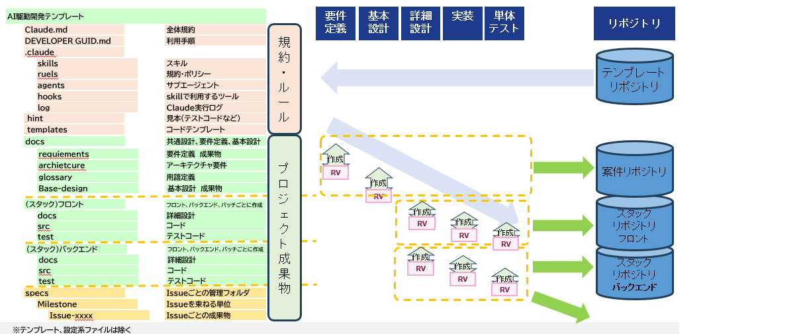


## 4. Claude Codeの起動と疎通確認

### 4.1 テンプレートの取得

以下リンクから ①AI駆動開発テンプレートを取得する。

* https://github.com/ai-tech-governance/AI_driven_development

取得方法（いずれか）:

* GitHub の「Code」→「Download ZIP」からダウンロードし、任意のディレクトリに解凍する
* または `git clone https://github.com/ai-tech-governance/AI_driven_development.git` で取得する

配置したディレクトリの名称（AI_driven_development）を任意の名称に変更する。

### 4.2 起動

```bash
cd /プロジェクトルート
claude
```

プロジェクトルートはフォルダ内のCLAUDE.mdのあるディレクトリ。


### 4.3 カスタムコマンドの確認

`/` を入力してスキル一覧が出れば正常：

```
> /
```

`/case-init`・`/issue-init`・`/detailed-design-gen` 等が表示されれば OK。

### 4.4 案件リポジトリの作成（初期構築のみ）

案件リポジトリが無い場合、GitHub 上に作成する。(webからの実行を推奨)

4.1 で取得したテンプレートを案件リポジトリにpushする

.claude/repositories.local.md.exampleをコピーして、.claude/repositories.local.mdを作成。作成した案件リポジトリのURLを記載する。

***

## 5. 開発ワークフロー

### 5.1 ワークフロー全体像

* **計画工程：黄色**: AIが計画の成果物（`plan.md`）を作成しPR、人間がレビュー承認
* **実施工程**: AIが工程成果物を作成しPR、人間がレビュー承認

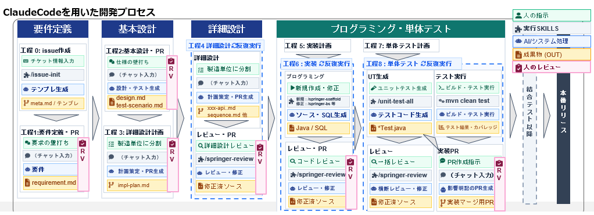


### 5.2 工程0 / 案件開始

#### 目的

すべての工程・ブランチ・issue の識別子である案件キーを確定し、案件リポジトリ・スタックリポジトリに Milestone・ラベル・統合ブランチを作成する。
案件キーはgh CLI スクリプトによる自動化（ブランチ命名・Milestone 連携）に使用される

#### 成果物一覧

| リポジトリ | 成果物格納パス | 関連スキル |
| --- | --- | --- |
| 案件リポジトリ | `specs/{案件キー}/meta.md`（案件レベル） | `/case-init` |


#### シーケンス

> 以降、Claude Code を操作して各工程を進める人を **実装者**、GitHub 上で Pull Request（PR）を確認しレビュー・承認する人を **承認者** と呼ぶ。各工程のシーケンス図・手順表はこの呼称で担当を表記する。

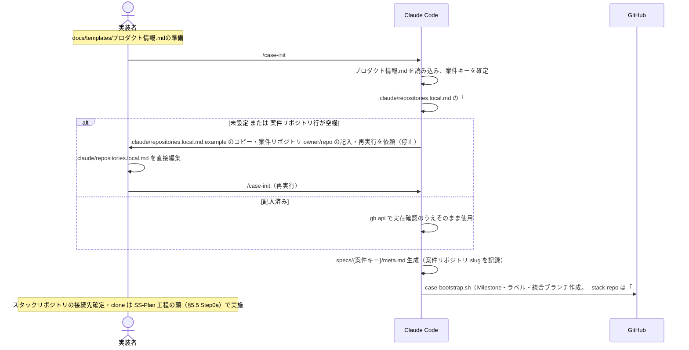

| Step | STEP名 | 人の指示（Claude への入力） | AI/システム処理 | 成果物 | 担当 | 人の役割 |
|---|---|---|---|---|---|---|
| 1 | 事前準備 | - | - | `docs/requirements/プロダクト情報.md` | 実装者 | `docs/templates/プロダクト情報.md` を`docs/requirements/`にコピーし、プロダクト名・パッケージ名・プロダクト略称を記入 |
| 2 | 工程着手 | `/case-init` | プロダクト情報.md を読み込み案件キーを確定／`.claude/repositories.local.md` の「## 案件リポジトリ」欄を確認 | - | 実装者 | 特になし |
| 3 | リポジトリ情報確認（未設定時のみ・停止） | - | 「## 案件リポジトリ」が空欄の場合、`.claude/repositories.local.md.example` のコピー・記入・`/case-init` 再実行を案内して停止（対話での値収集は行わない） | - | 実装者 | `.claude/repositories.local.md` を直接編集し `/case-init` を再実行 |
| 4 | 案件メタ生成 | - | `specs/{案件キー}/meta.md` を生成（案件リポジトリ slug を記録） | `meta.md` | - | 特になし |
| 5 | リポジトリ準備 | - | `case-bootstrap.sh`（Milestone・ラベル・統合ブランチ作成。`--stack-repo` は「## スタックリポジトリ」記入済み分のみ渡す） | Milestone／ラベル／`feature/{案件キー}`（②③リポジトリ） | - | 特になし |
| 6 | （参考）スタックリポジトリの確定 | - | - | - | 実装者 | どのスタックが必要かは UI 工程で確定する。接続先の記入・`git clone` のタイミングは §5.5 Step0a を参照（本工程での実施は任意の前倒しのみ） |


#### プロンプト例

以降 5.3〜5.10 では、架空案件「在庫アラート通知機能追加」（案件キー `foodshop-2026-003`／要件ID `R005`／機能ID `bs-002`〔在庫アラート判定API・bs スタック〕）を例に、人間が Claude Code に入力する主要プロンプトを示す。

**Step2 工程着手**
```
> /case-init
```

**Step3（未設定時のみ）再実行例**（`.claude/repositories.local.md` に案件リポジトリ owner/repo を記入後）
```
> /case-init
```

> Step1（プロダクト情報.md の作成）・Step3（`.claude/repositories.local.md` の直接編集）・Step6（スタックリポジトリの接続先記入・`git clone`、実施する場合）は Claude への入力ではなく人間が直接行う作業のため、プロンプト例はなし。

***

### 5.3 工程1 SA 要件定義

#### 目的

* システム開発に必要な要件を整理し、要件定義書（設計標準ドキュメントの要件定義成果物に相当）を作成する

#### 成果物一覧

| リポジトリ | 成果物格納パス | 関連スキル |
| --- | --- | --- |
| 案件リポジトリ | `docs/requirements/業務概要.md` | `/requirement-doc-gen` |
| 案件リポジトリ | `docs/requirements/システム全体図.md` | `/requirement-doc-gen` |
| 案件リポジトリ | `docs/requirements/システム化業務フロー.md` | `/requirement-doc-gen` |
| 案件リポジトリ | `docs/requirements/要件一覧.md` | `/case-init` |
| 案件リポジトリ | `docs/requirements/要件定義_{要件ID}.md` | `issue-to-requirement`／`/requirement-doc-gen` |
| 案件リポジトリ | `docs/requirements/コード定義書.md` | `/requirement-doc-gen` |
| 案件リポジトリ | `docs/requirements/画面レイアウト.md` | `/requirement-doc-gen` |
| 案件リポジトリ | `docs/requirements/ユースケース図.md` | `/requirement-doc-gen` |
| 案件リポジトリ | `docs/requirements/画面遷移図.md` | `/requirement-doc-gen` |
| 案件リポジトリ | `docs/requirements/帳票レイアウト.md`（該当時のみ） | `/requirement-doc-gen` |

#### シーケンス

> Step1〜9（PR作成まで）は実装者、Step10 以降（PRレビュー〜クローズ）は承認者が担当する。

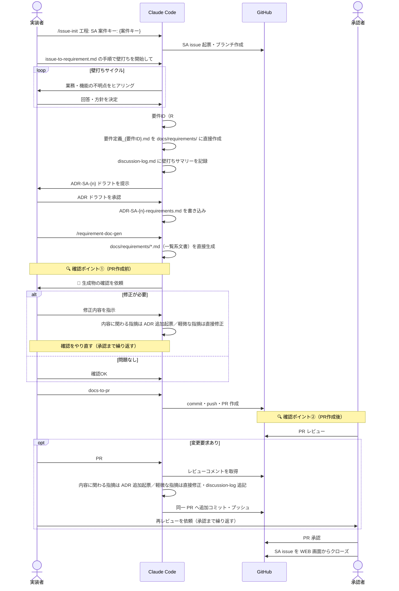

| Step | STEP名 | 人の指示（Claude への入力） | AI/システム処理 | 成果物 | 担当 | 人の役割 |
|---|---|---|---|---|---|---|
| 1 | 工程着手 | `/issue-init 工程: SA 案件キー: {案件キー}` | SA issue 起票・ブランチ作成 | SA issue／`feature/{案件キー}-sa` | 実装者 | 特になし |
| 2 | 壁打ち開始指示 | `issue-to-requirement.md の手順で壁打ちを開始して` | - | - | 実装者 | 壁打ち開始を指示 |
| 3 | 壁打ち | - | 業務・機能の不明点をヒアリング | - | 実装者 | 不明点に回答・方針を決定 |
| 4 | 要件定義書生成 | - | 要件ID（R###）を要件一覧.md に採番／`要件定義_{要件ID}.md` を docs/requirements/ に直接作成 | 要件一覧.md（追記）／要件定義_{要件ID}.md | - | 特になし |
| 5 | 壁打ち結果の承認 | - | `ADR-SA-{n}` ドラフトを提示 | ADRドラフト(ADRについては付録Bを参照) | 実装者 | ドラフトを確認・承認 |
| 6 | 壁打ち結果の記録 | - | `ADR-SA-{n}-requirements.md` を書き込み | `ADR-SA-{n}-requirements.md` | - | 特になし |
| 7 | 一覧系文書生成 | `/requirement-doc-gen` | `docs/requirements/*.md`（業務概要等・一覧系）を直接生成／📝生成物の確認を依頼 | 業務概要等 設計標準ドキュメント一覧系一式 | - | 特になし |
| 8 | 🔍 **確認①：PR作成前** | - | - | - | 実装者 | **`docs/requirements/*.md` を確認**（OK なら Step9へ／NG なら Step8a へ） |
| 8a | ┗ 修正（NGの場合のみ） | 修正内容を指示 | 内容に関わる指摘 → ADR 追加起票／軽微な指摘 → 直接修正 | 修正済みファイル・追加ADR | 実装者 | 修正内容を指示（Step8に戻り再確認） |
| 9 | PR作成 | `docs-to-pr` | commit・push・PR 作成 | PR | 実装者 | 特になし |
| 10 | 🔍 **確認②：PR作成後** | - | - | - | 承認者 | **PR をレビュー**（承認なら Step11へ／変更要求なら Step10a へ） |
| 10a | ┗ 指摘取込み（変更要求の場合のみ） | `PR #{N} のレビュー指摘を取り込んで` | レビューコメント取得／内容に関わる指摘 → ADR 追加起票／軽微な指摘 → 直接修正・discussion-log 追記 | 修正コミット | 実装者 | 承認者へ再レビューを依頼（承認まで Step10・10a を繰り返す） |
| 11 | ゲート承認・クローズ | - | - | - | 承認者 | PR 承認／SA issue を GitHub WEB 画面からクローズ |

#### プロンプト例

**Step1 工程着手**
```
> /issue-init 工程: SA 案件キー: foodshop-2026-003
```

**Step2 壁打ち開始指示**
```
> issue-to-requirement.md の手順で壁打ちを開始して
```

**Step3 壁打ち回答例**
```
> 在庫数が発注点を下回った商品を検知し、担当の在庫管理者にメールで通知したい。
> 対象は生鮮食品カテゴリの商品のみ。日次夜間バッチではなく、管理画面を開いたタイミングでの即時判定にしたい。
```

**Step5 壁打ち結果の承認**
```
> ADR-SA-1 のドラフトを承認します。このまま確定してください。
```

**Step7 一覧系文書生成**
```
> /requirement-doc-gen
```

**Step8a 修正指示例**（確認①でNGの場合）
```
> 要件一覧.md で要件名が「在庫通知機能」と「在庫アラート機能」で表記が揺れています。「在庫アラート通知機能」に統一してください。
```

**Step9 PR作成**
```
> docs-to-pr
```

**Step10a 指摘取込み例**（確認②で変更要求ありの場合）
```
> PR #12 のレビュー指摘を取り込んで
```

***

### 5.4 工程2 UI 基本設計

#### 目的

* `docs/base-design/` 配下の設計標準ドキュメントの基本設計ファイルを直接生成する

* 影響スタック構成を確認し `docs/architecture/stack-dependency.md` を更新する（機能IDのカテゴリ判定より前に完了させる。新規スタックが必要な場合、実際の構築〔リポジトリ作成・テンプレート配置・`/stack-init`〕は本工程完了後・SS-Plan工程の頭で行う）

#### 成果物一覧

| リポジトリ | 成果物格納パス | 関連スキル |
| --- | --- | --- |
| 案件リポジトリ | `docs/architecture/stack-dependency.md` | `issue-to-design` |
| 案件リポジトリ | `docs/base-design/機能一覧.md` | `/case-init` `/basic-design-gen` |
| 案件リポジトリ | `docs/base-design/Web_API_IF一覧表.md` | `/basic-design-gen` |
| 案件リポジトリ | `docs/base-design/Web_API_IF定義書_{機能ID}.md` | `/basic-design-gen` |
| 案件リポジトリ | `docs/base-design/機能概要_{機能ID}.md` | `/basic-design-gen` |
| 案件リポジトリ | `docs/base-design/シーケンス図_{機能ID}.md` | `/basic-design-gen` |
| 案件リポジトリ | `docs/base-design/テーブル一覧.md` | `/basic-design-gen` |
| 案件リポジトリ | `docs/base-design/テーブル定義書_{テーブルID}_{テーブル名}.md`（bs/batch のみ） | `/basic-design-gen` |
| 案件リポジトリ | `docs/base-design/実装対象クラス一覧.md` | `/basic-design-gen` |
| 案件リポジトリ | `docs/base-design/テストシナリオ.md` | `/basic-design-gen` |
| 案件リポジトリ | `docs/base-design/ロバストネス図_{要件ID}.md` | `/basic-design-gen` |
| 案件リポジトリ | `docs/base-design/クラス図.md` | `/basic-design-gen` |
| 案件リポジトリ | `docs/base-design/画面状態遷移図_{機能ID}.md` | `/basic-design-gen` |
| 案件リポジトリ | `docs/base-design/ファイルレイアウト一覧_{機能ID}.md` | `/basic-design-gen` |
| 案件リポジトリ | `docs/base-design/ファイル定義書_{機能ID}.md` | `/basic-design-gen` |

#### シーケンス

> Step1〜8（PR作成まで）は実装者、Step9 以降（PRレビュー〜クローズ）は承認者が担当する。

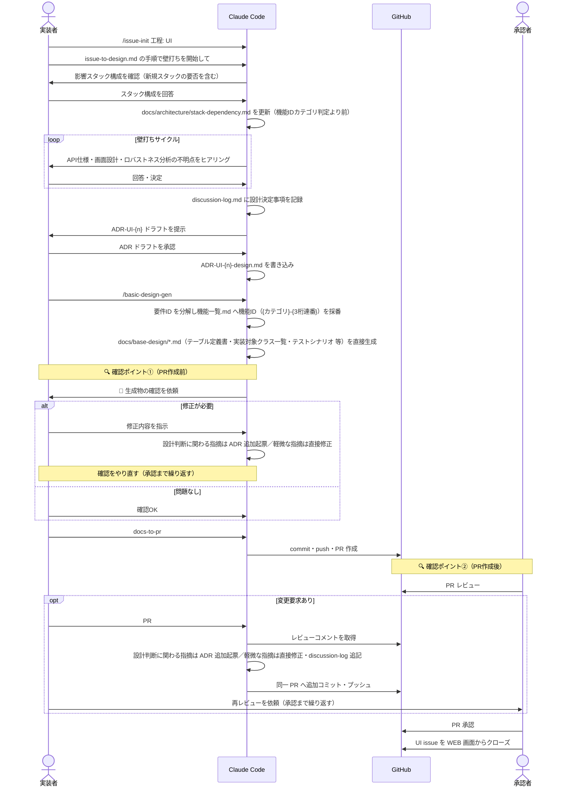

| Step | STEP名 | 人の指示（Claude への入力） | AI/システム処理 | 成果物 | 担当 | 人の役割 |
|---|---|---|---|---|---|---|
| 1 | 工程着手 | `/issue-init 工程: UI` | UI issue 起票・ブランチ作成 | UI issue／`feature/{案件キー}-ui` | 実装者 | 特になし |
| 2 | 壁打ち開始指示 | `issue-to-design.md の手順で壁打ちを開始して` | - | - | 実装者 | 壁打ち開始を指示 |
| 3 | 壁打ち | - | 影響スタック構成を確認し `docs/architecture/stack-dependency.md` を更新（機能IDカテゴリ判定より前）／API仕様・画面設計・ロバストネス分析の不明点をヒアリング | `stack-dependency.md`（更新） | 実装者 | スタック構成・不明点に回答・決定 |
| 4 | 壁打ち結果の承認 | - | `ADR-UI-{n}` ドラフトを提示 | ADRドラフト | 実装者 | ドラフトを確認・承認 |
| 5 | 壁打ち結果の記録 | - | `ADR-UI-{n}-design.md` を書き込み | `ADR-UI-{n}-design.md` | - | 特になし |
| 6 | 基本設計書生成 | `/basic-design-gen` | 機能一覧.md へ機能ID（{カテゴリ}-{3桁連番}）を採番／`docs/base-design/*.md`（テーブル定義書・実装対象クラス一覧・テストシナリオ・ロバストネス図 等）を直接生成／📝生成物の確認を依頼 | Web_API_IF一覧表等 設計標準ドキュメント一式 | - | 特になし |
| 7 | 🔍 **確認①：PR作成前** | - | - | - | 実装者 | **`docs/base-design/*.md` を確認**（OK なら Step8へ／NG なら Step7a へ） |
| 7a | ┗ 修正（NGの場合のみ） | 修正内容を指示 | 設計判断に関わる指摘 → ADR 追加起票／軽微な指摘 → 直接修正 | 修正済みファイル・追加ADR | 実装者 | 修正内容を指示（Step7に戻り再確認） |
| 8 | PR作成 | `docs-to-pr` | commit・push・PR 作成 | PR | 実装者 | 特になし |
| 9 | 🔍 **確認②：PR作成後** | - | - | - | 承認者 | **PR をレビュー**（承認なら Step10へ／変更要求なら Step9a へ） |
| 9a | ┗ 指摘取込み（変更要求の場合のみ） | `PR #{N} のレビュー指摘を取り込んで` | レビューコメント取得／設計判断に関わる指摘 → ADR 追加起票／軽微な指摘 → 直接修正・discussion-log 追記 | 修正コミット | 実装者 | 承認者へ再レビューを依頼（承認まで Step9・9a を繰り返す） |
| 10 | ゲート承認・クローズ | - | - | - | 承認者 | PR 承認・UI issue を GitHub WEB 画面からクローズ |

#### プロンプト例

**Step1**
```
> /issue-init 工程: UI
```

**Step2**
```
> issue-to-design.md の手順で壁打ちを開始して
```

**Step3 壁打ち回答例**
```
> 在庫アラート判定は BS アプリで実施し、判定結果を US-API 経由でフロント（在庫アラート一覧画面）に表示する方針にしたい。
> R005 は BS の判定API（1件）とフロントの一覧画面（1件）の2機能IDに分解される想定。
```

**Step4 壁打ち結果の承認**
```
> ADR-UI-1 のドラフトを承認します。
```

**Step6 基本設計書生成**
```
> /basic-design-gen
```

**Step7a 修正指示例**
```
> テーブル定義書の列名 threshold_qty を、要件定義の用語に合わせて reorder_point に変更してください。
```

**Step8**
```
> docs-to-pr
```

**Step9a**
```
> PR #15 のレビュー指摘を取り込んで
```

***

### 5.5 工程3 SS-Plan 詳細設計計画

#### 目的

* 各スタックの詳細設計を進めるために各機能の依存関係を整理し、設計の順番を決定する

* 詳細設計計画として`plan.md`を作成し、決定した設計の順序や想定成果物を決定する

* 詳細設計を進めるためのissueを各スタックリポジトリに起票する

#### 前提事項

* Springer 系スタックを構築する場合、Apache Archivaを利用できるようにしてください。
* 使用できない場合は、Springerのjar/pomを取得可能な方から受領して、ローカルリポジトリ（Maven）へ登録してください。

#### 成果物一覧

| リポジトリ | 成果物格納パス | 関連スキル |
| --- | --- | --- |
| 案件リポジトリ | `specs/{案件キー}/detail-design-plan/{issue_id}/plan.md` | `/issue-plan` |

#### シーケンス

> **Step0（未構築スタックがある場合のみ・`/issue-init` 実行前に完了させる）**: リポジトリ作成・テンプレート配置・`/stack-init` 実行。
> Step1〜4（PR作成まで）は実装者、Step5 以降（PRレビュー〜クローズ）は承認者が担当する。sub-issue 起票（Step7）は実装者が行う。

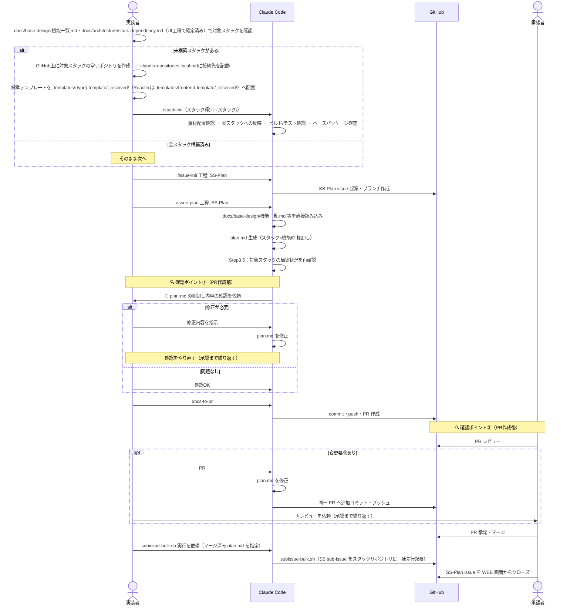

| Step | STEP名 | 人の指示（Claude への入力） | AI/システム処理 | 成果物 | 担当 | 人の役割 |
|---|---|---|---|---|---|---|
| 0 | スタック構築判定 | - | - | - | 実装者 | `docs/base-design/機能一覧.md`・`docs/architecture/stack-dependency.md`（UI工程で確定済み）で対象スタックを確認し、未構築スタックの有無を判断（**`/issue-init` 実行前**に行う） |
| 0a | ┗ リポジトリ作成（未構築スタックのみ） | - | - | - | 実装者 | GitHub上に対象スタックの空リポジトリを作成（WEBからの実行）<br>`.claude/repositories.local.md`に接続先を記載 |
| 0b | ┗ ワイヤーフレーム資材配置（同上） | - | - | - | 実装者 | springer-templateを `_templates/{type}-template/_received/`へ({type}はbsやus-apiなどのスタック名)<br>reacter-blank-templateを `_templates/frontend-template/_received/`）へ配置 |
| 0c | ┗ `/stack-init` 実行（同上） | `/stack-init` | 資材配置確認 → 実スタックへの反映 → ビルド/テスト確認 → ベースパッケージ確定 | `{スタック}/`（実体化）・`CLAUDE.md`更新 | - | 特になし |
| 1 | 工程着手 | `/issue-init 工程: SS-Plan` | SS-Plan issue 起票・ブランチ作成 | SS-Plan issue | 実装者 | 特になし |
| 2 | 棚卸し生成 | `/issue-plan 工程: SS-Plan` | `docs/base-design/機能一覧.md` 等を直接読み込み／`plan.md` 生成（スタック×機能ID 棚卸し）／Step3.5で構築状況を再確認／📝確認を依頼 | `plan.md` | - | 特になし |
| 3 | 🔍 **確認①：PR作成前** | - | - | - | 実装者 | **plan.md の棚卸しを確認**（OK なら Step4へ／NG なら Step3a へ） |
| 3a | ┗ 修正（NGの場合のみ） | 修正内容を指示 | plan.md を修正 | 修正済み plan.md | 実装者 | 修正内容を指示（Step3に戻り再確認） |
| 4 | PR作成 | `docs-to-pr` | commit・push・PR 作成 | PR | 実装者 | 特になし |
| 5 | 🔍 **確認②：PR作成後** | - | - | - | 承認者 | **PR をレビュー**（承認なら Step6へ／変更要求なら Step5a へ） |
| 5a | ┗ 指摘取込み（変更要求の場合のみ） | `PR #{N} のレビュー指摘を取り込んで` | plan.md を修正・追加コミット | 修正コミット | 実装者 | 承認者へ再レビューを依頼（承認まで Step5・5a を繰り返す） |
| 6 | ゲート承認・マージ | - | - | - | 承認者 | PR 承認・マージ |
| 7 | sub-issue起票 | `subissue-bulk.sh 実行を依頼` | `subissue-bulk.sh`（マージ済み plan.md を指定し SS sub-issue をスタックリポジトリに一括先行起票） | SS sub-issue 群 | 実装者 | 特になし |
| 8 | issueクローズ | - | - | - | 承認者 | SS-Plan issue を GitHub WEB 画面からクローズ |


#### プロンプト例

**Step0c（未構築スタックの場合のみ・`/issue-init` 実行前）**
```
> /stack-init
> スタック種別: us-api
```

**Step1**
```
> /issue-init 工程: SS-Plan
```

**Step2**
```
> /issue-plan 工程: SS-Plan
```

**Step3a 修正指示例**
```
> bs-002（在庫アラート判定API）と us-api-004（在庫アラート取得API）の依存関係が抜けています。bs-002 完了後でないと us-api-004 に着手できない旨を明記してください。
```

**Step4**
```
> docs-to-pr
```

**Step5a**
```
> PR #18 のレビュー指摘を取り込んで
```

**Step7 sub-issue起票依頼**
```
> subissue-bulk.sh の実行をお願いします。マージ済みの plan.md を指定して、bs-002・us-api-004 の SS sub-issue を起票してください。
```

***

### 5.6 工程4 SS 詳細設計

#### 目的

* 詳細設計計画工程で作成したplan.mdを元に詳細設計書を生成する

#### 成果物一覧

| リポジトリ | 成果物格納パス | 関連スキル |
| --- | --- | --- |
| スタックリポジトリ（bs/us-api/us-mpa/batch） | `docs/detail-design/外部IF定義書.md`（外部連携がある場合のみ・累積） | `/detailed-design-gen` |
| スタックリポジトリ（bs/us-api/us-mpa/batch） | `docs/detail-design/プログラム仕様書_{機能ID}.md` | `/detailed-design-gen` |
| スタックリポジトリ（frontend） | `docs/detail-design/コンポーネント仕様書_{機能ID}.md` | `/detailed-design-gen` |
| スタックリポジトリ（frontend） | `docs/detail-design/画面アクション遷移図_{機能ID}.md` | `/detailed-design-gen` |
| スタックリポジトリ（bs/us-api/us-mpa/batch） | `docs/detail-design/メッセージ一覧.md` | `/detailed-design-gen` |
| スタックリポジトリ（batch） | `docs/detail-design/ジョブネット一覧.md` | `/batch-design-gen` |
| スタックリポジトリ（batch） | `docs/detail-design/ジョブフロー一覧_{機能ID}.md` | `/batch-design-gen` |
| スタックリポジトリ（bs/us-api/us-mpa/batch） | `specs/{案件キー}/detail-design/{issue_id}_{機能ID}/controller.md` / `service.md` / `repository.md` | `/detailed-design-gen` |
| スタックリポジトリ（frontend） | `specs/{案件キー}/detail-design/{issue_id}_{機能ID}/frontend.md` | `/detailed-design-gen` |
| スタックリポジトリ（batch） | `specs/{案件キー}/detail-design/{issue_id}_{機能ID}/batch.md` | `/detailed-design-gen` |
| スタックリポジトリ | `specs/{案件キー}/detail-design/{issue_id}_{機能ID}/adr/ADR-SS-{n}-design.md` | `/detailed-design-review-*` |
| スタックリポジトリ | `specs/{案件キー}/detail-design/{issue_id}_{機能ID}/review-report.md` | `/detailed-design-review-*` |

#### シーケンス

> Step1〜6（PR作成まで）は実装者、Step7 以降（PRレビュー〜クローズ）は承認者が担当する。

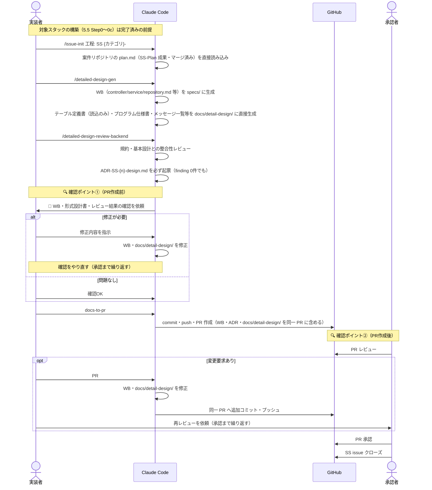

| Step | STEP名 | 人の指示（Claude への入力） | AI/システム処理 | 成果物 | 担当 | 人の役割 |
|---|---|---|---|---|---|---|
| 1 | 工程着手 | `/issue-init 工程: SS {カテゴリ}-### {スタック}` | SS issue 起票・ブランチ作成／案件リポジトリの `plan.md`（SS-Plan 成果・マージ済み）を直接読み込み | SS issue | 実装者 | 機能ID({カテゴリ}-###)を指定してissue-initを実行 |
| 2 | 詳細設計生成 | `/detailed-design-gen` | WB（controller/service/repository.md 等）を specs/ に生成／テーブル定義書（読込のみ）・プログラム仕様書・メッセージ一覧等を `docs/detail-design/` に直接生成 | WB／プログラム仕様書・メッセージ一覧 | 実装者 | 特になし |
| 3 | 設計レビュー | `/detailed-design-review-backend` | 規約・基本設計との整合性レビュー／`ADR-SS-{n}-design.md` を必ず起票／📝確認を依頼 | レビュー結果／`ADR-SS-{n}-design.md` | 実装者 | 特になし |
| 4 | 🔍 **確認①：PR作成前** | - | - | - | 実装者 | **WB・形式設計書・レビュー結果を確認**（OK なら Step5へ／NG なら Step4a へ） |
| 4a | ┗ 修正（NGの場合のみ） | 修正内容を指示 | WB・docs/detail-design/ を修正 | 修正済みファイル | 実装者 | 修正内容を指示（Step4に戻り再確認） |
| 5 | PR作成 | `docs-to-pr` | commit・push・PR 作成（WB・ADR・`docs/detail-design/` を同一 PR に含める） | PR | 実装者 | 特になし |
| 6 | 🔍 **確認②：PR作成後** | - | - | - | 承認者 | **PR をレビュー**（承認なら Step7へ／変更要求なら Step6a へ） |
| 6a | ┗ 指摘取込み（変更要求の場合のみ） | `PR #{N} のレビュー指摘を取り込んで` | WB・docs/detail-design/ を修正・追加コミット | 修正コミット | 実装者 | 承認者へ再レビューを依頼（承認まで Step6・6a を繰り返す） |
| 7 | ゲート承認・クローズ | - | - | - | 承認者 | PR 承認・SS issue クローズ |

#### プロンプト例

**Step1**
```
> /issue-init 工程: SS bs-002 bs
```

**Step2**
```
> /detailed-design-gen
```

**Step3**
```
> /detailed-design-review-backend
```

**Step4a 修正指示例**
```
> プログラム仕様書のエラーコード一覧に、対象商品データが存在しない場合のコード（E-BS-4041）が抜けています。追加してください。
```

**Step5**
```
> docs-to-pr
```

**Step6a**
```
> PR #21 のレビュー指摘を取り込んで
```

***

### 5.7 工程5 PG-Plan 実装計画

#### 目的

* 各スタックの実装方針を記載した実装計画を作成する

#### 成果物一覧

| リポジトリ | 成果物格納パス | 関連スキル |
| --- | --- | --- |
| スタックリポジトリ | `specs/{案件キー}/implementation-plan/{issue_id}/plan.md` | `/issue-plan` |

#### シーケンス

> Step1〜4（PR作成まで）は実装者、Step5 以降（PRレビュー〜クローズ）は承認者が担当する。sub-issue 起票（Step7）は実装者が行う。

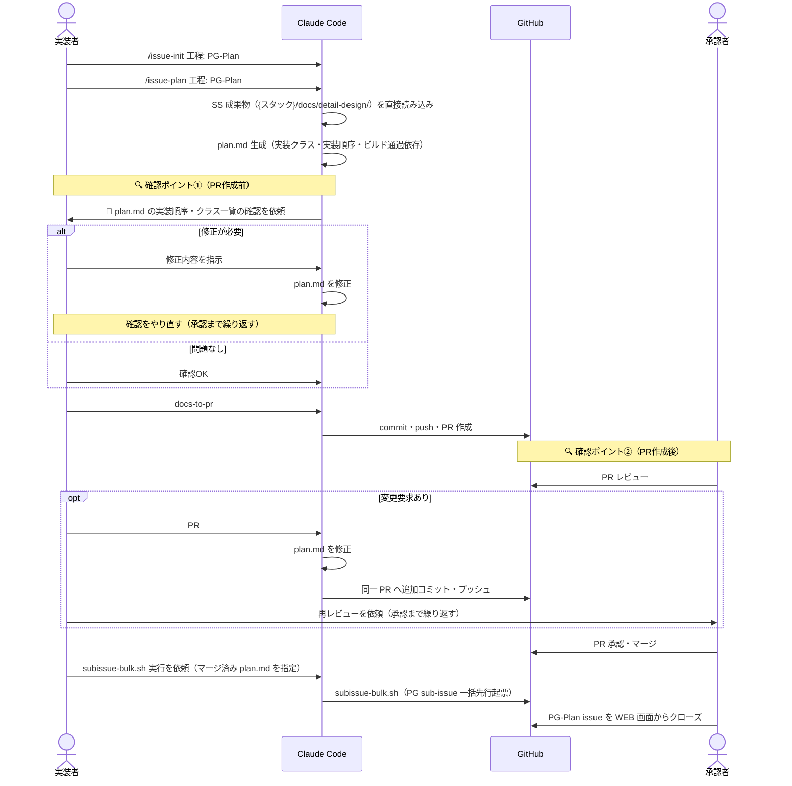

| Step | STEP名 | 人の指示（Claude への入力） | AI/システム処理 | 成果物 | 担当 | 人の役割 |
|---|---|---|---|---|---|---|
| 1 | 工程着手 | `/issue-init 工程: PG-Plan` | PG-Plan issue 起票・ブランチ作成 | PG-Plan issue | 実装者 | 特になし |
| 2 | 棚卸し生成 | `/issue-plan 工程: PG-Plan` | SS 成果物（`{スタック}/docs/detail-design/`）を直接読み込み／`plan.md` 生成（実装クラス・実装順序・ビルド通過依存）／📝確認を依頼 | `plan.md` | - | 特になし |
| 3 | 🔍 **確認①：PR作成前** | - | - | - | 実装者 | **plan.md の実装順序を確認**（OK なら Step4へ／NG なら Step3a へ） |
| 3a | ┗ 修正（NGの場合のみ） | 修正内容を指示 | plan.md を修正 | 修正済み plan.md | 実装者 | 修正内容を指示（Step3に戻り再確認） |
| 4 | PR作成 | `docs-to-pr` | commit・push・PR 作成 | PR | 実装者 | 特になし |
| 5 | 🔍 **確認②：PR作成後** | - | - | - | 承認者 | **PR をレビュー**（承認なら Step6へ／変更要求なら Step5a へ） |
| 5a | ┗ 指摘取込み（変更要求の場合のみ） | `PR #{N} のレビュー指摘を取り込んで` | plan.md を修正・追加コミット | 修正コミット | 実装者 | 承認者へ再レビューを依頼（承認まで Step5・5a を繰り返す） |
| 6 | ゲート承認・マージ | - | - | - | 承認者 | PR 承認・マージ |
| 7 | sub-issue起票 | `subissue-bulk.sh 実行を依頼` | `subissue-bulk.sh`（マージ済み plan.md を指定し PG sub-issue を一括先行起票） | PG sub-issue 群 | 実装者 | 特になし |
| 8 | issueクローズ | - | - | - | 承認者 | PG-Plan issue を GitHub WEB 画面からクローズ |

#### プロンプト例

**Step1**
```
> /issue-init 工程: PG-Plan
```

**Step2**
```
> /issue-plan 工程: PG-Plan
```

**Step3a 修正指示例**
```
> InventoryAlertService の実装順序を、Repository → Service → Controller の順に並べ直してください。
```

**Step4**
```
> docs-to-pr
```

**Step5a**
```
> PR #24 のレビュー指摘を取り込んで
```

**Step7 sub-issue起票依頼**
```
> subissue-bulk.sh の実行をお願いします。マージ済みの plan.md を指定して、bs-002 の PG sub-issue を起票してください。
```

### 5.8 工程6 PG 実装

#### 目的

* SS・PG-Plan 工程の成果物を入力として全レイヤーのコードを生成する

* `/springer-review` `reacter-review`で未対応指摘 0 件を確認する

#### 成果物一覧

| リポジトリ | 成果物格納パス | 関連スキル |
| --- | --- | --- |
| スタックリポジトリ | `/src/main/` | `/springer-scaffold` `/reacter-code-gen` |
| スタックリポジトリ（bs/us-api/us-mpa/batch） | `specs/{案件キー}/implementation/{issue_id}_{機能ID}/springer-review-{対象名}-{タイムスタンプ}/summary.md` 等 | `/springer-review` |
| スタックリポジトリ（frontend） | `specs/{案件キー}/implementation/{issue_id}_{機能ID}/reacter_code_review_{タイムスタンプ}/summary.md` 等 | `/reacter-code-review` |

#### シーケンス

> Step1〜6（PR作成まで）は実装者、Step7 以降（PRレビュー〜クローズ）は承認者が担当する。

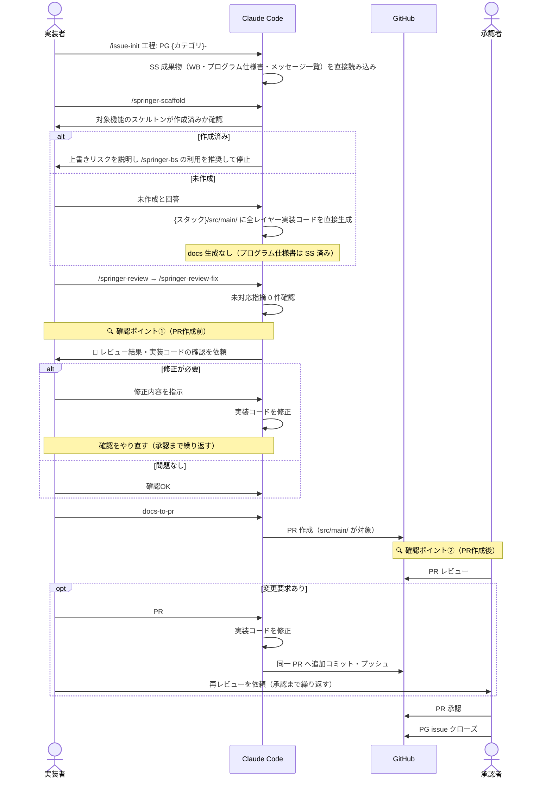

| Step | STEP名 | 人の指示（Claude への入力） | AI/システム処理 | 成果物 | 担当 | 人の役割 |
|---|---|---|---|---|---|---|
| 1 | 工程着手 | `/issue-init 工程: PG {カテゴリ}-### {スタック}` | PG issue 起票・ブランチ作成／SS 成果物（WB・プログラム仕様書・メッセージ一覧）を直接読み込み | PG issue | 実装者 | 機能ID({カテゴリ}-###)を指定してissue-initを実行 |
| 2 | スケルトン確認 | `/springer-scaffold` | スケルトンが作成済みかを確認（作成済みなら上書きリスクを説明し `/springer-bs` を推奨して停止） | - | 実装者 | 作成済みか回答 |
| 3 | 実装生成 | - | `{スタック}/src/main/` に全レイヤー実装コードを直接生成（未作成の場合のみ） | 実装コード | - | 特になし |
| 4 | 実装レビュー | `/springer-review` → `/springer-review-fix` | 未対応指摘 0 件を確認／📝確認を依頼 | レビュー結果 | - | 特になし |
| 5 | 🔍 **確認①：PR作成前** | - | - | - | 実装者 | **レビュー結果・実装コードを確認**（OK なら Step6へ／NG なら Step5a へ） |
| 5a | ┗ 修正（NGの場合のみ） | 修正内容を指示 | 実装コードを修正 | 修正済みコード | 実装者 | 修正内容を指示（Step5に戻り再確認） |
| 6 | PR作成 | `docs-to-pr` | PR 作成（`src/main/` が対象） | PR | 実装者 | 特になし |
| 7 | 🔍 **確認②：PR作成後** | - | - | - | 承認者 | **PR をレビュー**（承認なら Step8へ／変更要求なら Step7a へ） |
| 7a | ┗ 指摘取込み（変更要求の場合のみ） | `PR #{N} のレビュー指摘を取り込んで` | 実装コードを修正・追加コミット | 修正コミット | 実装者 | 承認者へ再レビューを依頼（承認まで Step7・7a を繰り返す） |
| 8 | ゲート承認・クローズ | - | - | - | 承認者 | PR 承認・PG issue クローズ |

#### プロンプト例

**Step1**
```
> /issue-init 工程: PG bs-002 bs
```

**Step2**
```
> /springer-scaffold
```

**Step2 回答例**（スケルトン作成済みか確認された場合）
```
> 未作成です。新規に生成してください。
```

**Step4 実装レビュー**
```
> /springer-review
```
```
> /springer-review-fix
```

**Step5a 修正指示例**
```
> InventoryAlertServiceImpl の判定ロジックが「生鮮食品カテゴリのみ」という要件を満たしていません。カテゴリコードによる絞り込みを追加してください。
```

**Step6**
```
> docs-to-pr
```

**Step7a**
```
> PR #27 のレビュー指摘を取り込んで
```

***

### 5.9 工程7 PT-Plan 単体テスト計画

#### 目的

* 各スタックの単体テスト方針を記載した単体テスト計画を作成する

#### 成果物一覧

| リポジトリ | 成果物格納パス | 関連スキル |
| --- | --- | --- |
| スタックリポジトリ | `specs/{案件キー}/unit-test-plan/{issue_id}/plan.md` | `/issue-plan` |

> 本工程は 付録A.1 の生成対象（工程設計ドキュメント）を持たない。

#### シーケンス

> Step1〜4（PR作成まで）は実装者、Step5 以降（PRレビュー〜クローズ）は承認者が担当する。sub-issue 起票（Step7）は実装者が行う。

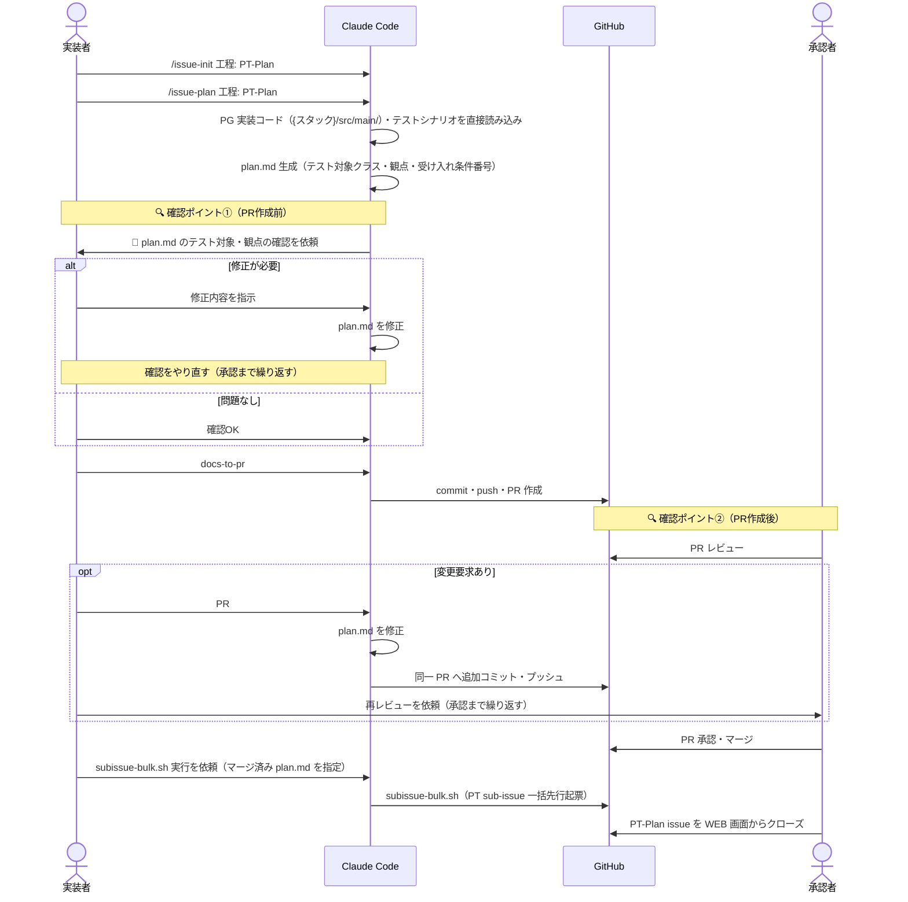

| Step | STEP名 | 人の指示（Claude への入力） | AI/システム処理 | 成果物 | 担当 | 人の役割 |
|---|---|---|---|---|---|---|
| 1 | 工程着手 | `/issue-init 工程: PT-Plan` | PT-Plan issue 起票・ブランチ作成 | PT-Plan issue | 実装者 | 特になし |
| 2 | 棚卸し生成 | `/issue-plan 工程: PT-Plan` | PG 実装コード・テストシナリオを直接読み込み／`plan.md` 生成（テスト対象クラス・観点・受け入れ条件番号）／📝確認を依頼 | `plan.md` | - | 特になし |
| 3 | 🔍 **確認①：PR作成前** | - | - | - | 実装者 | **plan.md のテスト対象・観点を確認**（OK なら Step4へ／NG なら Step3a へ） |
| 3a | ┗ 修正（NGの場合のみ） | 修正内容を指示 | plan.md を修正 | 修正済み plan.md | 実装者 | 修正内容を指示（Step3に戻り再確認） |
| 4 | PR作成 | `docs-to-pr` | commit・push・PR 作成 | PR | 実装者 | 特になし |
| 5 | 🔍 **確認②：PR作成後** | - | - | - | 承認者 | **PR をレビュー**（承認なら Step6へ／変更要求なら Step5a へ） |
| 5a | ┗ 指摘取込み（変更要求の場合のみ） | `PR #{N} のレビュー指摘を取り込んで` | plan.md を修正・追加コミット | 修正コミット | 実装者 | 承認者へ再レビューを依頼（承認まで Step5・5a を繰り返す） |
| 6 | ゲート承認・マージ | - | - | - | 承認者 | PR 承認・マージ |
| 7 | sub-issue起票 | `subissue-bulk.sh 実行を依頼` | `subissue-bulk.sh`（マージ済み plan.md を指定し PT sub-issue を一括先行起票） | PT sub-issue 群 | 実装者 | 特になし |
| 8 | issueクローズ | - | - | - | 承認者 | PT-Plan issue を GitHub WEB 画面からクローズ |

#### プロンプト例

**Step1**
```
> /issue-init 工程: PT-Plan
```

**Step2**
```
> /issue-plan 工程: PT-Plan
```

**Step3a 修正指示例**
```
> InventoryAlertService のテスト観点に、対象商品データが0件の場合の異常系観点が抜けています。追加してください。
```

**Step4**
```
> docs-to-pr
```

**Step5a**
```
> PR #30 のレビュー指摘を取り込んで
```

**Step7 sub-issue起票依頼**
```
> subissue-bulk.sh の実行をお願いします。マージ済みの plan.md を指定して、bs-002 の PT sub-issue を起票してください。
```

***

### 5.10 工程8 PT 単体テスト

#### 目的

* 単体テスト計画工程で作成したplan.mdを元に単体テストコードを生成し、単体テストを実施する（Springer系スタック: `/springer-unit-test-gen`／frontend: `/reacter-unit-test-gen`）

#### 成果物一覧

| リポジトリ | 成果物格納パス | 関連スキル |
| --- | --- | --- |
| スタックリポジトリ（bs/us-api/us-mpa/batch） | `src/test/` | `/springer-unit-test-gen` |
| スタックリポジトリ（bs/us-api/us-mpa/batch） | `docs/unit-test/テスト仕様書_{機能ID}.md` | `/springer-unit-test-gen` |
| スタックリポジトリ（bs/us-api/us-mpa/batch） | `docs/unit-test/テスト計画書.md` | `/springer-unit-test-gen` |
| スタックリポジトリ（bs/us-api/us-mpa/batch） | `docs/unit-test/機能要件対比表.md` | `/springer-unit-test-gen` |
| スタックリポジトリ（frontend） | `frontend/src/features/{feature}/__tests__/`・`frontend/src/shared/__tests__/` | `/reacter-unit-test-gen` |
| スタックリポジトリ（frontend） | `frontend/docs/unit-test/テスト仕様書_{機能ID}.md` | `/reacter-unit-test-gen` |
| スタックリポジトリ（frontend） | `frontend/docs/unit-test/テスト計画書.md` | `/reacter-unit-test-gen` |
| スタックリポジトリ（frontend） | `frontend/docs/unit-test/機能要件対比表.md` | `/reacter-unit-test-gen` |
| スタックリポジトリ | `specs/{案件キー}/unit-test/{issue_id}_{機能ID}/consistency-report.md` | `/consistency-check` |
| スタックリポジトリ（全スタック・リリース前ゲート） | `docs/unit-test/妥当性確認実施票_{機能ID}.md` | *(生成スキルなし・人間が作成)* |

> 妥当性確認実施票は `/springer-unit-test-gen`・`/reacter-unit-test-gen` のいずれのスコープでもない。PT 完了後、人間が任意のタイミングで作成する。テストコードの配置もSpringer系（`src/test/`）とfrontend（`__tests__/`）で異なり、frontendはソースツリーに同居させる（`frontend/CLAUDE.md` のディレクトリ構成規約）。

#### シーケンス

> Step1〜5（PR作成まで）は実装者、Step6 以降（PRレビュー〜クローズ）は承認者が担当する。

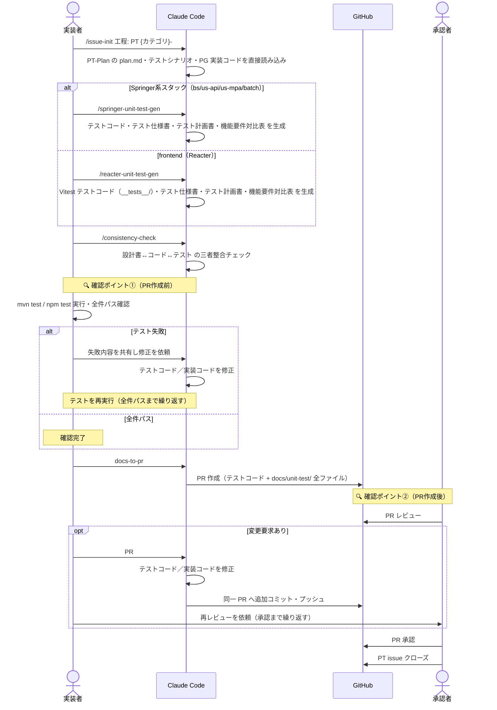

| Step | STEP名 | 人の指示（Claude への入力） | AI/システム処理 | 成果物 | 担当 | 人の役割 |
|---|---|---|---|---|---|---|
| 1 | 工程着手 | `/issue-init 工程: PT {カテゴリ}-### {スタック}` | PT issue 起票・ブランチ作成／PT-Plan の plan.md・テストシナリオ・PG 実装コードを直接読み込み | PT issue | 実装者 | 機能ID({カテゴリ}-###)を指定してissue-initを実行 |
| 2 | テスト生成 | `/springer-unit-test-gen`（Springer系）／`/reacter-unit-test-gen`（frontend） | Springer系: テストコード・テスト仕様書・テスト計画書・機能要件対比表 を生成／frontend: Vitest テストコード・テスト仕様書・テスト計画書・機能要件対比表 を生成（妥当性確認実施票はいずれも対象外。PT完了後に人間が作成） | テストコード／テスト仕様書等 | - | 特になし |
| 3 | 三者整合チェック | `/consistency-check` | 設計書↔コード↔テストの三者整合チェック | 整合チェック結果 | - | 特になし |
| 4 | 🔍 **確認①：PR作成前** | - | - | - | 実装者 | **`mvn test`／`npm test` 実行・全件パス確認**（全件パスなら Step5へ／失敗なら Step4a へ） |
| 4a | ┗ 修正（失敗の場合のみ） | 失敗内容を共有し修正を依頼 | テストコード／実装コードを修正 | 修正済みコード | 実装者 | 修正を依頼（Step4に戻り再実行） |
| 5 | PR作成 | `docs-to-pr` | PR 作成（テストコード + `docs/unit-test/` 全ファイル） | PR | 実装者 | 特になし |
| 6 | 🔍 **確認②：PR作成後** | - | - | - | 承認者 | **PR をレビュー**（承認なら Step7へ／変更要求なら Step6a へ） |
| 6a | ┗ 指摘取込み（変更要求の場合のみ） | `PR #{N} のレビュー指摘を取り込んで` | テストコード／実装コードを修正・追加コミット | 修正コミット | 実装者 | 承認者へ再レビューを依頼（承認まで Step6・6a を繰り返す） |
| 7 | ゲート承認・クローズ | - | - | - | 承認者 | PR 承認・PT issue クローズ |

#### プロンプト例

**Step1**
```
> /issue-init 工程: PT bs-002 bs
```

**Step2（Springer系スタック）**
```
> /springer-unit-test-gen
```

**Step2（frontendスタック）**
```
> /reacter-unit-test-gen
```

**Step3**
```
> /consistency-check
```

**Step4a 失敗内容共有例**
```
> InventoryAlertServiceImplTest の testFindAlertsBelowThreshold が失敗しています。期待値と実装のカテゴリ判定条件（生鮮食品カテゴリのみ）が一致していないようです。修正してください。
```

**Step5**
```
> docs-to-pr
```

**Step6a**
```
> PR #33 のレビュー指摘を取り込んで
```

***


## 付録A. 工程ごとの成果物

### A.1 設計標準テンプレート（工程設計ドキュメント）

| 工程   | リポジトリ                        | 成果物格納パス                                     | 関連スキル                                 |
| ---- | ----------------------------- | -------------------------------------------- | ------------------------------------- |
| SA   | 案件リポジトリ                        | `[案件リポジトリ]/docs/requirements/業務概要.md`                  | `/requirement-doc-gen`                |
| SA   | 案件リポジトリ                        | `[案件リポジトリ]/docs/requirements/システム全体図.md`               | `/requirement-doc-gen`                |
| SA   | 案件リポジトリ                        | `[案件リポジトリ]/docs/requirements/システム化業務フロー.md`            | `/requirement-doc-gen`                |
| SA   | 案件リポジトリ                        | `[案件リポジトリ]/docs/requirements/要件一覧.md`                  | `/case-init`                    |
| SA   | 案件リポジトリ                        | `[案件リポジトリ]/docs/requirements/要件定義_{要件ID}.md`           | `issue-to-requirement`、`/requirement-doc-gen` |
| SA   | 案件リポジトリ                        | `[案件リポジトリ]/docs/requirements/コード定義書.md`                | `/requirement-doc-gen`                |
| SA   | 案件リポジトリ                        | `[案件リポジトリ]/docs/requirements/画面レイアウト.md`               | `/requirement-doc-gen`                |
| SA   | 案件リポジトリ                        | `[案件リポジトリ]/docs/requirements/ユースケース図.md`               | `/requirement-doc-gen`                |
| SA   | 案件リポジトリ                        | `[案件リポジトリ]/docs/requirements/画面遷移図.md`                 | `/requirement-doc-gen`                |
| SA   | 案件リポジトリ                        | `[案件リポジトリ]/docs/requirements/帳票レイアウト.md`（該当時のみ）        | `/requirement-doc-gen`                |
| UI   | 案件リポジトリ                        | `[案件リポジトリ]/docs/base-design/機能一覧.md`                   | `/case-init`、`/basic-design-gen`） |
| UI   | 案件リポジトリ                        | `[案件リポジトリ]/docs/base-design/Web_API_IF一覧表.md`          | `/basic-design-gen`                   |
| UI   | 案件リポジトリ                        | `[案件リポジトリ]/docs/base-design/Web_API_IF定義書_{機能ID}.md`   | `/basic-design-gen`                   |
| UI   | 案件リポジトリ                        | `[案件リポジトリ]/docs/base-design/機能概要_{機能ID}.md`            | `/basic-design-gen`                   |
| UI   | 案件リポジトリ                        | `[案件リポジトリ]/docs/base-design/シーケンス図_{機能ID}.md`          | `/basic-design-gen`                   |
| UI   | 案件リポジトリ                        | `[案件リポジトリ]/docs/base-design/テーブル一覧.md`                | `/basic-design-gen`                   |
| UI   | 案件リポジトリ                        | `[案件リポジトリ]/docs/base-design/テーブル定義書_{テーブルID}_{テーブル名}.md`（bs/batch のみ） | `/basic-design-gen`                   |
| UI   | 案件リポジトリ                        | `[案件リポジトリ]/docs/base-design/実装対象クラス一覧.md`             | `/basic-design-gen`                   |
| UI   | 案件リポジトリ                        | `[案件リポジトリ]/docs/base-design/テストシナリオ.md`                | `/basic-design-gen`                   |
| UI   | 案件リポジトリ                        | `[案件リポジトリ]/docs/base-design/ロバストネス図_{要件ID}.md`         | `/basic-design-gen`                   |
| UI   | 案件リポジトリ                        | `[案件リポジトリ]/docs/base-design/クラス図.md`                   | `/basic-design-gen`                   |
| UI   | 案件リポジトリ                        | `[案件リポジトリ]/docs/base-design/画面状態遷移図_{機能ID}.md`         | `/basic-design-gen`                   |
| UI   | 案件リポジトリ                        | `[案件リポジトリ]/docs/base-design/ファイルレイアウト一覧_{機能ID}.md`     | `/basic-design-gen`                   |
| UI   | 案件リポジトリ                        | `[案件リポジトリ]/docs/base-design/ファイル定義書_{機能ID}.md`         | `/basic-design-gen`                   |
| SS   | スタックリポジトリ（bs/us-api/us-mpa/batch）      | `[スタックリポジトリ]/docs/detail-design/外部IF定義書.md`（外部連携がある場合のみ・累積） | `/detailed-design-gen`                          |
| SS   | スタックリポジトリ（bs/us-api/us-mpa/batch）      | `[スタックリポジトリ]/docs/detail-design/プログラム仕様書_{機能ID}.md`      | `/detailed-design-gen`                          |
| SS   | スタックリポジトリ（frontend）                   | `[スタックリポジトリ]/docs/detail-design/コンポーネント仕様書_{機能ID}.md`    | `/detailed-design-gen`                          |
| SS   | スタックリポジトリ（frontend）                   | `[スタックリポジトリ]/docs/detail-design/画面アクション遷移図_{機能ID}.md`    | `/detailed-design-gen`                          |
| SS   | スタックリポジトリ（bs/us-api/us-mpa/batch）      | `[スタックリポジトリ]/docs/detail-design/メッセージ一覧.md`              | `/detailed-design-gen`                          |
| SS   | スタックリポジトリ（batch）                      | `[スタックリポジトリ]/docs/detail-design/ジョブネット一覧.md`             | `/batch-design-gen`                             |
| SS   | スタックリポジトリ（batch）                      | `[スタックリポジトリ]/docs/detail-design/ジョブフロー一覧_{機能ID}.md`       | `/batch-design-gen`                             |
| PT   | スタックリポジトリ（bs/us-api/us-mpa/batch）      | `[スタックリポジトリ]/docs/unit-test/テスト仕様書_{機能ID}.md`            | `/springer-unit-test-gen`                       |
| PT   | スタックリポジトリ（bs/us-api/us-mpa/batch）      | `[スタックリポジトリ]/docs/unit-test/テスト計画書.md`                   | `/springer-unit-test-gen`                       |
| PT   | スタックリポジトリ（bs/us-api/us-mpa/batch）      | `[スタックリポジトリ]/docs/unit-test/機能要件対比表.md`                  | `/springer-unit-test-gen`                       |
| PT   | スタックリポジトリ（frontend）                   | `[スタックリポジトリ]/docs/unit-test/テスト仕様書_{機能ID}.md`            | `/reacter-unit-test-gen`                        |
| PT   | スタックリポジトリ（frontend）                   | `[スタックリポジトリ]/docs/unit-test/テスト計画書.md`                   | `/reacter-unit-test-gen`                        |
| PT   | スタックリポジトリ（frontend）                   | `[スタックリポジトリ]/docs/unit-test/機能要件対比表.md`                  | `/reacter-unit-test-gen`                        |
| リリース前ゲート ★ | スタックリポジトリ（全スタック）           | `[スタックリポジトリ]/docs/unit-test/妥当性確認実施票_{機能ID}.md`          | *(生成スキルなし・人間が作成)* |

### A.2 AI生成中間ドキュメント全量（specs/ 配下）

> **WB（Work Buffer）**: `controller.md`/`service.md`/`repository.md`/`frontend.md`/`batch.md` を指す。SS 工程で生成し PG 工程のコード生成入力として使う**一時的な中間成果物**であり、`docs/` の正式設計書（プログラム仕様書・コンポーネント仕様書等）とは異なる（`specs/{案件キー}/detail-design/` 配下に格納）。

| 工程 | リポジトリ | 成果物格納パス | 関連スキル | 後工程への役割 |
| --- | --- | --- | --- | --- |
| 全工程 | 案件リポジトリ | `[案件リポジトリ]/specs/{案件キー}/meta.md` | `/case-init` | 案件基本情報・要件ID/機能ID採番表・issue-id対応表・手戻り管理表 |
| 全工程 | 案件リポジトリ（SA/UI/SS-Plan）／スタックリポジトリ（SS以降） | `[案件リポジトリ]/specs/{案件キー}/{工程パス}/{issue_id}/discussion-log.md`（SS以降は `[スタックリポジトリ]/specs/{案件キー}/{工程パス}/{issue_id}_{機能ID}/discussion-log.md`） | `/issue-init` | 意思決定の記録 |
| 全工程 | 案件リポジトリ（SA/UI/SS-Plan）／スタックリポジトリ（SS以降） | `[案件リポジトリ]/specs/{案件キー}/{工程パス}/{issue_id}/meta.md`（SS以降は `[スタックリポジトリ]/specs/{案件キー}/{工程パス}/{issue_id}_{機能ID}/meta.md`） | `/issue-init` | 当該issueの影響スタック・工程・issue種別の記録 |
| 全工程 | 案件リポジトリ（SA/UI/SS-Plan）／スタックリポジトリ（SS以降） | `[案件リポジトリ]/specs/{案件キー}/{工程パス}/{issue_id}/work-log.md`（SS以降は `[スタックリポジトリ]/specs/{案件キー}/{工程パス}/{issue_id}_{機能ID}/work-log.md`） | フック自動生成 + `/work-log` | 作業ログ（自動記録＋手動メモ追記） |
| 全工程 | 案件リポジトリ（SA/UI/SS-Plan）／スタックリポジトリ（SS以降） | `[案件リポジトリ]/specs/{案件キー}/{工程パス}/{issue_id}/llm-usage.jsonl`（SS以降は `[スタックリポジトリ]/specs/{案件キー}/{工程パス}/{issue_id}_{機能ID}/llm-usage.jsonl`） | フック自動生成 | AI 工数 |
| SA | 案件リポジトリ | `[案件リポジトリ]/specs/{案件キー}/requirements/{issue_id}/adr/ADR-SA-{n}-requirements.md` | `issue-to-requirement` | 要件定義工程の決定事項記録 |
| UI | 案件リポジトリ | `[案件リポジトリ]/specs/{案件キー}/base-design/{issue_id}/adr/ADR-UI-{n}-design.md` | `issue-to-design` | 基本設計工程の決定事項記録 |
| UI | 案件リポジトリ | `[案件リポジトリ]/specs/{案件キー}/base-design/{issue_id}/review-report.md` | `/basic-design-review` | 基本設計レビュー結果 |
| SS-Plan | 案件リポジトリ | `[案件リポジトリ]/specs/{案件キー}/detail-design-plan/{issue_id}/plan.md` | `/issue-plan` | sub-issue 起票の入力 |
| SS | スタックリポジトリ | `[スタックリポジトリ]/specs/{案件キー}/detail-design/{issue_id}_{機能ID}/controller.md` / `service.md` / `repository.md` | `/detailed-design-gen` | WB（PG の設計入力） |
| SS | スタックリポジトリ（frontend/batch） | `[スタックリポジトリ]/specs/{案件キー}/detail-design/{issue_id}_{機能ID}/frontend.md` / `batch.md` | `/detailed-design-gen` | WB |
| SS | スタックリポジトリ | `[スタックリポジトリ]/specs/{案件キー}/detail-design/{issue_id}_{機能ID}/adr/ADR-SS-{n}-design.md` | `/detailed-design-review-*` | 詳細設計工程の決定事項記録（finding 0件でも必須起票） |
| SS | スタックリポジトリ | `[スタックリポジトリ]/specs/{案件キー}/detail-design/{issue_id}_{機能ID}/review-report.md` | `/detailed-design-review-*` | 詳細設計レビュー結果 |
| PG-Plan | スタックリポジトリ | `[スタックリポジトリ]/specs/{案件キー}/implementation-plan/{issue_id}/plan.md` | `/issue-plan` | sub-issue 起票の入力 |
| PG（backend） | スタックリポジトリ | `[スタックリポジトリ]/specs/{案件キー}/implementation/{issue_id}_{機能ID}/springer-review-{対象名}-{タイムスタンプ}/summary.md` 等（MAY.md・観点ID別ファイル含む） | `/springer-review` | 実装レビュー結果 |
| PG（frontend） | スタックリポジトリ（frontend） | `[スタックリポジトリ]/specs/{案件キー}/implementation/{issue_id}_{機能ID}/reacter_code_review_{タイムスタンプ}/summary.md` 等 | `/reacter-code-review` | 実装レビュー結果 |
| PT-Plan | スタックリポジトリ | `[スタックリポジトリ]/specs/{案件キー}/unit-test-plan/{issue_id}/plan.md` | `/issue-plan` | sub-issue 起票の入力 |
| PT | スタックリポジトリ | `[スタックリポジトリ]/specs/{案件キー}/unit-test/{issue_id}_{機能ID}/consistency-report.md` | `/consistency-check` | 三者整合確認記録 |
| 手戻り | 原因工程に従う（案件リポジトリ or スタックリポジトリ） | `.../rework/{手戻りID}/ADR-rework-{NNN}.md` | `/rework-guide` | 手戻りの原因・影響範囲・再スタート方針の記録 |
| 手戻り | 原因工程に従う（案件リポジトリ or スタックリポジトリ） | `.../rework/{手戻りID}/rework-impact-report-{m}.md` | `rework-trace`エージェント | 影響範囲記録 |


## 付録B. ADR（Architecture-Decision-Record）の作成について

### 概要

ADR は各工程の壁打ちで決定した内容を「1 ADR = 1 決定事項」の粒度で記録する文書。
**SA・UI・SS 工程、および手戻り発生時**に作成する（各 Plan 工程・PG・PT では作成しない）。

### 目的

壁打ちの結果をそのまま流すと、後工程で「なぜこの設計にしたか」を追跡できず、
手戻り発生時の原因調査（rework-trace）や後続工程からの参照ができなくなる。
ADR を必須ゲートにすることで、決定の根拠・理由・未確定事項を構造化して残し、
工程を追うだけで意思決定の経緯を再現できるようにする。

### 作成される工程・命名規則・配置先

| 工程 | リポジトリ | 命名規則 | 配置先（specs 配下） | 起票の契機 |
|---|---|---|---|---|
| SA 要件定義 | **案件リポジトリ** | `ADR-SA-{n}-requirements.md` | `specs/{案件キー}/requirements/{issue_id}/adr/` | `issue-to-requirement.md` Step8（壁打ち後・`/requirement-doc-gen` 実行前） |
| UI 基本設計 | **案件リポジトリ** | `ADR-UI-{n}-design.md` | `specs/{案件キー}/base-design/{issue_id}/adr/` | `issue-to-design.md` Step9（壁打ち後・`/basic-design-gen` 実行前） |
| SS 詳細設計 | **スタックリポジトリ** | `ADR-SS-{n}-design.md` | `{スタック}/specs/{案件キー}/detail-design/{issue_id}_{機能ID}/adr/` | `/detailed-design-review-*` 実行後（**finding 0件でも必ず起票**） |
| 手戻り | 原因工程に従う（案件リポジトリ or スタックリポジトリ） | `ADR-rework-{手戻りID}.md` | 原因工程に従う（`.../rework/{手戻りID}/`） | `/rework-guide` 実施時 |

> ⚠️ SA・UI は「案件リポジトリ」直下の `specs/{案件キー}/...`、SS は「スタックリポジトリ」側（`{スタック}/` プレフィックス付き）の `{スタック}/specs/{案件キー}/...` であり、**同じ `specs/` でも実体は別リポジトリ**（3 リポジトリ構成。`.claude/rules/github-ops.md` §1・§3-B 参照）。SS 以降は各スタックリポジトリで自己完結するため、SA/UI の ADR をそのまま参照できない点に注意。

* `{n}` は 001, 002, ... の連番（工程 issue 内で既存ファイルの続きから採番）
* 1 つの決定事項につき 1 ファイル（決定が複数あれば同じ工程内で複数 ADR を起票）

#### 作成フロー（AI がドラフト作成 → 人間が承認）

ADR は完全な AI 自動生成ではなく、**AI がドラフトを作成し、人間が承認してから確定する**運用です。

| フェーズ | 実施者 | 内容 |
|---|---|---|
| ① ドラフト作成 | AI | `discussion-log.md` に記録された決定事項ごとに、ADR テンプレート（`adr-template.md`）に従いドラフトを連番で作成 |
| ② 提示 | AI | 作成した全ドラフトをユーザーに提示 |
| ③ 承認 | **人間** | ドラフト内容（背景・決定事項・理由・影響・未確定事項）を確認。問題があれば修正を指示 |
| ④ 確定書き込み | AI | 承認後、正式ファイルとして `adr/ADR-{工程}-{n}-....md` に書き込み |

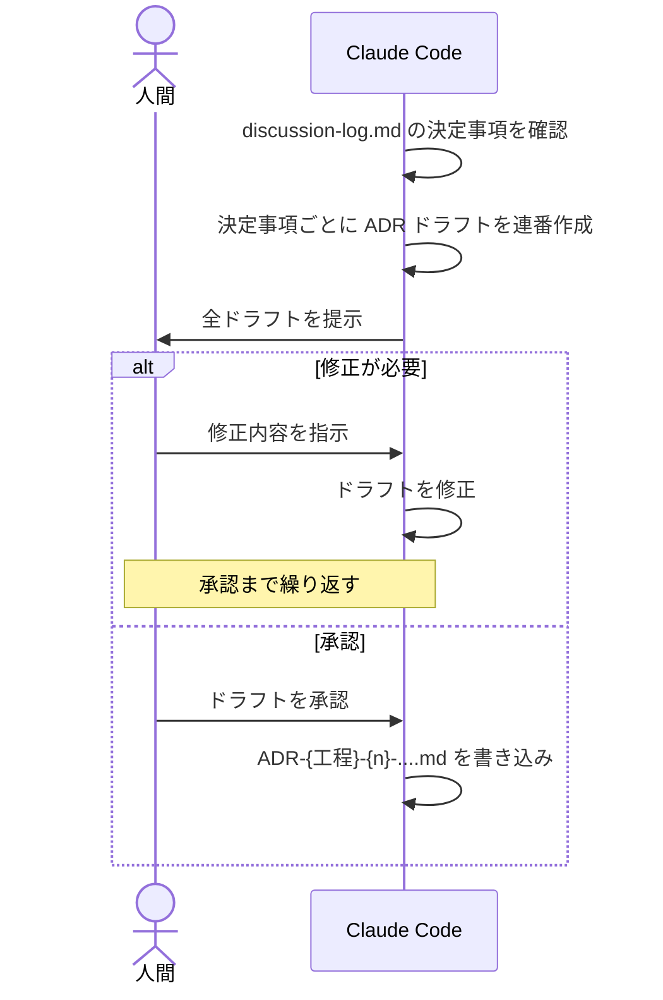

> 5.3（SA）・5.4（UI）・5.6（SS）のシーケンス図内「ADR ドラフトを提示 → 承認 → 書き込み」は、
> 本フローの各工程での実例です。

#### ADR に記載する内容

* メタ情報：日付・ステータス・対象案件/issue・起票工程・関連 ADR（例: UI の ADR は関連する SA の ADR を参照）
* 背景：①状況（前工程で確定したスコープ）／②課題（今回の工程で解決が必要だった論点）／③制約
* 決定事項：この ADR が扱う **1 つ**の決定内容（API 設計・DB スキーマ・実装クラス構成 等、工程に応じた粒度）
* 理由：採用・却下した選択肢とその根拠
* 影響：後続工程への影響
* 未確定事項：後工程で確定すべき残課題（チェックリスト形式）

#### 工程間の連動

UI 工程で ADR-UI-{n} を確定した際、対応する SA 工程の `ADR-SA-{n}-requirements.md` の「未確定事項」欄を、
UI 工程で確定した内容に基づいて更新する（後工程が前工程の ADR を読み、未決定事項を潰していく連動）。

#### 手戻り発生時の ADR

手戻り（`/rework-guide`）発生時は、原因工程に応じて `ADR-rework-{手戻りID}.md` を起票する。
通常の ADR 起票と異なり、**手戻りの原因・影響範囲・再スタート方針**を記録する専用フォーマットを使う
（詳細は 付録C（手戻りワークフロー）を参照）。

## 付録C. 手戻りワークフロー

### 目的

すべての手戻りを単一フローで管理することでルールの一貫性を保つ。手戻りは工程に属さない**横断機構**であり、`consistency-check` のエスカレーション・レビュー指摘・実装者の気づきなど、発生トリガーを問わず本フローに合流する。

#### 全体像（判定フロー）

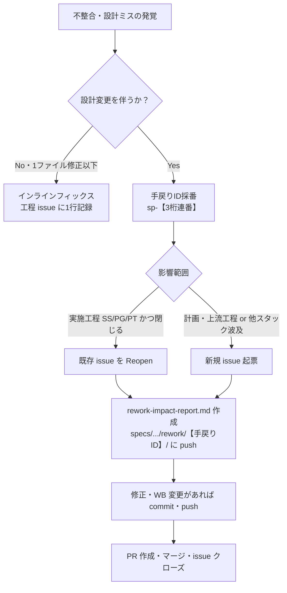

#### 成果物一覧

| リポジトリ | 成果物格納パス | 関連スキル |
| --- | --- | --- |
| 案件リポジトリ or スタックリポジトリ（原因工程に従う） | `.../specs/{案件キー}/rework/{m}/rework-impact-report-{m}.md` | `rework-trace` |
| 案件リポジトリ or スタックリポジトリ（原因工程に従う） | `.../specs/{案件キー}/rework/{m}/ADR-rework-{NNN}.md` | `/rework-guide` |
| 案件リポジトリ | `specs/{案件キー}/meta.md`（手戻り管理表への追記） | - |

> 格納先は**原因工程**に従う：SA/UI/SS-Plan 起因＝案件リポジトリ側 `specs/{案件キー}/rework/{m}/`／SS/PG-Plan/PG/PT-Plan/PT 起因＝スタックリポジトリ側 `{スタック}/specs/{案件キー}/rework/{m}/`。

#### シーケンス

> インラインフィックス（3条件をすべて満たす軽微な修正）は Step1a で完了する。それ以外は Step2 以降の本フロー（縦方向診断 → 横展開調査・ADR起票 → 手戻りID採番・issue運用 → 再スタート → PR）に進む。Step2〜9（PR作成まで）は実装者、Step10 以降（PRレビュー〜クローズ）は承認者が担当する。

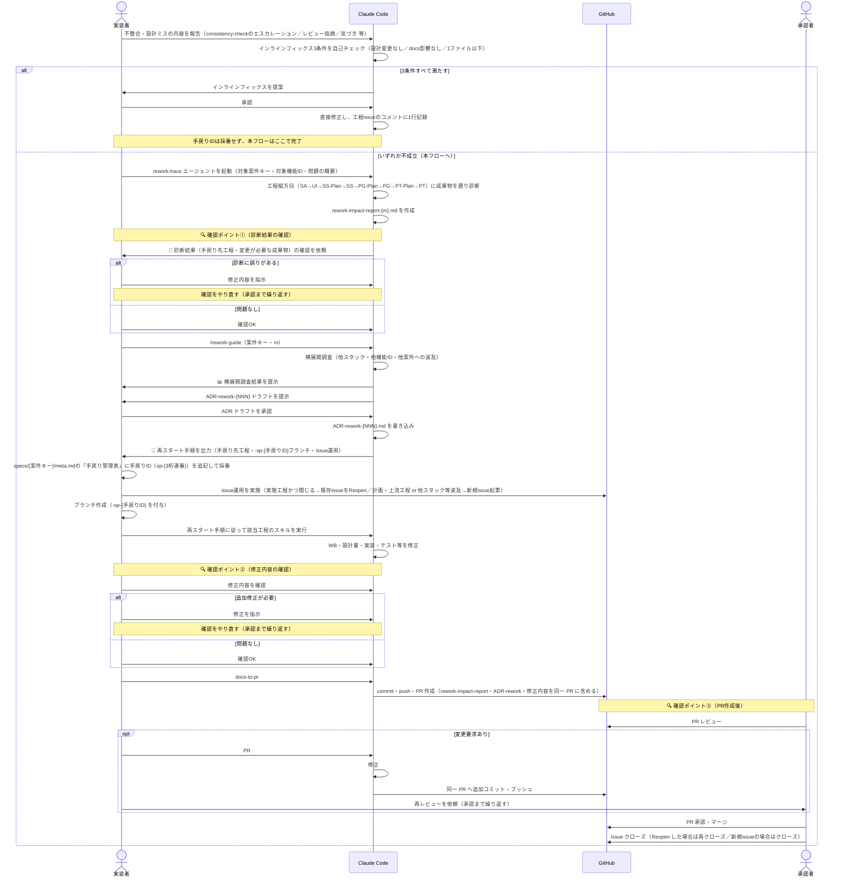

| Step | STEP名 | 人の指示（Claude への入力） | AI/システム処理 | 成果物 | 担当 | 人の役割 |
|---|---|---|---|---|---|---|
| 1 | 不整合の報告 | 不整合・設計ミスの内容を報告 | インラインフィックス3条件を自己チェック | - | 実装者 | 発覚した不整合の内容を伝える |
| 1a | ┗ インラインフィックス（3条件すべて満たす場合のみ） | 提案内容を承認 | 直接修正し工程issueのコメントに1行記録 | 修正済みファイル | 実装者 | 提案を承認（本フローはここで完了。Step2以降は対象外） |
| 2 | 縦方向診断 | `rework-trace` エージェントを起動（対象案件キー・対象機能ID・問題の概要） | 工程縦方向に成果物を遡り診断／`rework-impact-report-{m}.md` を作成 | `rework-impact-report-{m}.md` | - | 特になし |
| 3 | 🔍 **確認①：診断結果** | - | - | - | 実装者 | **診断結果を確認**（OK なら Step4へ／NG なら Step3a へ） |
| 3a | ┗ 修正（NGの場合のみ） | 修正内容を指示 | 診断をやり直す | - | 実装者 | 修正内容を指示（Step3に戻り再確認） |
| 4 | 横展開調査・ADR起票 | `/rework-guide`（案件キー・m） | 横展開調査（他スタック・他機能ID・他案件）／`ADR-rework-{NNN}` ドラフトを提示 | 横展開調査結果／ADRドラフト | - | 特になし |
| 5 | ADR承認 | ADRドラフトを承認 | `ADR-rework-{NNN}.md` を書き込み／再スタート手順を出力 | `ADR-rework-{NNN}.md` | 実装者 | ドラフトを確認・承認 |
| 6 | 手戻りID採番・issue運用 | - | - | - | 実装者 | `meta.md`の手戻り管理表にID（`sp-{3桁連番}`）を追記／issue運用（Reopenまたは新規起票）／ブランチ作成（`-sp-{手戻りID}`） |
| 7 | 再スタート・修正 | 再スタート手順に従い該当工程のスキルを実行 | WB・設計書・実装・テスト等を修正 | 修正済み成果物 | 実装者 | 特になし |
| 8 | 🔍 **確認②：修正内容** | - | - | - | 実装者 | **修正内容を確認**（OK なら Step9へ／NG なら Step8a へ） |
| 8a | ┗ 修正（NGの場合のみ） | 修正内容を指示 | 修正 | 修正済みファイル | 実装者 | 修正内容を指示（Step8に戻り再確認） |
| 9 | PR作成 | `docs-to-pr` | commit・push・PR 作成（rework-impact-report・ADR-rework・修正を同一PRに含める） | PR | 実装者 | 特になし |
| 10 | 🔍 **確認③：PR作成後** | - | - | - | 承認者 | **PR をレビュー**（承認なら Step11へ／変更要求なら Step10a へ） |
| 10a | ┗ 指摘取込み（変更要求の場合のみ） | `PR #{N} のレビュー指摘を取り込んで` | 修正・追加コミット | 修正コミット | 実装者 | 承認者へ再レビューを依頼（承認まで Step10・10a を繰り返す） |
| 11 | ゲート承認・クローズ | - | - | - | 承認者 | PR 承認・issue クローズ |

#### プロンプト例

**Step1**
```
> consistency-check で [設計不整合] が検出され、上位波及の可能性があります。診断をお願いします。
```

**Step1a 承認例（インラインフィックスの場合）**
```
> その修正でお願いします。
```

**Step2**
```
> rework-trace エージェントを起動してください
> 対象案件キー: foodshop-2026-003
> 対象機能ID: bs-002
> 問題の概要: 在庫アラート判定APIの閾値項目名が基本設計と詳細設計で一致していない
```

**Step3a 修正指示例**
```
> 手戻り先工程の判定が違います。テーブル定義書の変更を伴うため UI 工程まで遡ってください。
```

**Step4**
```
> /rework-guide
> 案件キー: foodshop-2026-003
> m: 01
```

**Step5 ADR承認**
```
> ADR-rework-001 のドラフトを承認します。
```

**Step7 再スタート実行例（工程4 SSに戻る場合）**
```
> /detailed-design-gen
```

**Step9**
```
> docs-to-pr
```

**Step10a**
```
> PR #40 のレビュー指摘を取り込んで
```

***


## 付録D. Claude Codeのセッションの考え方

### 目的

本テンプレートの各工程は複数日〜複数週にわたることが多い。`claude` をいつ終了してよいか、続きから再開するにはどうすればよいかを理解しておく。

### 基本動作

* `claude` をディレクトリ内で実行すると、そのたびに**新規セッション**として開始する（前回の会話は自動では引き継がれない）
* `Ctrl+C` または `Ctrl+D` で終了すれば会話は自動的に保存される。終了前に特別な操作は不要
* セッションは実行したプロジェクトディレクトリに紐づいて保存される（既定30日で自動削除。`settings.json` の `cleanupPeriodDays` で変更可能）

### 再開方法

| 目的 | コマンド |
|---|---|
| 直前のセッションにそのまま戻る | `claude --continue`（同じディレクトリで実行） |
| 過去のセッション一覧から選んで戻る | `claude --resume`（起動前に実行）／チャット内で `/resume`（起動後） |
| 名前を付けたセッションに戻る | `claude --resume {名前}`／チャット内で `/resume {名前}` |

### セッションに名前を付ける（rename）

過去のセッションが増えると一覧から探しづらくなるため、案件キー・工程単位で名前を付けておくと再開しやすくなる。

| タイミング | コマンド |
|---|---|
| 起動時に名前を指定 | `claude -n {案件キー}-{工程}` |
| セッション中に名前を付ける／変更する | `/rename {案件キー}-{工程}` |
| セッション一覧（`--resume`／`/resume`）表示中に名前を変更 | 対象を選択して `Ctrl+R` |

### 関連コマンド

* `/clear`：会話履歴をクリアして新しい文脈で続ける（クリア前の会話は保存されており `/resume` で戻れる）
* `/compact`：会話履歴を要約して圧縮する（文脈が長くなってきた場合）
* `/export`：会話内容をファイルに書き出す

> 本節は Claude Code 公式ドキュメント（`https://code.claude.com/docs/en/sessions.md`）の内容に基づく。バージョンにより挙動が変わる場合があるため、最新の挙動は `/help` または公式ドキュメントで確認すること。

## 付録E. 今後の改定予定

* AI駆動開発テンプレートは早期公開版として公開するため、以下の内容を改定予定です
* このため、本テンプレートの利用者はテンプレートの指示する内容や成果物を十分に確認しながら、利用してください
  * 現時点は、Skill呼び出し（例: /issue-init）とコマンド（例：docs-to-pr）を併用しているため、ガイドに従い使い分けて入力をお願いします。また、一部 Skillについては、オプション指定の方法も見直し予定です
  * 複数人で開発を進めている際などにGithub上でのマージ時にClaude Codeが自身の進捗を管理するファイル（meta.md）の更新が衝突する場合があります。その場合は内容を確認してコンフリクトを解消してください。解消の手段としては、Claude Codeにコンフリクトを解消するように指示するか、人間が直接編集してください。今後はバージョン・日付での管理への改定を予定しています
  * 各工程（要件定義、基本設計、詳細設計など）において発生するAIからの質問に対して、あらかじめ決めておくとよいであろうことを事前にinputする機能拡充を予定しています。現時点では、AIからの質問のほか、不足が感じられる場合には、設計に必要な決定事項を決めるようAIへ促してください