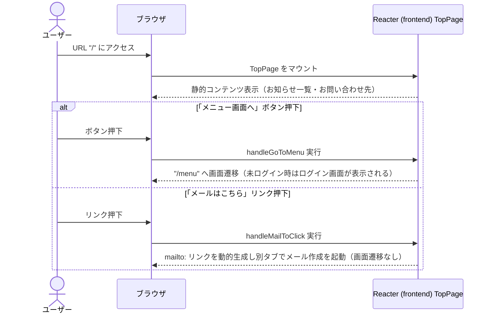

# シーケンス図

| 項目 | 内容 |
|---|---|
| プロダクト名 | コスト管理システム |
| 作成日 | 2026/08/20 |
| 作成者 | Claude (basic-design移行) |
| 最終更新日 | 2026/08/20 |
| 最終更新者 | Claude (basic-design移行) |

> 本ファイルは `シーケンス図_{機能ID}.md` として **1機能ID = 1シーケンス** で生成する。
> 機能ID・要件ID・スタックの対応は `docs/base-design/機能一覧.md`（本移行では `new_docs/base-design/機能一覧.md`）を正とする。

---

## トップページ表示・画面遷移

| 項目 | 内容 |
|---|---|
| 機能ID | front-intra-001 |
| 要件ID | R001 |

### 概要

トップページ（`TopPage`）は静的コンテンツ（お知らせ一覧・お問い合わせ先）のみを表示し、API通信を行わない画面である。このシーケンスは「画面表示」「メニュー画面への遷移」「メールはこちらリンク押下」の3操作を示す。ログイン認証による保護の対象外のため、US-API/BS/DB は登場しない。

### 登場人物

| 識別子 | 名称 | 役割 |
|---|---|---|
| User | ユーザー | 操作者 |
| Browser | ブラウザ | クライアント |
| Frontend | Reacter (frontend) `TopPage` | SPA フロント（静的コンテンツ表示・画面遷移制御） |

### シーケンス

### 処理説明

| ステップ | 送信元 | 送信先 | 内容 |
|---|---|---|---|
| 1 | ユーザー | ブラウザ | URL `/` にアクセスする |
| 2 | ブラウザ | Frontend | `TopPage` をマウントする |
| 3 | Frontend | ブラウザ | 画面のソースに直接記述された静的コンテンツ（お知らせ一覧9件・お問い合わせ先の表）を表示する（通信による取得は行わない） |
| 4 | ユーザー | ブラウザ | 「メニュー画面へ」ボタンを押下する |
| 5 | ブラウザ | Frontend | `handleGoToMenu` を実行する |
| 6 | Frontend | ブラウザ | `/menu` へ画面遷移する（未ログインの場合はルーティング保護によりログイン画面が表示される） |
| 7 | ユーザー | ブラウザ | 「メールはこちら」リンクを押下する |
| 8 | ブラウザ | Frontend | `handleMailToClick` を実行する |
| 9 | Frontend | ブラウザ | 宛先・CC・件名を設定した `mailto:` リンクを動的生成し、別タブでメール作成を起動する（この画面は表示されたままとなる） |

---

## 更新履歴

| Ver | 更新日 | 更新者 | 更新内容 |
|---|---|---|---|
| 1.0 | 2026/08/20 | Claude (basic-design移行) | 初版 |
