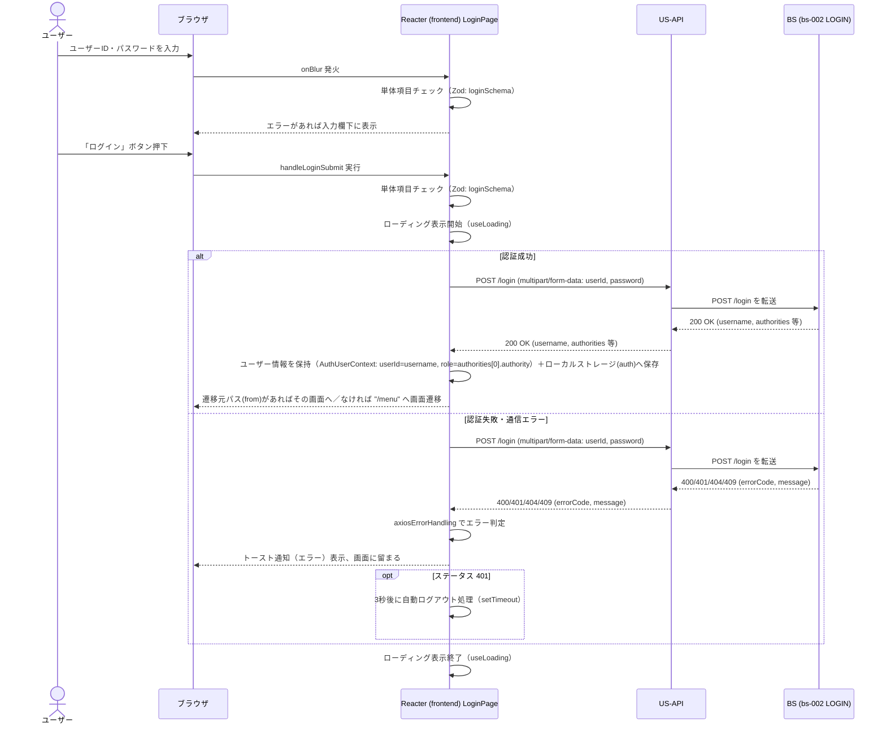

# シーケンス図

| 項目 | 内容 |
|---|---|
| プロダクト名 | コスト管理システム |
| 作成日 | 2026/08/20 |
| 作成者 | Claude (basic-design移行) |
| 最終更新日 | 2026/08/20 |
| 最終更新者 | Claude (basic-design移行) |

> 本ファイルは `シーケンス図_{機能ID}.md` として **1機能ID = 1シーケンス** で生成する。
> 機能ID・要件ID・スタックの対応は `docs/base-design/機能一覧.md`（本移行では `new_docs/base-design/機能一覧.md`）を正とする。

---

## ログイン認証

| 項目 | 内容 |
|---|---|
| 機能ID | front-intra-002 |
| 要件ID | R002 |

### 概要

ログイン画面（`LoginPage`）で入力された「ユーザーID」「パスワード」をログインAPI（機能ID: bs-002 / API ID: LOGIN、`POST /login`）へフォームデータで送信し認証を行う。`.claude/rules/product-rules.md` のスタック間依存ルール（`frontend → us-api → bs`。frontend から bs への直接アクセスは禁止）に従い、Frontend は US-API を経由して BS のログインAPIを呼び出す構成として記述する（`new_docs/frontend/docs/detail-design/コンポーネント仕様書_front-intra-002.md` の「対応 US-API エンドポイント」表記に基づく。bs スタックは本移行時点で未着手のため、bs-002 は参考情報）。正常系（認証成功→ユーザー情報保持→画面遷移）と異常系（認証失敗・通信エラー→トースト通知）の2パターンを示す。

### 登場人物

| 識別子 | 名称 | 役割 |
|---|---|---|
| User | ユーザー | 操作者 |
| Browser | ブラウザ | クライアント |
| Frontend | Reacter (frontend) `LoginPage` | SPA フロント（入力チェック・API呼出・遷移制御） |
| USAPI | US-API アプリ | JSON API フロント（bs-002 への中継。参考情報） |
| BS | BS アプリ（bs-002 ログインAPI） | 認証処理（参考情報。bs スタック未着手） |

### シーケンス

### 処理説明

| ステップ | 送信元 | 送信先 | 内容 |
|---|---|---|---|
| 1 | ユーザー | ブラウザ | ユーザーID・パスワードを入力する |
| 2 | Frontend | Frontend | フォーカスアウト時に単体項目チェック（`loginSchema`）を実行し、エラーがあれば入力欄下に表示する |
| 3 | ユーザー | ブラウザ | 「ログイン」ボタンを押下する（Enter押下含む） |
| 4 | Frontend | Frontend | 単体項目チェックを再実行し、ローディング表示を開始する |
| 5 | Frontend | US-API | `POST /login` を `multipart/form-data`（`userId`, `password`）で呼び出す |
| 6 | US-API | BS | `POST /login` を bs-002（LOGIN）へ転送する |
| 7 | BS | US-API | 認証結果を返す（成功: `200 OK` + `username`/`authorities` 等、失敗: `400`/`401`/`404`/`409` + `errorCode`/`message`） |
| 8 | US-API | Frontend | 認証結果をそのまま返す |
| 9 | Frontend | Frontend | 成功時: `username` をユーザーID、`authorities` 先頭要素の `authority` を権限として保持（React Context＋ローカルストレージ）／失敗時: `axiosErrorHandling` でエラー内容を判定する |
| 10 | Frontend | ブラウザ | 成功時: 遷移元パス（`from`）があればその画面へ（履歴を置き換え）、なければ `/menu` へ遷移（履歴は残す）／失敗時: トースト通知（エラー）を表示し画面に留まる |
| 11 | Frontend | Frontend | ステータス `401` の場合は3秒後に自動ログアウト処理を行う |
| 12 | Frontend | Frontend | ローディング表示を終了する |

---

## 更新履歴

| Ver | 更新日 | 更新者 | 更新内容 |
|---|---|---|---|
| 1.0 | 2026/08/20 | Claude (basic-design移行) | 初版 |
