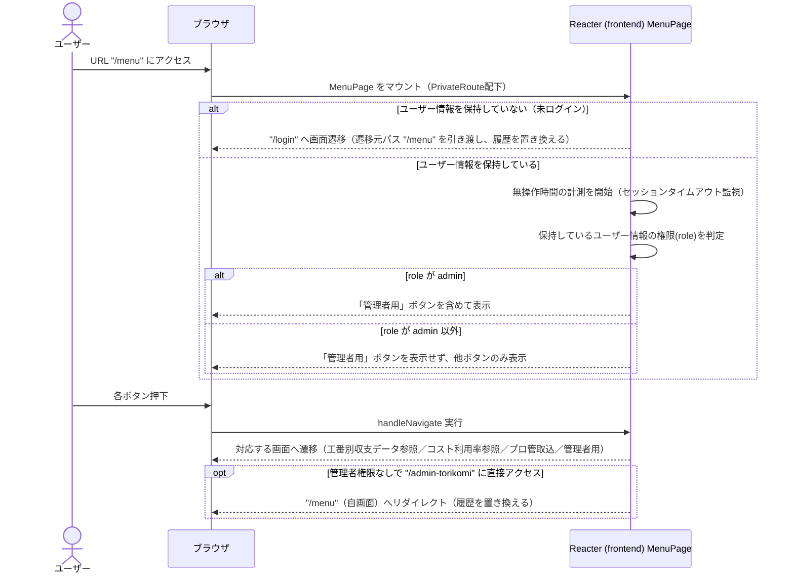

# シーケンス図

| 項目 | 内容 |
|---|---|
| プロダクト名 | コスト管理システム |
| 作成日 | 2026/08/20 |
| 作成者 | Claude (basic-design移行) |
| 最終更新日 | 2026/08/20 |
| 最終更新者 | Claude (basic-design移行) |

> 本ファイルは `シーケンス図_{機能ID}.md` として **1機能ID = 1シーケンス** で生成する。
> 機能ID・要件ID・スタックの対応は `docs/base-design/機能一覧.md`（本移行では `new_docs/base-design/機能一覧.md`）を正とする。

---

## メニュー画面表示・認可判定・画面遷移

| 項目 | 内容 |
|---|---|
| 機能ID | front-intra-003 |
| 要件ID | R003 |

### 概要

メニュー画面（`MenuPage`）は API 通信を行わず、保持済みのユーザー情報（`AuthUserContext`）を参照して「管理者用」ボタンの表示可否を判定し、各機能画面への遷移ボタンを表示する画面である。未ログイン状態でのアクセス制御（ログイン画面への遷移）と、セッションタイムアウト監視の開始も表現する。API 呼び出しがないため US-API/BS/DB は登場しない。

### 登場人物

| 識別子 | 名称 | 役割 |
|---|---|---|
| User | ユーザー | 操作者 |
| Browser | ブラウザ | クライアント |
| Frontend | Reacter (frontend) `MenuPage` | SPA フロント（認可判定・画面遷移制御） |

### シーケンス

### 処理説明

| ステップ | 送信元 | 送信先 | 内容 |
|---|---|---|---|
| 1 | ユーザー | ブラウザ | URL `/menu` にアクセスする |
| 2 | ブラウザ | Frontend | `MenuPage` をマウントする（`PrivateRoute` 配下） |
| 3 | Frontend | ブラウザ | ユーザー情報を保持していない場合、遷移元パス `/menu` を引き渡し履歴を置き換えて `/login` へ遷移する |
| 4 | Frontend | Frontend | ユーザー情報を保持している場合、無操作時間の計測（セッションタイムアウト監視）を開始する |
| 5 | Frontend | Frontend | 保持しているユーザー情報の権限（`role`）を判定する |
| 6 | Frontend | ブラウザ | `role` が `admin` の場合のみ「管理者用」ボタンを含めて表示する |
| 7 | ユーザー | ブラウザ | 「工番別収支データ参照」等のボタンを押下する |
| 8 | ブラウザ | Frontend | `handleNavigate` を実行する |
| 9 | Frontend | ブラウザ | 対応する画面（`/kobanbetsu-shushi`・`/cost-riyoritsu`・`/torikomi`・`/admin-torikomi`）へ遷移する |
| 10 | Frontend | ブラウザ | 管理者権限がない状態で `/admin-torikomi` を直接指定した場合、ルーティング保護により `/menu`（履歴を置き換え）へリダイレクトする |

---

## 更新履歴

| Ver | 更新日 | 更新者 | 更新内容 |
|---|---|---|---|
| 1.0 | 2026/08/20 | Claude (basic-design移行) | 初版 |
