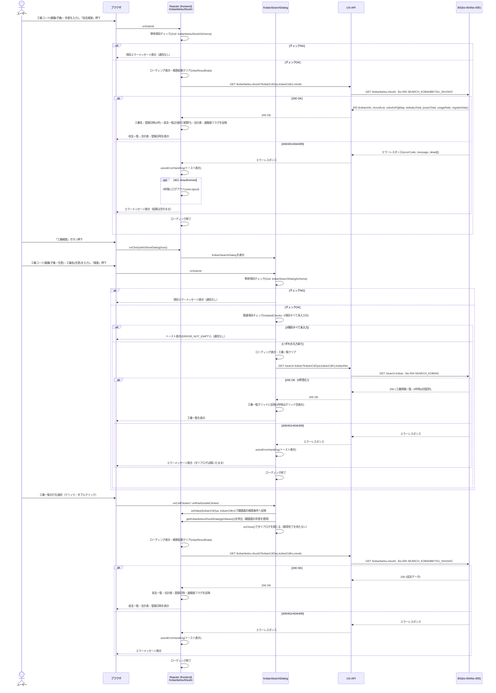

# シーケンス図

| 項目 | 内容 |
|---|---|
| プロダクト名 | コスト管理システム |
| 作成日 | 2026/08/20 |
| 作成者 | Claude (basic-design移行) |
| 最終更新日 | 2026/08/20 |
| 最終更新者 | Claude (basic-design移行) |

> 本ファイルは `シーケンス図_{機能ID}.md` として **1機能ID = 1シーケンス** で生成する。
> 機能ID・要件ID・スタックの対応は `docs/base-design/機能一覧.md` を正とする。
> `bs-004`（工番検索API `SEARCH_KOBAN`）・`bs-005`（工番別収支検索API `SEARCH_KOBANBETSU_SHUSHI`）は本プロダクトでは `bs` スタック未着手のため、`Web_API_IF定義書_bs-004.md`・`Web_API_IF定義書_bs-005.md` に定義済みの仕様を参考情報として、本シーケンス内で呼び出し順のみ言及する（独立したシーケンス図は作成しない）。

---

## 工番別収支データ参照

| 項目 | 内容 |
|---|---|
| 機能ID | front-intra-004 |
| 要件ID | R004 |

### 概要

工番別収支データ参照画面（`KobanbetsuShushi.tsx`）で、①工番コード（親番・子番）・年度を条件とした収支検索（工番別収支検索API・bs-005）、②工番検索ダイアログ（`KobanSearchDialog.tsx`）経由の工番検索（工番検索API・bs-004）→行選択→検索条件反映→収支再検索（bs-005）、の2系統の呼び出し順を示す。正常系に加え、検索結果0件（工番検索）・APIエラー（400/401/404/409）の異常系も表現する。

### 登場人物

| 識別子 | 名称 | 役割 |
|---|---|---|
| User | ユーザー | ログイン済み利用者 |
| Browser | ブラウザ | クライアント |
| Frontend | Reacter (frontend)・`KobanbetsuShushi` | 収支検索・並び替え・エラーハンドリング（`useErrorHandling`）・ローディング制御（`useLoading`） |
| Dialog | Reacter (frontend)・`KobanSearchDialog` | 工番検索ダイアログ（親画面から `setValue`/`getValues`/`getKobanbetsuShushiData` を受け取る） |
| USAPI | US-API アプリ | JSON API フロント（本プロダクトでは frontend→bs 実装上の中継。`.claude/rules/product-rules.md` の依存規約に従う） |
| BS | BS アプリ | bs-004 `SEARCH_KOBAN` / bs-005 `SEARCH_KOBANBETSU_SHUSHI`（**未着手・参考情報**） |

### シーケンス

### 処理説明

| ステップ | 送信元 | 送信先 | 内容 |
|---|---|---|---|
| 1 | ユーザー | ブラウザ | 検索条件（工番コード・年度）を入力し「収支検索」を押下 |
| 2 | Frontend | Frontend | 単体項目チェック（Zod）。NG時は通信せずエラーメッセージ表示 |
| 3 | Frontend | Frontend | ローディング表示・検索結果クリア（`clearResultData`） |
| 4 | Frontend | US-API | `GET /kobanbetsu-shushi` を呼び出す（`kobanCdOya`/`kobanCdKo`/`nendo`） |
| 5 | US-API | BS | `GET /kobanbetsu-shushi` を転送する（bs-005・未着手・参考情報） |
| 6 | BS | US-API | 200時は収支データ、400/401/404/409時はエラーレスポンスを返す |
| 7 | Frontend | Frontend | 成功時は工番名・登録日時・収支一覧・合計表・速報値フラグを反映。失敗時は `axiosErrorHandling` でトースト表示（401は3秒後にログアウト） |
| 8 | ユーザー | ブラウザ | 「工番検索」ボタン押下でダイアログ表示（検索条件・結果は保持） |
| 9 | ユーザー | ブラウザ | ダイアログの検索条件を入力し「検索」を押下 |
| 10 | Dialog | Dialog | 単体項目チェック（Zod）→関連項目チェック（3項目すべて未入力ならトースト表示・通信なし） |
| 11 | Dialog | US-API | `GET /search-koban` を呼び出す（`kobanCdOya`/`kobanCdKo`/`kobanNm`） |
| 12 | US-API | BS | `GET /search-koban` を転送する（bs-004・未着手・参考情報） |
| 13 | BS | US-API | 200時は工番情報一覧（0件時は空配列）、エラー時はエラーレスポンスを返す |
| 14 | ユーザー | ブラウザ | 工番一覧の行を選択（クリック／ダブルクリック） |
| 15 | Dialog | Frontend | `setValue` で親画面の検索条件（工番コード）に反映し、`getKobanbetsuShushiData` を呼び出す（親画面の年度を使用） |
| 16 | Dialog | Dialog | 取得完了を待たずに `onClose` でダイアログを閉じる |
| 17 | Frontend | US-API | 再検索として `GET /kobanbetsu-shushi` を呼び出す（bs-005） |
| 18 | Frontend | Frontend | 成功時は収支一覧・合計表等を反映、失敗時はトースト表示 |

---

## 更新履歴

| Ver | 更新日 | 更新者 | 更新内容 |
|---|---|---|---|
| 1.0 | 2026/08/20 | Claude (basic-design移行) | 初版 |
