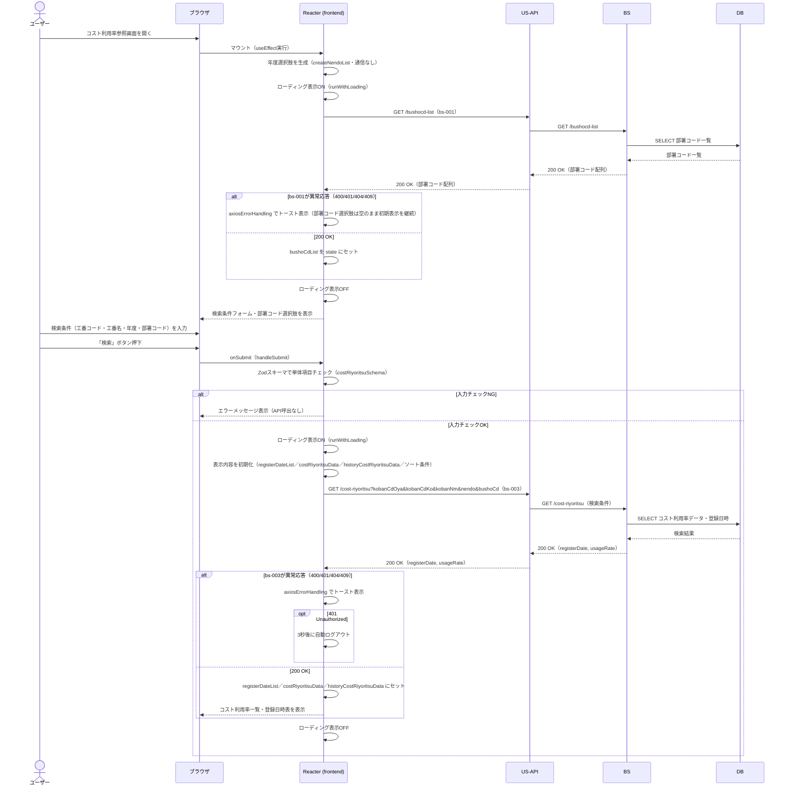

# シーケンス図

| 項目 | 内容 |
|---|---|
| プロダクト名 | コスト管理システム |
| 作成日 | 2026/08/20 |
| 作成者 | Claude (basic-design移行) |
| 最終更新日 | 2026/08/20 |
| 最終更新者 | Claude (basic-design移行) |

> 本ファイルは `シーケンス図_{機能ID}.md` として **1機能ID = 1シーケンス** で生成する。
> 機能ID・要件ID・スタックの対応は `docs/base-design/機能一覧.md` を正とする。
> `bs` スタックは未着手のため、bs-001・bs-003 は `new_docs/base-design/Web_API_IF定義書_bs-001.md`／`_bs-003.md` の仕様（参考情報）に基づき、US-API・BS 間のやり取りを想定表記する。

---

## コスト利用率参照画面 初期表示・検索

| 項目 | 内容 |
|---|---|
| 機能ID | front-intra-005 |
| 要件ID | R005 |

### 概要

コスト利用率参照画面（`CostRiyoritsu`、URL: `/cost-riyoritsu`）の初期表示時に部署コード一覧取得API（bs-001）を呼び出して検索条件の選択肢を用意し、ユーザーが検索条件（工番コード・工番名・年度・部署コード）を入力後「検索」ボタンを押下するとコスト利用率検索API（bs-003）を呼び出して月別コスト利用率一覧・登録日時一覧を取得し画面へ表示する。年度の選択肢はAPIを呼ばずフロントエンド側（`createNendoList`）で生成する。「並び替え」操作は取得済みデータの画面内ソートのみでAPI通信を伴わないため、本シーケンスの対象外とする。

### 登場人物

| 識別子 | 名称 | 役割 |
|---|---|---|
| Browser | ブラウザ | クライアント |
| Frontend | Reacter (frontend) `CostRiyoritsu` | SPA フロント |
| US-API | US-API アプリ | JSON API フロント |
| BS | BS アプリ | バックエンド |
| DB | データベース | データストア |

### シーケンス

### 処理説明

| ステップ | 送信元 | 送信先 | 内容 |
|---|---|---|---|
| 1 | ユーザー | ブラウザ | コスト利用率参照画面（`/cost-riyoritsu`）を開く |
| 2 | Frontend | Frontend | マウント時に年度選択肢を生成する（通信なし） |
| 3 | Frontend | US-API | `GET /bushocd-list`（bs-001）を呼び出す |
| 4 | US-API | BS | `GET /bushocd-list` を転送する |
| 5 | BS | DB | 部署コード一覧を検索する |
| 6 | DB | BS | 検索結果を返す |
| 7 | BS | US-API | `200 OK` + 部署コード配列を返す |
| 8 | US-API | Frontend | `200 OK` + 部署コード配列を返す（異常時はトースト表示のうえ選択肢を空のまま初期表示を継続） |
| 9 | ユーザー | ブラウザ | 検索条件を入力し「検索」ボタンを押下する |
| 10 | Frontend | Frontend | Zod スキーマで単体項目チェックを行う（NG時はAPI呼出なしでエラー表示） |
| 11 | Frontend | Frontend | 表示内容（登録日時・一覧・ソート条件）を初期化する |
| 12 | Frontend | US-API | `GET /cost-riyoritsu`（bs-003）を検索条件付きで呼び出す |
| 13 | US-API | BS | `GET /cost-riyoritsu` を転送する |
| 14 | BS | DB | コスト利用率データ・登録日時を検索する |
| 15 | DB | BS | 検索結果を返す |
| 16 | BS | US-API | `200 OK` + `registerDate`／`usageRate` を返す |
| 17 | US-API | Frontend | `200 OK` + `registerDate`／`usageRate` を返す（異常時はトースト表示。401は3秒後に自動ログアウト） |
| 18 | Frontend | ブラウザ | コスト利用率一覧・登録日時表を描画する |

---

## 更新履歴

| Ver | 更新日 | 更新者 | 更新内容 |
|---|---|---|---|
| 1.0 | 2026/08/20 | Claude (basic-design移行) | 初版 |
