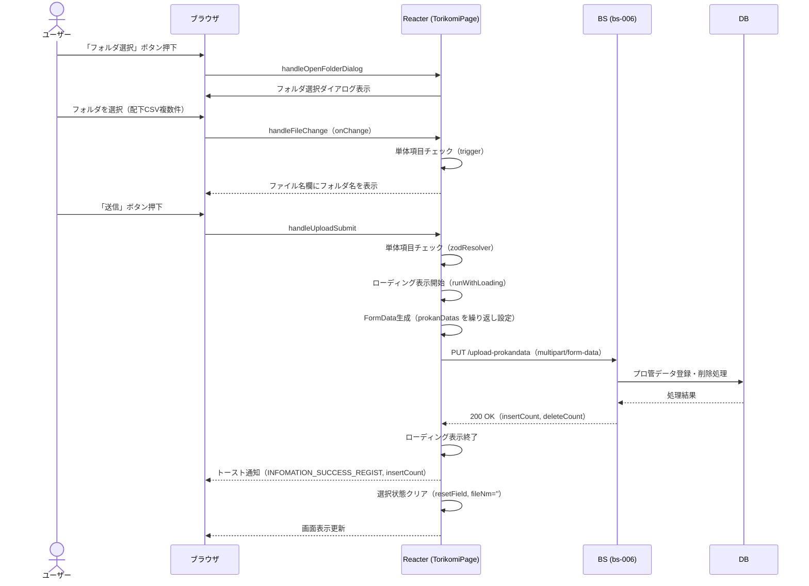
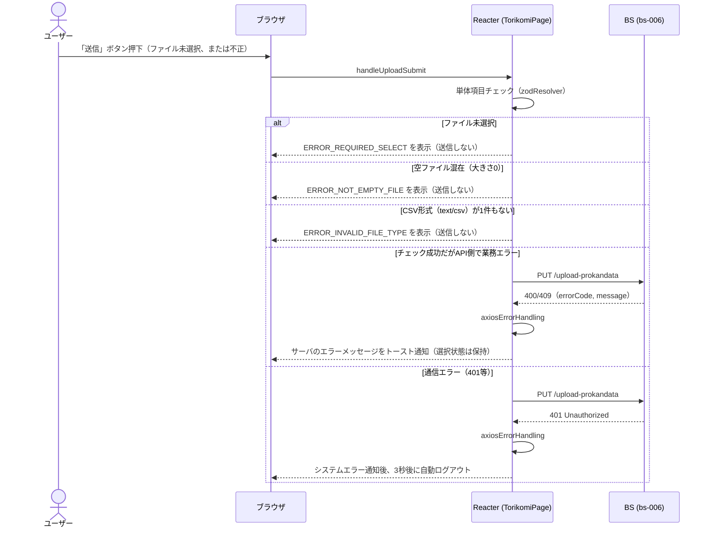

# シーケンス図

| 項目 | 内容 |
|---|---|
| プロダクト名 | コスト管理システム |
| 作成日 | 2026/08/20 |
| 作成者 | Claude (basic-design移行) |
| 最終更新日 | 2026/08/20 |
| 最終更新者 | Claude (basic-design移行) |

> 本ファイルは `シーケンス図_{機能ID}.md` として **1機能ID = 1シーケンス** で生成する。
> 機能ID・要件ID・スタックの対応は `docs/base-design/機能一覧.md` を正とする。
> `bs` スタックは未着手のため、BS/DB 部分は `Web_API_IF定義書_bs-006.md` に基づく参考情報として記載する。

---

## データ取り込み（プロ管データCSV取り込み）

| 項目 | 内容 |
|---|---|
| 機能ID | front-intra-006 |
| 要件ID | R006 |

### 概要

利用者がフォルダ選択で配下のプロ管データ（CSV）を複数選択し、「送信」ボタン押下でプロ管データアップロードAPI（bs-006・`PUT /upload-prokandata`）へ一括送信する。成功時は登録件数をトースト通知し選択状態をクリアする。異常系として、ファイル未選択・空ファイル混在・CSV形式なしの単体項目チェックエラー、およびAPI呼出時の業務エラー・通信エラーを扱う。

### 登場人物

| 識別子 | 名称 | 役割 |
|---|---|---|
| User | ユーザー | データ取り込み画面の利用者 |
| Browser | ブラウザ | クライアント |
| Frontend | Reacter (frontend・TorikomiPage) | SPA フロント |
| BS | BS アプリ（bs-006・参考情報） | バックエンド（未着手） |
| DB | データベース（参考情報） | データストア |

### シーケンス（正常系）

### シーケンス（異常系: ファイル未選択・空ファイル・不正形式）

### 処理説明

| ステップ | 送信元 | 送信先 | 内容 |
|---|---|---|---|
| 1 | ユーザー | ブラウザ | 「フォルダ選択」ボタン押下 |
| 2 | Frontend | Frontend | 非表示のファイル選択欄（`webkitdirectory`＋`multiple`、`accept=text/csv`）を起動 |
| 3 | ユーザー | ブラウザ | フォルダ配下のCSVを複数選択 |
| 4 | Frontend | Frontend | `handleFileChange` で選択フォルダ名を表示し単体項目チェックを実行 |
| 5 | ユーザー | ブラウザ | 「送信」ボタン押下 |
| 6 | Frontend | Frontend | Zodスキーマで単体項目チェック（未選択・空ファイル・CSV形式なしを判定） |
| 7 | Frontend | BS | `PUT /upload-prokandata`（`prokanDatas` を同一物理名で繰り返し設定） |
| 8 | BS | DB | プロ管データの登録・削除処理（参考情報） |
| 9 | BS | Frontend | `200 OK` + `insertCount`／`deleteCount` |
| 10 | Frontend | ブラウザ | 登録件数をトースト通知し選択状態をクリア |

---

## 更新履歴

| Ver | 更新日 | 更新者 | 更新内容 |
|---|---|---|---|
| 1.0 | 2026/08/20 | Claude (basic-design移行) | 初版 |
