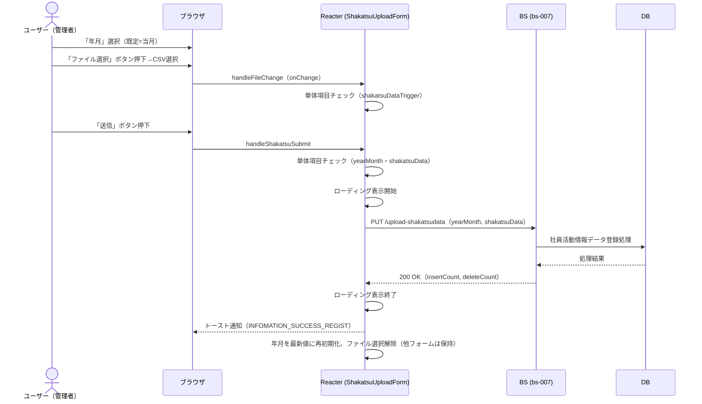
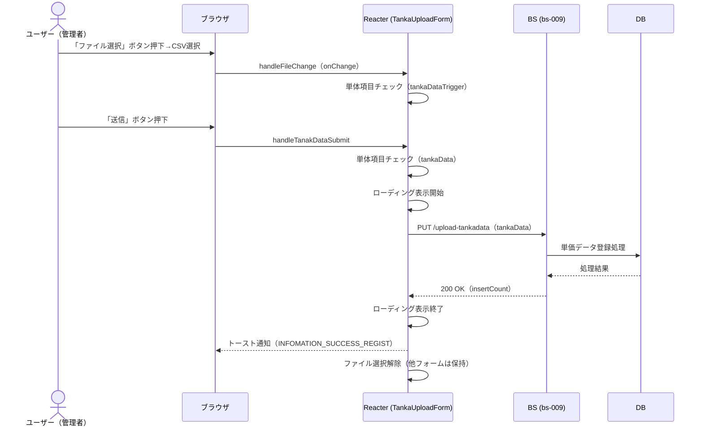
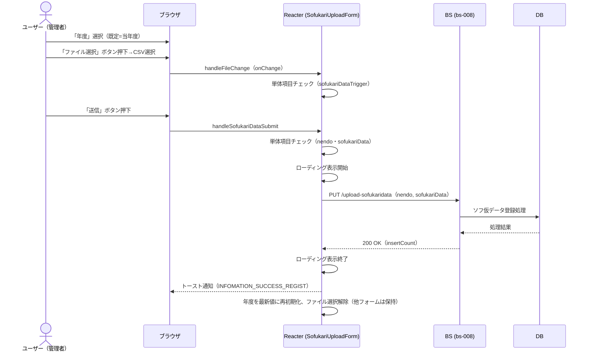
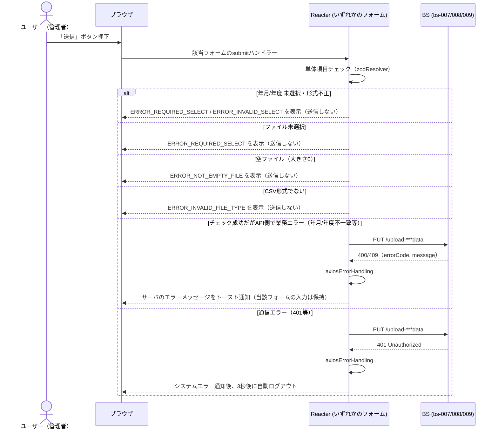

# シーケンス図

| 項目 | 内容 |
|---|---|
| プロダクト名 | コスト管理システム |
| 作成日 | 2026/08/20 |
| 作成者 | Claude (basic-design移行) |
| 最終更新日 | 2026/08/20 |
| 最終更新者 | Claude (basic-design移行) |

> 本ファイルは `シーケンス図_{機能ID}.md` として **1機能ID = 1シーケンス** で生成する。
> front-intra-007 は「社員活動情報データ」「単価データ」「ソフ仮データ」の3つの独立したフォームを持つ画面のため、
> 3つのサブシーケンスとしてまとめて表現する（各フォームは他フォームの状態に影響しない）。
> `bs` スタックは未着手のため、BS/DB 部分は `Web_API_IF定義書_bs-007/008/009.md` に基づく参考情報として記載する。

---

## 管理者用データ取り込み（3フォーム）

| 項目 | 内容 |
|---|---|
| 機能ID | front-intra-007 |
| 要件ID | R007 |

### 概要

管理者権限（`admin`）を持つ利用者が、3つの独立したフォーム（社員活動情報データ・単価データ・ソフ仮データ）のいずれかで、年月／年度＋CSVファイルを選択し送信する。各フォームの送信は他フォームの入力状態に影響しない。

### 登場人物

| 識別子 | 名称 | 役割 |
|---|---|---|
| User | ユーザー（管理者） | 管理者用データ取り込み画面の利用者 |
| Browser | ブラウザ | クライアント |
| Frontend | Reacter (frontend・AdminTorikomiPage) | SPA フロント |
| BS | BS アプリ（bs-007/008/009・参考情報） | バックエンド（未着手） |
| DB | データベース（参考情報） | データストア |

### サブシーケンス1: 社員活動情報データ CSV取り込み（bs-007）

### サブシーケンス2: 単価データ CSV取り込み（bs-009）

### サブシーケンス3: ソフ仮データ CSV取り込み（bs-008）

### 異常系（3フォーム共通）

### 処理説明

| ステップ | 送信元 | 送信先 | 内容 |
|---|---|---|---|
| 1 | ユーザー | ブラウザ | 対象フォームで年月／年度・ファイルを選択 |
| 2 | Frontend | Frontend | 選択時の単体項目チェック（`trigger`） |
| 3 | ユーザー | ブラウザ | 対象フォームの「送信」ボタン押下 |
| 4 | Frontend | Frontend | Zodスキーマで単体項目チェック（フォームごとに独立） |
| 5 | Frontend | BS | 対象APIへ `PUT`（`multipart/form-data`） |
| 6 | BS | DB | 対象データの登録処理（参考情報） |
| 7 | BS | Frontend | `200 OK` + `insertCount`（社員活動情報データは`deleteCount`も含む） |
| 8 | Frontend | ブラウザ | トースト通知し、当該フォームのみ入力状態を初期化（他フォームは保持） |

---

## 更新履歴

| Ver | 更新日 | 更新者 | 更新内容 |
|---|---|---|---|
| 1.0 | 2026/08/20 | Claude (basic-design移行) | 初版 |
