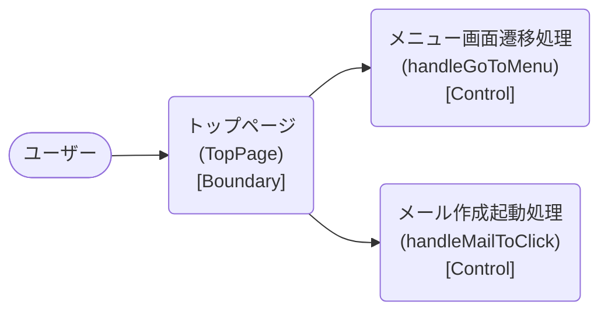

# ロバストネス図

> 工程2 UI（基本設計）の正式成果物。`docs/base-design/ロバストネス図_{要件ID}.md` に生成する（**1要件ID = 1ロバストネス図**。要件ID＝ユースケース単位で分析する。1要件IDが複数機能IDに分解されても分割しない）。
> ユースケース（要件ID）の記述を Boundary（境界）・Control（制御）・Entity（実体）オブジェクトに変換し、実装対象クラス一覧・シーケンス図への解像度を上げる（ICONIXプロセスの手法を採用）。
> 機能ID・要件ID・スタックの対応は `new_docs/base-design/機能一覧.md` を正とする。

| 項目 | 内容 |
|---|---|
| プロダクト名 | コスト管理システム |
| 作成日 | 2026/08/20 |
| 作成者 | Claude (basic-design移行) |
| 最終更新日 | 2026/08/20 |
| 最終更新者 | Claude (basic-design移行) |

---

## トップページ表示・画面遷移

| 項目 | 内容 |
|---|---|
| 要件ID | R001 |
| 関連機能ID | front-intra-001 |

### 概要

システムの入口となるトップページで、静的コンテンツ（お知らせ・お問い合わせ先）を表示し、メニュー画面への遷移とメール作成の起動を行うユースケース。API 通信・永続化データを持たないため Entity（実体）オブジェクトは存在しない（お知らせ・お問い合わせ先は画面のソースに直接記述された静的コンテンツであり、DB等から取得する実体ではない）。

### ロバストネス図

### オブジェクト一覧

| 種別 | 名称 | 概要 | 対応実装クラス（実装対象クラス一覧を参照） |
|---|---|---|---|
| Boundary | トップページ | お知らせ一覧・お問い合わせ先の静的表示、遷移操作の受付 | `TopPage` |
| Control | メニュー画面遷移処理 | 「メニュー画面へ」ボタン押下で `/menu` へ遷移する | `handleGoToMenu`（`TopPage` 内） |
| Control | メール作成起動処理 | 「メールはこちら」リンク押下で宛先・件名を設定した `mailto:` リンクを動的生成し別タブで起動する | `handleMailToClick`（`MailToLink`） |
| Entity | （該当なし） | API通信・DBアクセスを行わないため、永続化される実体は存在しない | — |

---

## 更新履歴

| Ver | 更新日 | 更新者 | 更新内容 |
|---|---|---|---|
| 1.0 | 2026/08/20 | Claude (basic-design移行) | 初版 |
