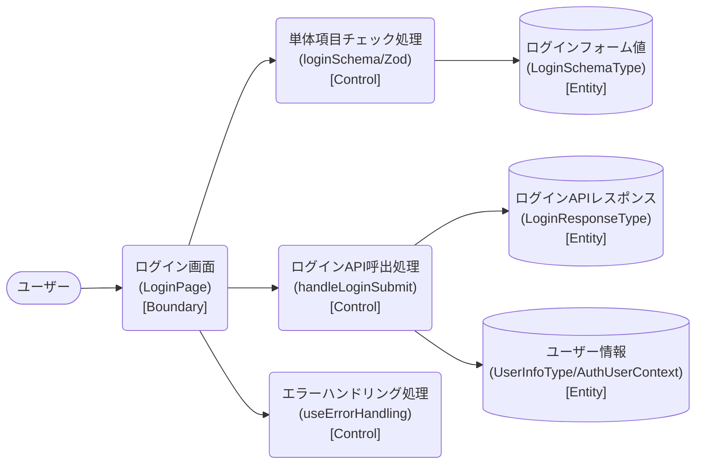

# ロバストネス図

> 工程2 UI（基本設計）の正式成果物。`docs/base-design/ロバストネス図_{要件ID}.md` に生成する（**1要件ID = 1ロバストネス図**。要件ID＝ユースケース単位で分析する。1要件IDが複数機能IDに分解されても分割しない）。
> ユースケース（要件ID）の記述を Boundary（境界）・Control（制御）・Entity（実体）オブジェクトに変換し、実装対象クラス一覧・シーケンス図への解像度を上げる（ICONIXプロセスの手法を採用）。
> 機能ID・要件ID・スタックの対応は `new_docs/base-design/機能一覧.md` を正とする。

| 項目 | 内容 |
|---|---|
| プロダクト名 | コスト管理システム |
| 作成日 | 2026/08/20 |
| 作成者 | Claude (basic-design移行) |
| 最終更新日 | 2026/08/20 |
| 最終更新者 | Claude (basic-design移行) |

---

## ログイン認証

| 項目 | 内容 |
|---|---|
| 要件ID | R002 |
| 関連機能ID | front-intra-002, bs-002（参考情報。bs スタック未着手） |

### 概要

ユーザーID・パスワードによるログイン認証を行い、認証成功時にユーザー情報を保持して遷移するユースケース。ログインAPI（bs-002）は本移行時点で bs スタック未着手のため参考情報とし、Control はフロントエンド側の呼び出し処理（`useErrorHandling` を含む）までを対象とする。

### ロバストネス図

### オブジェクト一覧

| 種別 | 名称 | 概要 | 対応実装クラス（実装対象クラス一覧を参照） |
|---|---|---|---|
| Boundary | ログイン画面 | ユーザーID・パスワードの入力受付、ログイン/Topページボタンの操作受付 | `LoginPage`（`LoginForm`・`UserIdField`・`PasswordField`） |
| Control | 単体項目チェック処理 | フォーカスアウト時・送信時にユーザーID・パスワードの必須／桁数チェックを行う | `loginSchema`（Zod）、`trigger`（react-hook-form） |
| Control | ログインAPI呼出処理 | ログインAPI（bs-002、参考情報）へフォームデータで送信し、成功時はユーザー情報を保持して遷移する | `handleLoginSubmit`（`LoginPage`）、`useLoading` |
| Control | エラーハンドリング処理 | 認証失敗・通信エラー時にエラー内容を判定しトースト通知する（401時は3秒後に自動ログアウト） | `useErrorHandling` |
| Entity | ログインフォーム値 | 入力されたユーザーID・パスワード | `LoginSchemaType` |
| Entity | ログインAPIレスポンス | 認証成功時の応答（`username`, `authorities` 等） | `LoginResponseType` |
| Entity | ユーザー情報 | 保持するユーザーID・権限（ローカルストレージ `auth` にも保存） | `UserInfoType`（`AuthUserContext`） |

---

## 更新履歴

| Ver | 更新日 | 更新者 | 更新内容 |
|---|---|---|---|
| 1.0 | 2026/08/20 | Claude (basic-design移行) | 初版 |
