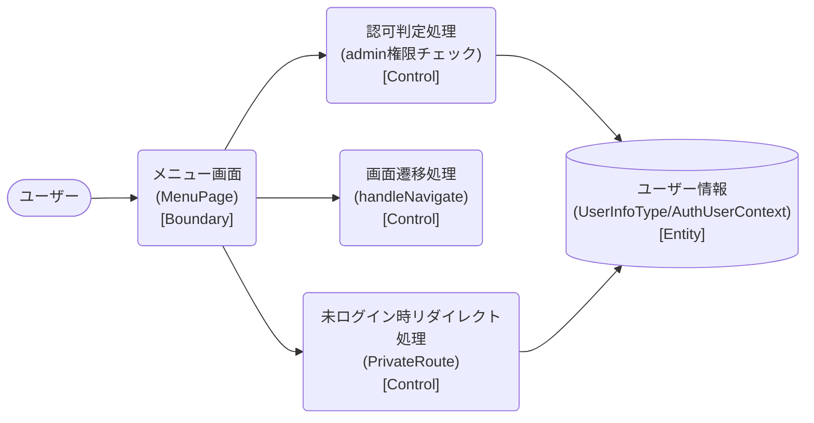

# ロバストネス図

> 工程2 UI（基本設計）の正式成果物。`docs/base-design/ロバストネス図_{要件ID}.md` に生成する（**1要件ID = 1ロバストネス図**。要件ID＝ユースケース単位で分析する。1要件IDが複数機能IDに分解されても分割しない）。
> ユースケース（要件ID）の記述を Boundary（境界）・Control（制御）・Entity（実体）オブジェクトに変換し、実装対象クラス一覧・シーケンス図への解像度を上げる（ICONIXプロセスの手法を採用）。
> 機能ID・要件ID・スタックの対応は `new_docs/base-design/機能一覧.md` を正とする。

| 項目 | 内容 |
|---|---|
| プロダクト名 | コスト管理システム |
| 作成日 | 2026/08/20 |
| 作成者 | Claude (basic-design移行) |
| 最終更新日 | 2026/08/20 |
| 最終更新者 | Claude (basic-design移行) |

---

## メニュー画面表示・認可判定・画面遷移

| 項目 | 内容 |
|---|---|
| 要件ID | R003 |
| 関連機能ID | front-intra-003 |

### 概要

保持しているユーザー情報の権限に応じて「管理者用」ボタンの表示を切り替え、各機能画面への入口を提供するユースケース。API 通信は行わず、既にログイン時に保持済みのユーザー情報（`AuthUserContext`）を参照する。

### ロバストネス図

### オブジェクト一覧

| 種別 | 名称 | 概要 | 対応実装クラス（実装対象クラス一覧を参照） |
|---|---|---|---|
| Boundary | メニュー画面 | 各機能画面への遷移ボタンの表示・操作受付 | `MenuPage`（`ShushiGroup`・`MaintenanceGroup`） |
| Control | 認可判定処理 | 保持しているユーザー情報の権限（`role`）が `admin` の場合のみ「管理者用」ボタンを表示する | `AdminTorikomiButton` の表示条件判定（`MenuPage`） |
| Control | 画面遷移処理 | 各ボタン押下で対応する画面へ遷移する | `handleNavigate`（`MenuPage`） |
| Control | 未ログイン時リダイレクト処理 | ユーザー情報を保持していない場合にログイン画面へ、管理者権限なしで管理者用画面に直接アクセスした場合に自画面へリダイレクトする | `PrivateRoute`／`AdminRoute` |
| Entity | ユーザー情報 | 保持するユーザーID・権限 | `UserInfoType`（`AuthUserContext`） |

---

## 更新履歴

| Ver | 更新日 | 更新者 | 更新内容 |
|---|---|---|---|
| 1.0 | 2026/08/20 | Claude (basic-design移行) | 初版 |
