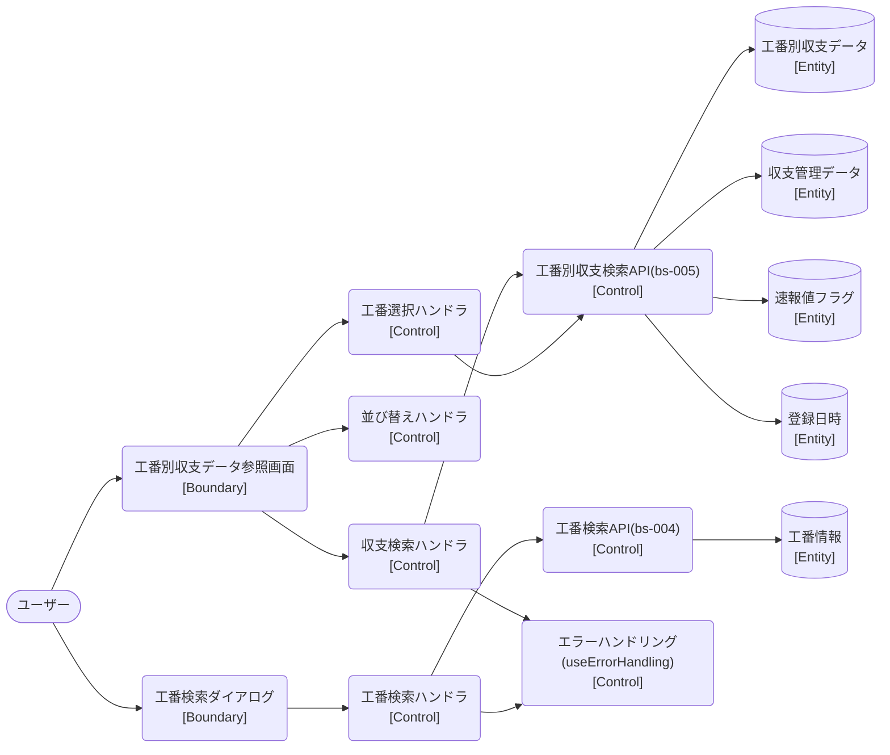

# ロバストネス図

> 工程2 UI（基本設計）の正式成果物。`docs/base-design/ロバストネス図_{要件ID}.md` に生成する（**1要件ID = 1ロバストネス図**。要件ID＝ユースケース単位で分析する。1要件IDが複数機能IDに分解されても分割しない）。
> ユースケース（要件ID）の記述を Boundary（境界）・Control（制御）・Entity（実体）オブジェクトに変換し、実装対象クラス一覧・シーケンス図への解像度を上げる（ICONIXプロセスの手法を採用）。
> 機能ID・要件ID・スタックの対応は `docs/base-design/機能一覧.md` を正とする。

| 項目 | 内容 |
|---|---|
| プロダクト名 | コスト管理システム |
| 作成日 | 2026/08/20 |
| 作成者 | Claude (basic-design移行) |
| 最終更新日 | 2026/08/20 |
| 最終更新者 | Claude (basic-design移行) |

---

## 工番別収支データの参照

| 項目 | 内容 |
|---|---|
| 要件ID | R004 |
| 関連機能ID | front-intra-004, bs-004, bs-005（bs-004・bs-005 は `bs` スタック未着手のため参考情報。機能一覧.md を参照） |

### 概要

ログイン済み利用者が、工番コード（親番・子番）と年度を指定して収支データ（社員ごとの計画・実算・合計・利用率）を参照するユースケース。工番が不明な場合は工番検索ダイアログ（工番コード・工番名による検索）から工番を検索・選択できる。検索結果は画面内で並び替え可能（通信を伴わない）。参照専用機能であり、登録・更新・削除は行わない。

### ロバストネス図

<!-- Mermaid にロバストネス図の専用記法はないため、flowchart でノード形状により Boundary(角丸) / Control(円) / Entity(下線=矩形) を区別して近似表現する -->

### オブジェクト一覧

| 種別 | 名称 | 概要 | 対応実装クラス（実装対象クラス一覧を参照） |
|---|---|---|---|
| Boundary | 工番別収支データ参照画面 | 検索条件入力・並び替え・検索結果表示 | `KobanbetsuShushi`（`features/kobanbetsuShushi/components/KobanbetsuShushi.tsx`） |
| Boundary | 工番検索ダイアログ | 工番コード・工番名による工番検索、選択結果の親画面への反映 | `KobanSearchDialog`（`features/kobanbetsuShushi/components/KobanSearchDialog.tsx`） |
| Control | 収支検索ハンドラ | 単体項目チェック後、検索結果クリア・工番別収支検索APIの呼出・応答反映 | `onValid` / `getKobanbetsuShushiData`（`KobanbetsuShushi.tsx`） |
| Control | 並び替えハンドラ | 関連項目チェック後、保持済み結果を社員単位でグループ化し並び替え（通信なし） | `handleSortButtonClick`（`KobanbetsuShushi.tsx`） |
| Control | 工番検索ハンドラ | 単体項目チェック・関連項目チェック（3項目未入力判定）後、工番検索APIの呼出・応答反映 | `getKobanIfno` / `relatedChecks`（`KobanSearchDialog.tsx`） |
| Control | 工番選択ハンドラ | 選択行の工番コードを親画面へ反映し、収支再検索を実行してダイアログを閉じる | `returnParentWindow`（`KobanSearchDialog.tsx`） |
| Control | 工番別収支検索API（bs-005） | 工番コード・年度から収支データを検索する（`bs` 未着手・参考情報） | `SEARCH_KOBANBETSU_SHUSHI`（`Web_API_IF定義書_bs-005.md`） |
| Control | 工番検索API（bs-004） | 工番コード・工番名から工番情報一覧を検索する（`bs` 未着手・参考情報） | `SEARCH_KOBAN`（`Web_API_IF定義書_bs-004.md`） |
| Control | エラーハンドリング | Axiosエラーをメッセージ化しトースト表示（401は自動ログアウト） | `useErrorHandling`（`hooks/useErrorHandling.ts`） |
| Entity | 工番別収支データ | 工番情報・収支レコード一覧・合計・利用率・登録日時を含む収支検索の応答実体 | `KobanbetsuShushiResponseType`（`types/kobanbetsuShushiDefinitions.ts`） |
| Entity | 収支管理データ | 計画／実算／合計／利用率で共通の月別収支構造 | `ShushiKanriType`（`@/types/commonTypes`） |
| Entity | 速報値フラグ | 月ごとの速報値（実算未確定）を示す真偽値集合 | `SokuhoFlgType`（`types/kobanbetsuShushiDefinitions.ts`） |
| Entity | 登録日時 | 収支データの元となる各テーブルの登録日時（5件） | `RegisterDateType`（`@/types/commonTypes`） |
| Entity | 工番情報 | 工番コード（親番・子番）・工番名・優先度 | `KobanInfoResponseType` / `KobanDataType`（`types/kobanSearchDialogDefinitions.ts`） |

---

## 更新履歴

| Ver | 更新日 | 更新者 | 更新内容 |
|---|---|---|---|
| 1.0 | 2026/08/20 | Claude (basic-design移行) | 初版 |
