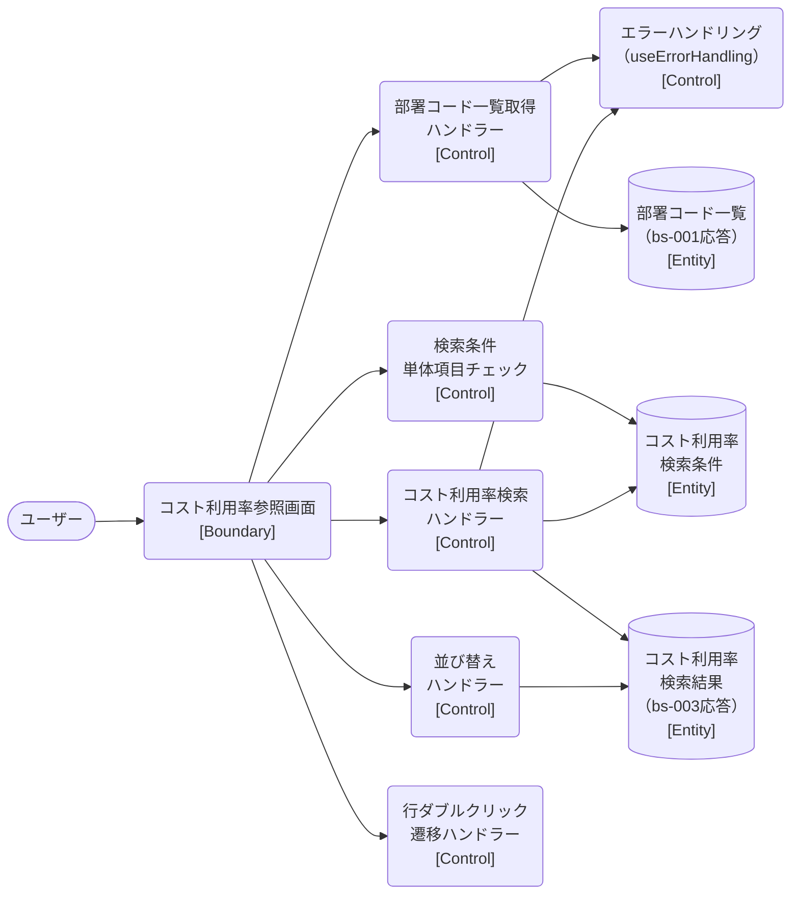

# ロバストネス図

> 工程2 UI（基本設計）の正式成果物。`/basic-design-gen` が `docs/base-design/ロバストネス図_{要件ID}.md` に生成する（**1要件ID = 1ロバストネス図**。要件ID＝ユースケース単位で分析する。1要件IDが複数機能IDに分解されても分割しない）。
> ユースケース（要件ID）の記述を Boundary（境界）・Control（制御）・Entity（実体）オブジェクトに変換し、実装対象クラス一覧・シーケンス図への解像度を上げる（ICONIXプロセスの手法を採用）。
> 機能ID・要件ID・スタックの対応は `docs/base-design/機能一覧.md` を正とする。

| 項目 | 内容 |
|---|---|
| プロダクト名 | コスト管理システム |
| 作成日 | 2026/08/20 |
| 作成者 | Claude (basic-design移行) |
| 最終更新日 | 2026/08/20 |
| 最終更新者 | Claude (basic-design移行) |

---

## コスト利用率の参照

| 項目 | 内容 |
|---|---|
| 要件ID | R005 |
| 関連機能ID | front-intra-005, bs-001, bs-003 |

### 概要

ログイン済みの利用者が、工番コード・工番名・年度・部署コードを条件に月別コスト利用率を検索・一覧参照するユースケース。部署コードの選択肢は初期表示時に部署コード一覧取得API（bs-001）から取得し、検索条件確定後にコスト利用率検索API（bs-003）で一覧・登録日時を取得する。一覧は画面内で並び替え（通信なし）でき、行ダブルクリックで工番別収支データ参照画面（front-intra-004）へ遷移する。参照専用機能であり、登録・更新・削除は行わない。

### ロバストネス図

<!-- Mermaid にロバストネス図の専用記法はないため、flowchart でノード形状により Boundary(角丸) / Control(円) / Entity(下線=矩形) を区別して近似表現する -->

<!-- Boundary=画面のみ（APIはControlに分類する）。矢印は Actor→Boundary→Control→Entity の単方向のみとし、戻り矢印は書かない。
     縦軸（列）は種別で揃え、ノード・エッジは Boundary→Control→Entity の種別ごとにまとめて記述する。1行に複数の Control・複数の Entity を並べない。 -->

### オブジェクト一覧

| 種別 | 名称 | 概要 | 対応実装クラス（実装対象クラス一覧を参照） |
|---|---|---|---|
| Boundary | コスト利用率参照画面 | 検索条件入力・一覧表示・並び替え操作・画面遷移の起点となる画面 | `CostRiyoritsu`（`src/features/costRiyoritsu/components/CostRiyoritsu.tsx`） |
| Control | 部署コード一覧取得ハンドラー | 画面初期表示時に部署コード一覧取得API（bs-001）を呼び出し選択肢を用意する | `useEffect`内処理・`getBushoCdList`（`src/utils/commonUtil.ts`） |
| Control | 検索条件単体項目チェック | React Hook Form + Zod による検索条件の単体項目チェック | `costRiyoritsuSchema`（`costRiyoritsuSchema.ts`）・`useForm` |
| Control | コスト利用率検索ハンドラー | チェック済み検索条件でコスト利用率検索API（bs-003）を呼び出し結果を反映する | `getCostRiyoritsuData`／`onValid`（`CostRiyoritsu.tsx`） |
| Control | 並び替えハンドラー | 取得済みデータを選択列・並び順で画面内ソートする（通信なし） | `handleSortButtonClick`（`CostRiyoritsu.tsx`） |
| Control | エラーハンドリング | API呼出失敗時にレスポンス種別に応じたトースト表示・401時の自動ログアウトを行う | `useErrorHandling`（`src/hooks/useErrorHandling.ts`） |
| Control | 行ダブルクリック遷移ハンドラー | 一覧行の工番コード有無を判定し工番別収支データ参照画面（front-intra-004）へ遷移する | `gridOptions.onRowDoubleClicked`（`CostRiyoritsu.tsx`） |
| Entity | 部署コード一覧 | 部署コード一覧取得API（bs-001）の応答（文字列配列） | `bushoCdList`（`SelectOptionType[]`）・`CostRiyoritsuResponseType`関連の`bushocd-list`応答 |
| Entity | コスト利用率検索条件 | 工番コード（親番・子番）・工番名・年度・部署コードからなる検索パラメータ | `CostRiyoritsuSchemaType`（`costRiyoritsuSchema.ts`） |
| Entity | コスト利用率検索結果 | コスト利用率検索API（bs-003）の応答（登録日時一覧・利用率一覧） | `CostRiyoritsuResponseType`（`costRiyoritsuDefinitions.ts`）・`RegisterDateType`・`ShushiKanriType`（`src/types/commonTypes.ts`） |

---

## 更新履歴

| Ver | 更新日 | 更新者 | 更新内容 |
|---|---|---|---|
| 1.0 | 2026/08/20 | Claude (basic-design移行) | 初版 |
