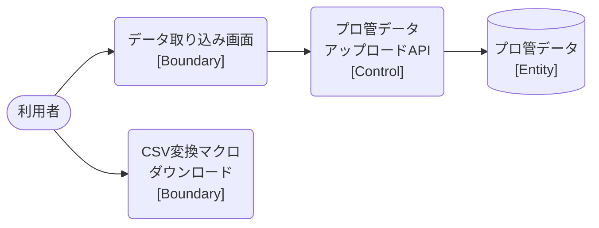

# ロバストネス図

> 工程2 UI（基本設計）の正式成果物。`docs/base-design/ロバストネス図_{要件ID}.md` に生成する（**1要件ID = 1ロバストネス図**）。
> ユースケース（要件ID）の記述を Boundary（境界）・Control（制御）・Entity（実体）オブジェクトに変換し、実装対象クラス一覧・シーケンス図への解像度を上げる（ICONIXプロセスの手法を採用）。
> 機能ID・要件ID・スタックの対応は `docs/base-design/機能一覧.md` を正とする。`bs` スタックは未着手のため、Control/Entity は `Web_API_IF定義書_bs-006.md` に基づく参考情報として記載する。

| 項目 | 内容 |
|---|---|
| プロダクト名 | コスト管理システム |
| 作成日 | 2026/08/20 |
| 作成者 | Claude (basic-design移行) |
| 最終更新日 | 2026/08/20 |
| 最終更新者 | Claude (basic-design移行) |

---

## データ取り込み（プロ管データ）

| 項目 | 内容 |
|---|---|
| 要件ID | R006 |
| 関連機能ID | front-intra-006, bs-006（参考情報） |

### 概要

利用者がフォルダ選択で複数のプロ管データCSVを取り込む。データ取り込み画面（front-intra-006）からプロ管データアップロードAPI（bs-006）を呼び出し、プロ管データを登録・削除する。

### ロバストネス図

### オブジェクト一覧

| 種別 | 名称 | 概要 | 対応実装クラス（実装対象クラス一覧を参照） |
|---|---|---|---|
| Boundary | データ取り込み画面 | フォルダ選択でプロ管データCSVを複数選択し送信する | `TorikomiPage`（frontend） |
| Boundary | CSV変換マクロダウンロード | プロ管計画値をCSV化するExcelマクロファイルの配布 | `MacroDownloadButton`（frontend。API呼出を伴わない静的配布） |
| Control | プロ管データアップロードAPI | 送信されたCSV全件を解析し登録・削除処理を行う（参考情報） | `UploadProkanDataController` / `UploadProkanDataService`（bs・未着手） |
| Entity | プロ管データ | プロ管データの永続化実体（参考情報） | `ProkanData` / 対応テーブル（bs・未着手） |

---

## 更新履歴

| Ver | 更新日 | 更新者 | 更新内容 |
|---|---|---|---|
| 1.0 | 2026/08/20 | Claude (basic-design移行) | 初版 |
