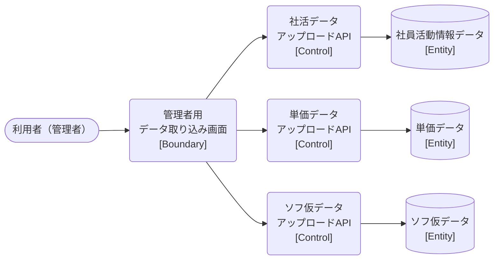

# ロバストネス図

> 工程2 UI（基本設計）の正式成果物。`docs/base-design/ロバストネス図_{要件ID}.md` に生成する（**1要件ID = 1ロバストネス図**）。
> ユースケース（要件ID）の記述を Boundary（境界）・Control（制御）・Entity（実体）オブジェクトに変換し、実装対象クラス一覧・シーケンス図への解像度を上げる（ICONIXプロセスの手法を採用）。
> 機能ID・要件ID・スタックの対応は `docs/base-design/機能一覧.md` を正とする。`bs` スタックは未着手のため、Control/Entity は `Web_API_IF定義書_bs-007/008/009.md` に基づく参考情報として記載する。

| 項目 | 内容 |
|---|---|
| プロダクト名 | コスト管理システム |
| 作成日 | 2026/08/20 |
| 作成者 | Claude (basic-design移行) |
| 最終更新日 | 2026/08/20 |
| 最終更新者 | Claude (basic-design移行) |

---

## 管理者用データ取り込み（社員活動情報・単価・ソフ仮データ）

| 項目 | 内容 |
|---|---|
| 要件ID | R007 |
| 関連機能ID | front-intra-007, bs-007, bs-008, bs-009（bs-007〜009は参考情報） |

### 概要

管理者権限を持つ利用者が、社員活動情報データ・単価データ・ソフ仮データの3種のCSVをそれぞれ独立したフォームから取り込む。管理者用データ取り込み画面（front-intra-007）から対応する3つのアップロードAPI（bs-007/008/009）を個別に呼び出す。

### ロバストネス図

### オブジェクト一覧

| 種別 | 名称 | 概要 | 対応実装クラス（実装対象クラス一覧を参照） |
|---|---|---|---|
| Boundary | 管理者用データ取り込み画面 | 3種のCSVを独立したフォームでそれぞれ選択・送信する（管理者権限必須） | `AdminTorikomiPage`（frontend） |
| Control | 社活データアップロードAPI | 年月＋CSVを解析し社員活動情報データを登録する（参考情報） | `UploadShakatsuDataController` / `UploadShakatsuDataService`（bs・未着手） |
| Control | 単価データアップロードAPI | CSVを解析し単価データを登録する（参考情報） | `UploadTankaDataController` / `UploadTankaDataService`（bs・未着手） |
| Control | ソフ仮データアップロードAPI | 年度＋CSVを解析しソフ仮データを登録する（参考情報） | `UploadSofukariDataController` / `UploadSofukariDataService`（bs・未着手） |
| Entity | 社員活動情報データ | 社員活動情報データの永続化実体（参考情報） | `ShakatsuData` / 対応テーブル（bs・未着手） |
| Entity | 単価データ | 単価データの永続化実体（参考情報） | `TankaData` / 対応テーブル（bs・未着手） |
| Entity | ソフ仮データ | ソフ仮データの永続化実体（参考情報） | `SofukariData` / 対応テーブル（bs・未着手） |

---

## 更新履歴

| Ver | 更新日 | 更新者 | 更新内容 |
|---|---|---|---|
| 1.0 | 2026/08/20 | Claude (basic-design移行) | 初版 |
