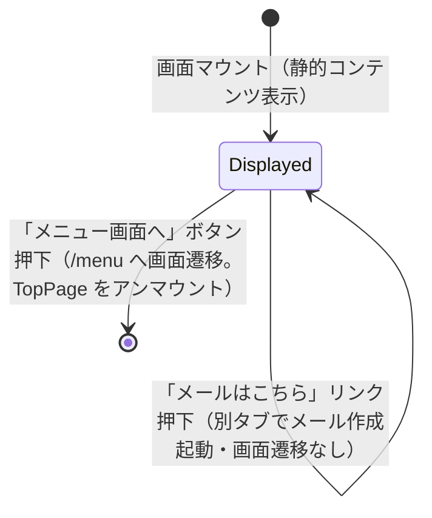

# 画面状態遷移図

> 工程2 UI（基本設計）の正式成果物。`docs/base-design/画面状態遷移図_{機能ID}.md` に生成する（**1機能ID = 1画面**・frontend のみ）。
> 画面（コンポーネント）内部の state 設計の軸になる。`コンポーネント仕様書_{機能ID}.md` の State 定義と対応させる。

| 項目 | 内容 |
|---|---|
| プロダクト名 | コスト管理システム |
| 作成日 | 2026/08/20 |
| 作成者 | Claude (basic-design移行) |
| 最終更新日 | 2026/08/20 |
| 最終更新者 | Claude (basic-design移行) |

## 基本情報

| 項目 | 内容 |
|---|---|
| 機能ID | front-intra-001 |
| 画面名 | トップページ |
| コンポーネント名 | TopPage |

> `TopPage` は `useState` を保持しない（`_src/features/top/components/Top.tsx` を確認済み。お知らせ・お問い合わせ先は画面のソースに直接記述された静的コンテンツであり、API通信・ローディング・エラー等の内部状態を持たない）。このため状態遷移は「表示中」の単一状態のみで、遷移は他画面への画面遷移（本コンポーネントのアンマウント）に限られる。

## 状態遷移図

## 状態一覧

| 状態 | 概要 | 画面表示 |
|---|---|---|
| Displayed | 唯一の状態。マウント直後から静的コンテンツ（お知らせ一覧・お問い合わせ先）を表示し続ける | お知らせ一覧（9件・新しい順）、お問い合わせ先の表、「メニュー画面へ」ボタン、「メールはこちら」リンク |

## 更新履歴

| Ver | 更新日 | 更新者 | 更新内容 |
|---|---|---|---|
| 1.0 | 2026/08/20 | Claude (basic-design移行) | 初版 |
