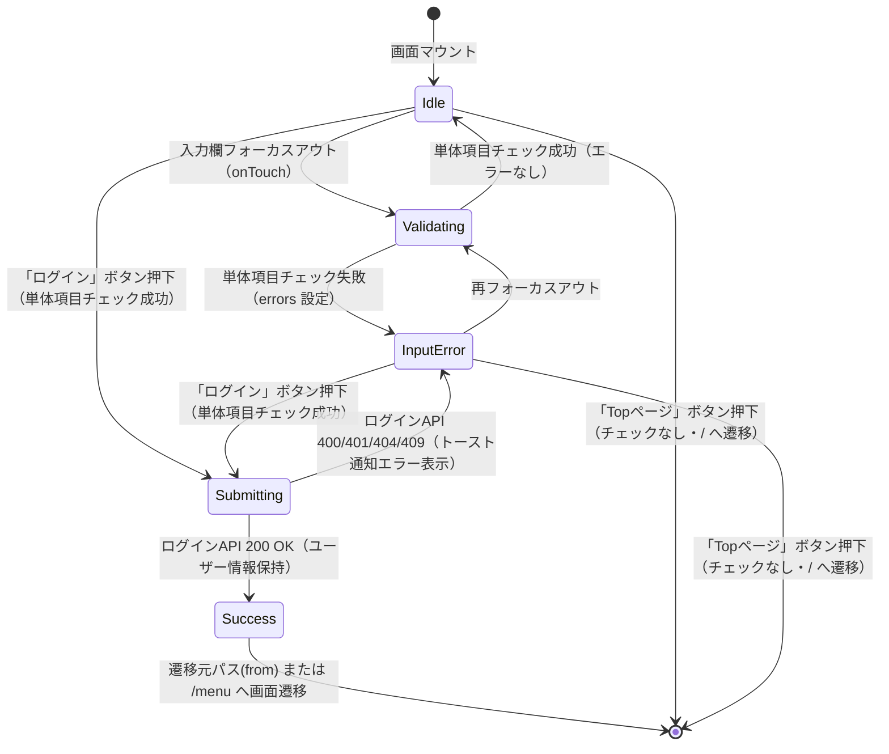

# 画面状態遷移図

> 工程2 UI（基本設計）の正式成果物。`docs/base-design/画面状態遷移図_{機能ID}.md` に生成する（**1機能ID = 1画面**・frontend のみ）。
> 画面（コンポーネント）内部の state 設計の軸になる。`コンポーネント仕様書_{機能ID}.md` の State 定義と対応させる。

| 項目 | 内容 |
|---|---|
| プロダクト名 | コスト管理システム |
| 作成日 | 2026/08/20 |
| 作成者 | Claude (basic-design移行) |
| 最終更新日 | 2026/08/20 |
| 最終更新者 | Claude (basic-design移行) |

## 基本情報

| 項目 | 内容 |
|---|---|
| 機能ID | front-intra-002 |
| 画面名 | ログイン画面 |
| コンポーネント名 | LoginPage |

> `_src/features/login/components/Login.tsx` を確認。`LoginPage` は `useForm`（react-hook-form）の `formState.errors` によりバリデーションエラー状態を保持し、`useLoading`（`LoadingContext`）の `isLoading` によりAPI呼出中のローディング状態を保持する（いずれもローカル `useState` ではないが、画面上は同様の状態遷移として振る舞う）。

## 状態遷移図

## 状態一覧

| 状態 | 概要 | 画面表示 |
|---|---|---|
| Idle | 初期表示・入力待ち状態。エラー表示なし | ユーザーID・パスワード入力欄、「ログイン」「Topページ」ボタン |
| Validating | フォーカスアウト時に単体項目チェック（Zod: `loginSchema`）を実行中の遷移状態 | 入力欄表示（チェック結果反映前） |
| InputError | 単体項目チェック失敗、または認証失敗・通信エラーによりエラーが表示されている状態 | 該当入力欄の背景・枠線を変更しエラーメッセージ表示、またはトースト通知（エラー） |
| Submitting | 「ログイン」ボタン押下後、ログインAPI（bs-002）呼出中の状態（`isLoading = true`） | 画面全体を覆うローディング表示 |
| Success | 認証成功。ユーザー情報（`AuthUserContext`）を保持し画面遷移する直前の状態 | （遷移のため当該画面の表示なし） |

## 更新履歴

| Ver | 更新日 | 更新者 | 更新内容 |
|---|---|---|---|
| 1.0 | 2026/08/20 | Claude (basic-design移行) | 初版 |
