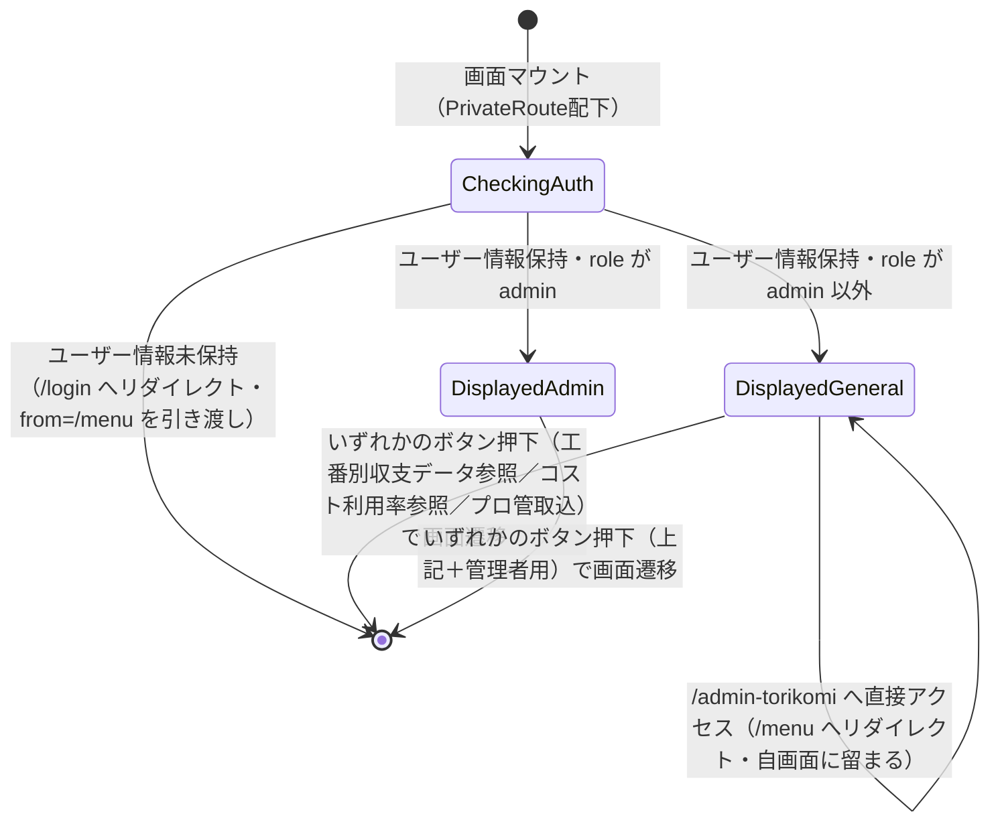

# 画面状態遷移図

> 工程2 UI（基本設計）の正式成果物。`docs/base-design/画面状態遷移図_{機能ID}.md` に生成する（**1機能ID = 1画面**・frontend のみ）。
> 画面（コンポーネント）内部の state 設計の軸になる。`コンポーネント仕様書_{機能ID}.md` の State 定義と対応させる。

| 項目 | 内容 |
|---|---|
| プロダクト名 | コスト管理システム |
| 作成日 | 2026/08/20 |
| 作成者 | Claude (basic-design移行) |
| 最終更新日 | 2026/08/20 |
| 最終更新者 | Claude (basic-design移行) |

## 基本情報

| 項目 | 内容 |
|---|---|
| 機能ID | front-intra-003 |
| 画面名 | メニュー画面 |
| コンポーネント名 | MenuPage |

> `_src/features/menu/components/Menu.tsx` を確認。`MenuPage` はローカル `useState` を保持しない。表示の分岐は `useUserInfo()`（`AuthUserContext`）から取得する権限（`role`）に応じたレンダリング条件であり、ルーティング保護（`PrivateRoute`/`AdminRoute`）による画面遷移と合わせて状態遷移として表現する。

## 状態遷移図

## 状態一覧

| 状態 | 概要 | 画面表示 |
|---|---|---|
| CheckingAuth | マウント直後、`PrivateRoute` によるログイン状態チェックが行われる遷移状態 | （画面表示前。未ログイン時は即時リダイレクト） |
| DisplayedGeneral | ログイン済み・`role` が `admin` 以外。無操作時間の計測（セッションタイムアウト監視）を開始 | 「収支管理データ参照」「メンテ機能」グループのボタン（「管理者用」ボタンは非表示） |
| DisplayedAdmin | ログイン済み・`role` が `admin`。無操作時間の計測を開始 | 「収支管理データ参照」「メンテ機能」グループのボタン（「管理者用」ボタンを含む） |

## 更新履歴

| Ver | 更新日 | 更新者 | 更新内容 |
|---|---|---|---|
| 1.0 | 2026/08/20 | Claude (basic-design移行) | 初版 |
