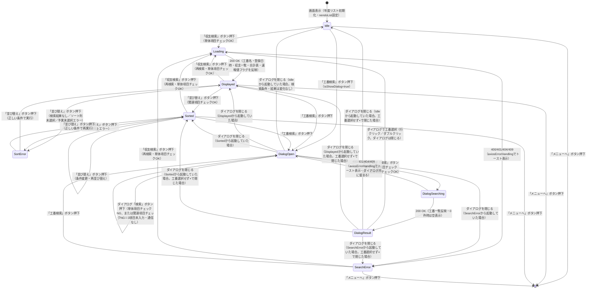

# 画面状態遷移図

> 工程2 UI（基本設計）の正式成果物。`docs/base-design/画面状態遷移図_{機能ID}.md` に生成する（**1機能ID = 1画面**・frontend のみ）。
> 画面（コンポーネント）内部の state 設計の軸になる。`コンポーネント仕様書_{機能ID}.md` の State 定義と対応させる。

| 項目 | 内容 |
|---|---|
| プロダクト名 | コスト管理システム |
| 作成日 | 2026/08/20 |
| 作成者 | Claude (basic-design移行) |
| 最終更新日 | 2026/08/20 |
| 最終更新者 | Claude (basic-design移行) |

## 基本情報

| 項目 | 内容 |
|---|---|
| 機能ID | front-intra-004 |
| 画面名 | 工番別収支データ参照画面 |
| コンポーネント名 | `KobanbetsuShushi`（`features/kobanbetsuShushi/components/KobanbetsuShushi.tsx`。ダイアログ `KobanSearchDialog` を内包） |

> 状態は `KobanbetsuShushi.tsx` の `useState`（`kobanNm` / `nendoList` / `sortingYojitsuFlg` / `sortingColumn` / `sortingErrorMessage` / `sortOrder` / `registerDateList` / `sokuhoFlg` / `shushiData` / `historyShushiData` / `totalData` / `pinedColumnWidth` / `isShowDialog` 等）および `KobanSearchDialog.tsx` の `useState`（`kobanData`）・ローディングコンテキスト（`useLoading`）から抽出した、画面全体としての実効的な状態遷移を表す。

## 状態遷移図

## 状態一覧

| 状態 | 概要 | 画面表示 |
|---|---|---|
| Idle | 初期表示・検索条件入力待ち（`shushiData`/`totalData` 未検索状態、`isShowDialog=false`） | 検索条件フォーム表示。収支一覧・合計表は空。登録日時表は初期値（`----/--/-- --:--:--`。「プロ管（計画値）」は未登録扱いで「プロ管取込」リンク表示） |
| Loading | 収支検索API（bs-005）呼出中（`useLoading` の `runWithLoading` 実行中）。呼出前に `clearResultData` で検索結果をクリア済み | ローディング表示（画面全体を覆う） |
| Displayed | 収支検索成功・検索結果表示中（`shushiData`/`historyShushiData`/`totalData`/`sokuhoFlg`/`registerDateList`/`kobanNm` を反映済み） | 収支一覧グリッド・合計表グリッド・工番名・登録日時（5件）を表示。速報値の月に `(*)` 表示 |
| SearchError | 収支検索失敗（400/401/404/409） | 検索結果は空のまま（`clearResultData` 実行済み）。トースト通知でエラーメッセージ表示。401時は3秒後に自動ログアウト |
| Sorted | 並び替え適用済み（`shushiData` を社員単位でグループ化しソート。合計表・`historyShushiData` は対象外） | 収支一覧グリッドの行順が並び替え条件（予実／列／昇順・降順）に従って変化。合計表は変化なし |
| SortError | 並び替え条件エラー（`sortingErrorMessage` 設定） | 並び替え条件欄下にエラーメッセージ表示（検索結果なし／ソート列未選択／予実未選択で収支列を選択、のいずれか） |
| DialogOpen | 工番検索ダイアログ表示中・検索前または検索エラー時（`isShowDialog=true`、`kobanData` は初期状態またはクリア済み） | ダイアログ（工番コード親番・子番・工番名の入力欄、工番一覧は空） |
| DialogSearching | ダイアログ内で工番検索API（bs-004）呼出中 | ダイアログ内ローディング表示 |
| DialogResult | 工番検索成功・工番一覧表示中（`kobanData` に検索結果を反映。0件時は空一覧） | ダイアログ内に工番一覧グリッドを表示（0件時はグリッドに行なし） |

## 更新履歴

| Ver | 更新日 | 更新者 | 更新内容 |
|---|---|---|---|
| 1.0 | 2026/08/20 | Claude (basic-design移行) | 初版 |
