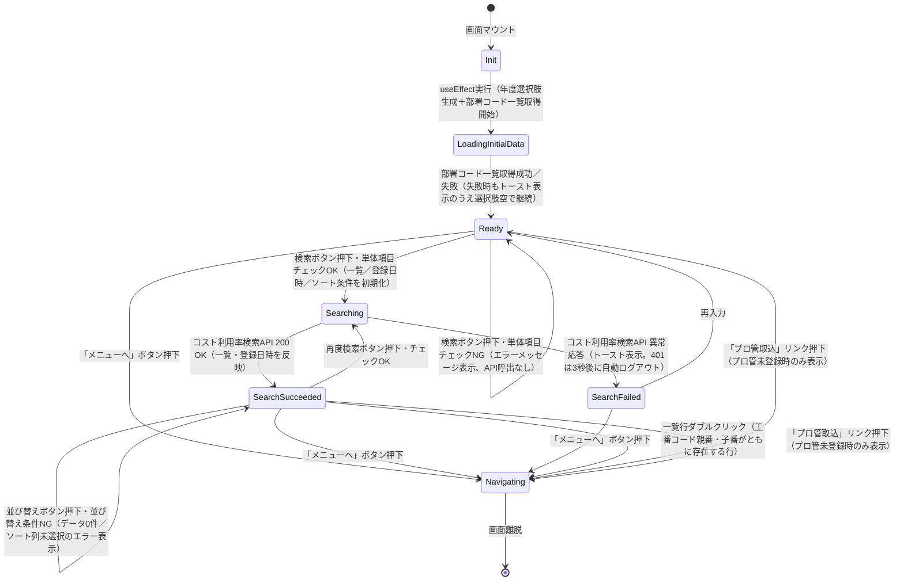

# 画面状態遷移図

> 工程2 UI（基本設計）の正式成果物。`/basic-design-gen` が `docs/base-design/画面状態遷移図_{機能ID}.md` に生成する（**1機能ID = 1画面**・frontend のみ）。
> 画面（コンポーネント）内部の state 設計の軸になる。`コンポーネント仕様書_{機能ID}.md` の State 定義と対応させる。

| 項目 | 内容 |
|---|---|
| プロダクト名 | コスト管理システム |
| 作成日 | 2026/08/20 |
| 作成者 | Claude (basic-design移行) |
| 最終更新日 | 2026/08/20 |
| 最終更新者 | Claude (basic-design移行) |

## 基本情報

| 項目 | 内容 |
|---|---|
| 機能ID | front-intra-005 |
| 画面名 | コスト利用率参照画面 |
| コンポーネント名 | `CostRiyoritsu`（`src/features/costRiyoritsu/components/CostRiyoritsu.tsx`） |

> 実装コードの `useState` 定義（`nendoList`／`bushoCdList`／`costRiyoritsuData`／`historyCostRiyoritsuData`／`sortingColumn`／`sortingErrorMessage`／`sortOrder`／`registerDateList`）およびローディングコンテキスト（`useLoading`）・フォームエラー（`react-hook-form`）を基に、画面全体の状態遷移として抽出したもの。

## 状態遷移図

## 状態一覧

| 状態 | 概要 | 画面表示 |
|---|---|---|
| Init | コンポーネントマウント直後（`useState` 初期値：`nendoList`/`bushoCdList`=空配列、`costRiyoritsuData`/`historyCostRiyoritsuData`=空配列、`sortingColumn`='kobanCdOya'、`sortOrder`=1、`registerDateList`=空5件） | 何も表示されない一瞬の状態 |
| LoadingInitialData | `useEffect` により年度選択肢（`createNendoList`）を生成しつつ、部署コード一覧取得API（bs-001）を呼出中（`runWithLoading`でローディング表示ON） | ローディング表示 |
| Ready | 初期表示完了・検索条件入力待ち（`bushoCdList`セット済み、`nendoList`の最終年度を`nendo`初期値に設定） | 検索条件フォーム（工番コード・工番名・年度・部署コード）・登録日時表（未登録項目は「-」または「プロ管取込」リンク） |
| Searching | 「検索」ボタン押下・単体項目チェックOK後、コスト利用率検索API（bs-003）呼出中（`registerDateList`/`costRiyoritsuData`/`historyCostRiyoritsuData`/ソート条件を先に初期化してからローディング表示ON） | ローディング表示 |
| SearchSucceeded | 検索成功・一覧表示中（`costRiyoritsuData`/`historyCostRiyoritsuData`/`registerDateList`にAPI応答を反映） | コスト利用率一覧グリッド（セル値により背景色変化）・登録日時表・並び替えUI |
| SearchFailed | 検索API異常応答（`axiosErrorHandling`でトースト表示、一覧は空のまま） | トースト通知（401時は3秒後に自動ログアウト）。一覧・登録日時は表示されない |
| Navigating | 「メニューへ」ボタン・「プロ管取込」リンク・一覧行ダブルクリック（工番コードあり）により画面遷移中 | 遷移先画面へ切り替わる（本画面から離脱） |

## 更新履歴

| Ver | 更新日 | 更新者 | 更新内容 |
|---|---|---|---|
| 1.0 | 2026/08/20 | Claude (basic-design移行) | 初版 |
