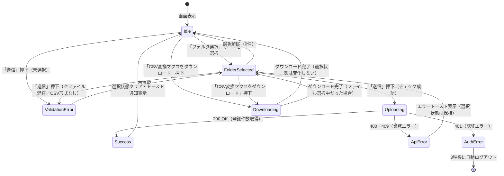

# 画面状態遷移図

> 工程2 UI（基本設計）の正式成果物。`docs/base-design/画面状態遷移図_{機能ID}.md` に生成する（**1機能ID = 1画面**）。
> 画面（コンポーネント）内部の state 設計の軸になる。`コンポーネント仕様書_front-intra-006.md` の State 定義と対応させる。

| 項目 | 内容 |
|---|---|
| プロダクト名 | コスト管理システム |
| 作成日 | 2026/08/20 |
| 作成者 | Claude (basic-design移行) |
| 最終更新日 | 2026/08/20 |
| 最終更新者 | Claude (basic-design移行) |

## 基本情報

| 項目 | 内容 |
|---|---|
| 機能ID | front-intra-006 |
| 画面名 | データ取り込み画面 |
| コンポーネント名 | TorikomiPage |

## 状態遷移図

## 状態一覧

| 状態 | 概要 | 画面表示 |
|---|---|---|
| Idle | 初期表示・フォルダ未選択の入力待ち | ファイル名欄は空、送信・マクロダウンロードボタン表示 |
| FolderSelected | フォルダ選択済み（単体項目チェック成功） | ファイル名欄に選択フォルダ名を表示 |
| ValidationError | 単体項目チェック失敗（未選択／空ファイル混在／CSV形式なし） | `ERROR_REQUIRED_SELECT`／`ERROR_NOT_EMPTY_FILE`／`ERROR_INVALID_FILE_TYPE` をファイル名欄下に表示 |
| Uploading | プロ管データアップロードAPI呼出中 | ローディング表示（画面全体をブロック） |
| Success | 登録成功 | トースト通知（`INFOMATION_SUCCESS_REGIST` + 登録件数） |
| ApiError | API呼出時の業務エラー（400／409） | サーバのエラーメッセージをトースト通知。選択状態は保持し再送信可能 |
| AuthError | 認証エラー（401） | システムエラートースト表示後、3秒後に自動ログアウト |
| Downloading | CSV変換マクロファイルのダウンロード処理中 | 動的リンク生成→クリック→削除（画面状態は変化しない） |

## 更新履歴

| Ver | 更新日 | 更新者 | 更新内容 |
|---|---|---|---|
| 1.0 | 2026/08/20 | Claude (basic-design移行) | 初版 |
