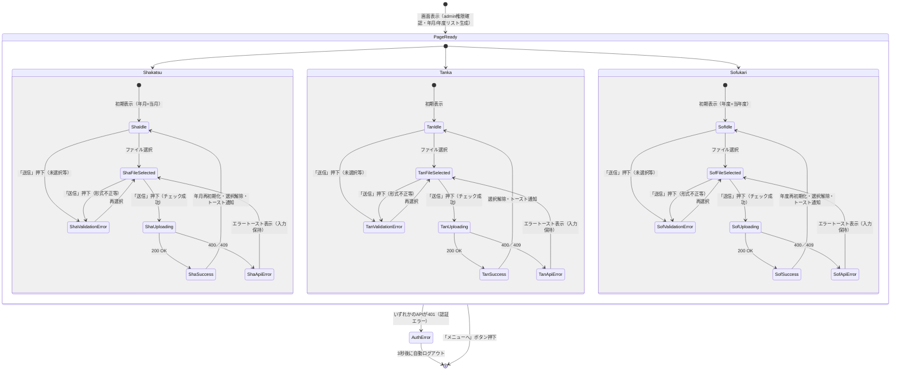

# 画面状態遷移図

> 工程2 UI（基本設計）の正式成果物。`docs/base-design/画面状態遷移図_{機能ID}.md` に生成する（**1機能ID = 1画面**）。
> 画面（コンポーネント）内部の state 設計の軸になる。`コンポーネント仕様書_front-intra-007.md` の State 定義と対応させる。
> front-intra-007 は3つの独立したフォーム（社員活動情報データ／単価データ／ソフ仮データ）を持つため、
> フォームごとの状態を並行状態（`state ... {}`）として個別に表現する。1フォームの状態遷移は他フォームに影響しない。

| 項目 | 内容 |
|---|---|
| プロダクト名 | コスト管理システム |
| 作成日 | 2026/08/20 |
| 作成者 | Claude (basic-design移行) |
| 最終更新日 | 2026/08/20 |
| 最終更新者 | Claude (basic-design移行) |

## 基本情報

| 項目 | 内容 |
|---|---|
| 機能ID | front-intra-007 |
| 画面名 | 管理者用 データ取り込み画面 |
| コンポーネント名 | AdminTorikomiPage |

## 状態遷移図

## 状態一覧

| 状態 | 概要 | 画面表示 |
|---|---|---|
| PageReady | 3フォームがそれぞれ独立に操作可能な状態 | admin権限確認済み。年月／年度の選択肢を初期表示 |
| Sha/Tan/SofIdle | 各フォームの入力待ち状態 | ファイル名欄は空。年月／年度は既定値（当月・当年度）を選択済み |
| Sha/Tan/SofFileSelected | 各フォームでファイル選択済み（単体項目チェック成功） | ファイル名欄に選択ファイル名を表示 |
| Sha/Tan/SofValidationError | 単体項目チェック失敗 | `ERROR_REQUIRED_SELECT`／`ERROR_INVALID_SELECT`／`ERROR_NOT_EMPTY_FILE`／`ERROR_INVALID_FILE_TYPE` をエラーメッセージ欄に表示 |
| Sha/Tan/SofUploading | 対応するアップロードAPI呼出中 | ローディング表示（画面全体をブロック。他フォームも操作不可） |
| Sha/Tan/SofSuccess | 登録成功 | トースト通知（`INFOMATION_SUCCESS_REGIST` + 登録件数）。当該フォームのみ初期化（他フォームは保持） |
| Sha/Tan/SofApiError | API呼出時の業務エラー（400／409） | サーバのエラーメッセージをトースト通知。当該フォームの入力は保持し再送信可能 |
| AuthError | 認証エラー（401） | システムエラートースト表示後、3秒後に自動ログアウト（画面全体） |

## 更新履歴

| Ver | 更新日 | 更新者 | 更新内容 |
|---|---|---|---|
| 1.0 | 2026/08/20 | Claude (basic-design移行) | 初版 |
