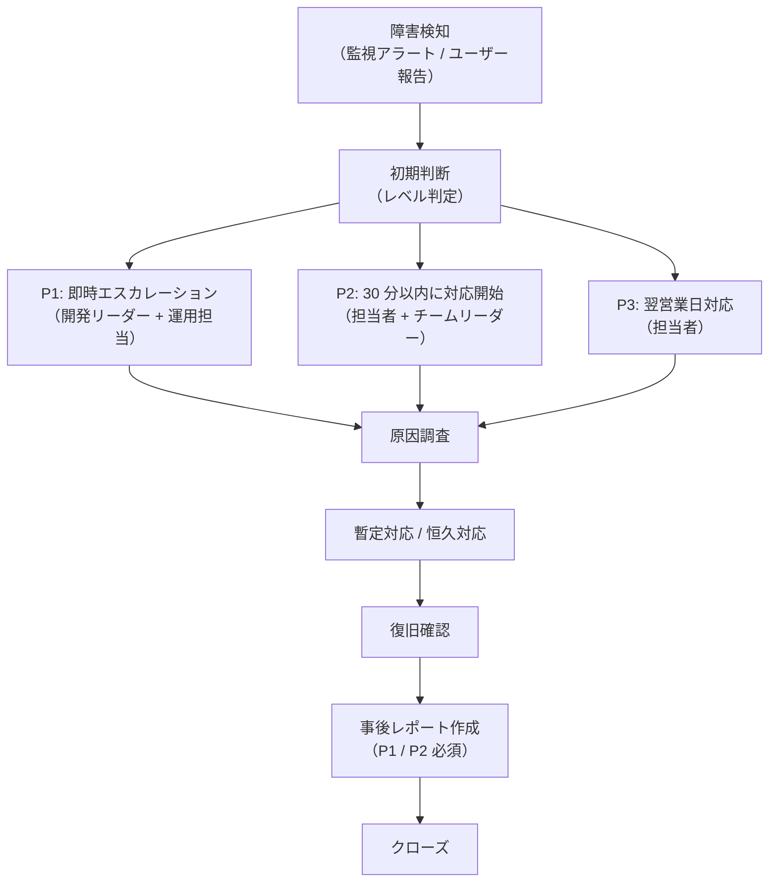

# 障害管理手順書

## 1. 目的

本手順書は、本番環境で障害が発生した場合の検知・報告・対応・復旧・事後分析の手順を定める。

## 2. 障害レベル定義

| レベル | 名称 | 判断基準 | 初動目標時間 |
|---|---|---|---|
| P1 | 重大障害 | 全ユーザーがサービスを利用できない / データ損失の可能性がある | 15 分以内に対応開始 |
| P2 | 重要障害 | 一部機能が停止している / 主要業務が継続できない | 30 分以内に対応開始 |
| P3 | 軽微障害 | 一部機能の不具合 / 業務継続は可能 | 翌営業日中に対応開始 |
| P4 | 問い合わせ | 動作に疑問 / 要望 | 通常対応 |

## 3. 障害対応フロー



## 4. 連絡体制

| 役割 | 担当者 | 連絡方法 | 備考 |
|---|---|---|---|
| 運用担当（一次対応） | <!-- 氏名 --> | <!-- Slack / 電話 --> | 24 時間対応 |
| 開発リーダー（P1 / P2 対応） | <!-- 氏名 --> | <!-- Slack / 電話 --> | — |
| システム管理者 | <!-- 氏名 --> | <!-- 電話 --> | インフラ起因の場合 |
| 顧客窓口 | <!-- 氏名 --> | <!-- メール --> | P1 / P2 時に報告 |

<!-- 実プロダクトの体制に合わせて更新すること -->

## 5. 初期調査手順

### 5.1 ログ確認

```bash
# アプリケーションログ（直近 1 時間）
$ tail -n 1000 /var/log/app/application.log | grep "ERROR\|WARN"

# 詳細ログ（タイムスタンプ指定）
$ grep "2026-05-29 10:" /var/log/app/application.log | grep ERROR
```

### 5.2 DB 状態確認

```sql
-- ロック確認（PostgreSQL）
SELECT * FROM pg_locks;

-- 長時間実行クエリ
SELECT pid, now() - pg_stat_activity.query_start AS duration, query
FROM pg_stat_activity
WHERE (now() - pg_stat_activity.query_start) > interval '5 minutes';
```

### 5.3 リソース確認

```bash
# CPU / メモリ
$ top -b -n 1

# ディスク使用量
$ df -h

# JVM ヒープ状況（PID は ps aux で確認）
$ jstat -gc <PID>
```

## 6. ロールバック手順

### アプリロールバック

`docs/operation/deployment.md` の「ロールバック手順」を参照。

### DB ロールバック

```bash
# Flyway による特定バージョンへのロールバック
$ mvn flyway:undo -Dflyway.target={バージョン番号}
```

> ⚠️ Flyway undo は DDL 変更を伴う場合、慎重に実施すること。データ損失リスクを事前に確認する。

## 7. 障害管理票

障害発生時はこのテンプレートをコピーして記録する。

| 項目 | 内容 |
|---|---|
| 障害 ID | <!-- INC-YYYY-NNN --> |
| 検知日時 | <!-- YYYY/MM/DD HH:mm --> |
| 障害レベル | <!-- P1 / P2 / P3 / P4 --> |
| 影響範囲 | <!-- 影響を受けた機能・ユーザー数 --> |
| 症状 | <!-- 具体的な現象を記述 --> |
| 原因 | <!-- 根本原因を記述 --> |
| 暫定対応 | <!-- 暫定措置の内容・実施日時 --> |
| 恒久対応 | <!-- 恒久対応の内容・実施予定日 --> |
| 復旧日時 | <!-- YYYY/MM/DD HH:mm --> |
| 対応者 | <!-- 氏名 --> |

## 8. ポストモーテム（事後分析）テンプレート（P1 / P2 必須）

P1 / P2 障害は復旧から 3 営業日以内にポストモーテムを作成し、チームで共有する。

```markdown
# ポストモーテム: {障害ID}

## 概要
<!-- 何が起きたか、影響範囲、復旧までの時間を要約 -->

## タイムライン
| 時刻 | 出来事 |
|-----|-------|
| HH:mm | 障害検知 |
| HH:mm | 初期対応開始 |
| HH:mm | 原因特定 |
| HH:mm | 復旧完了 |

## 根本原因
<!-- 技術的な根本原因 -->

## 再発防止策
| 対応内容 | 担当 | 期限 |
|---------|------|------|
| | | |

## 学習事項
<!-- このインシデントから学んだこと -->
```

## 更新履歴

| Ver | 更新日 | 更新者 | 更新内容 |
|---|---|---|---|
| 1.0 | <!-- YYYY/MM/DD --> | <!-- 氏名 --> | 初版 |
