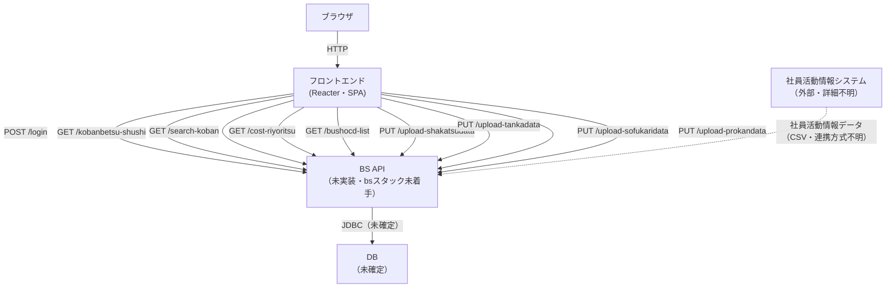

# システム全体図

| 項目 | 内容 |
|---|---|
| プロダクト名 | コスト管理システム |
| 作成日 | 2026/08/20 |
| 作成者 | Claude Code |
| 最終更新日 | 2026/08/20 |
| 最終更新者 | Claude Code |

> 本ファイルは `reacter-react-tsx2doc-試作/_src/const/const.ts`（`API_URL`）を一次情報源として、フロントエンドが呼び出すバックエンドAPI群を整理したものである。本リポジトリでは `bs` スタックが未着手（`bs/` ディレクトリ不在）のため、BS API 群は「未実装」と明記する。旧設計書（`old_docs/`）のコードからは、フロントエンドが US-API 層を経由せず BS の各エンドポイントへ直接アクセスする構成として実装されている（`docs/base-design/Web_API_IF一覧表.md` 参照）。本プロダクトの標準アーキテクチャ（`.claude/rules/product-rules.md`）ではフロントエンドは US-API を介して BS と連携する方針だが、本移行元の旧実装は US-API 層を持たない構成であったため、その事実を以下に記載する（アーキテクチャ変更の要否は SS 工程以降で判断する）。

## システム全体図

> 上図の `BS` ノードは9本の API（`Web_API_IF一覧表.md` の bs-001〜bs-009）をまとめて表現している。US-API 層は旧実装コードから存在が確認できないため図に含めていない（フロントエンドは BS の各エンドポイントへ直接 `axios` で通信している）。

## システムコンテキスト

| コンポーネント | 役割 | 主要技術 |
|---|---|---|
| ブラウザ | ユーザーが操作するクライアント | — |
| フロントエンド（Reacter） | SPA フロント。ログイン・工番別収支参照・コスト利用率参照・データ取り込み・管理者用データ取り込みの7画面を提供する | Reacter / React / TypeScript / React Hook Form + Zod / AG Grid / axios |
| BS API | 認証・収支検索・コスト利用率検索・部署コード取得・CSVアップロードの9エンドポイントを提供する想定のバックエンド | 未実装（`bs` スタック未着手。想定技術は Springer + Spring Boot + MyBatis） |
| DB | データストア | 未確定（`docs/architecture/overview.md` の DB 製品欄が未確定のプレースホルダーのまま。SA 工程で確定していない） |
| 社員活動情報システム | 社員活動情報データ（CSV）の提供元 | 不明（旧設計書に記載なし。フロントエンドのコードからは判定できない） |

## 関連システム

| システム名 | 連携種別 | 連携方式 | 概要 |
|---|---|---|---|
| コスト管理システム BS（バックエンドAPI） | 双方向 | REST（想定・未実装） | ログイン認証・工番別収支検索・工番検索・コスト利用率検索・部署コード一覧取得・4種のCSVアップロード（プロ管・社員活動情報・単価・ソフ仮）を提供する想定 |
| 社員活動情報システム | 入力 | 不明（旧設計書に記載なし） | 社員活動情報データ（CSV）の提供元。取り込みは管理者用データ取り込み画面から手動で行う |

## 更新履歴

| Ver | 更新日 | 更新者 | 更新内容 |
|---|---|---|---|
| 1.0 | 2026/08/20 | Claude Code | 初版（`reacter-react-tsx2doc-試作/_src/const/const.ts` の `API_URL` 一覧・`docs/base-design/Web_API_IF一覧表.md`・`docs/architecture/overview.md` を基に作成） |
