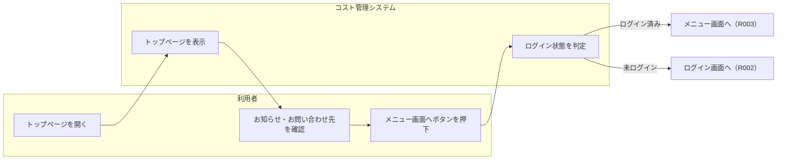
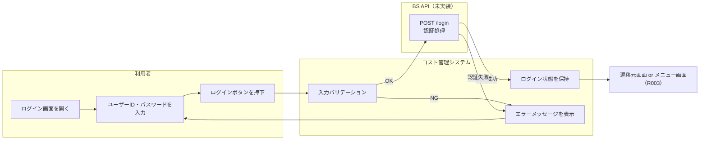
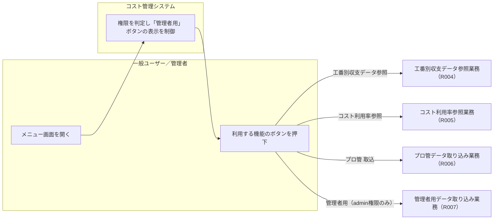
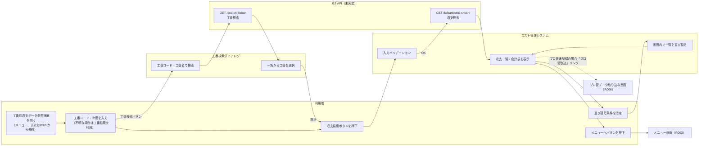
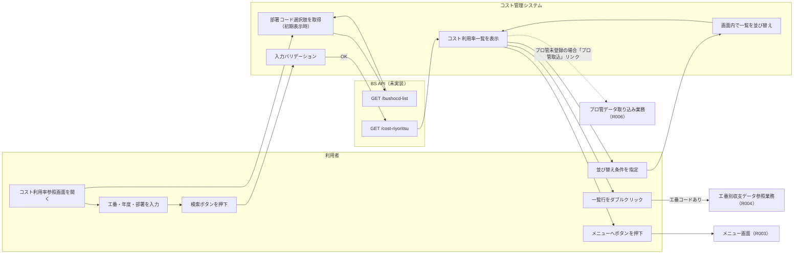
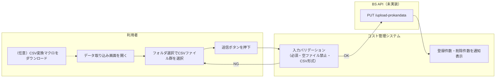
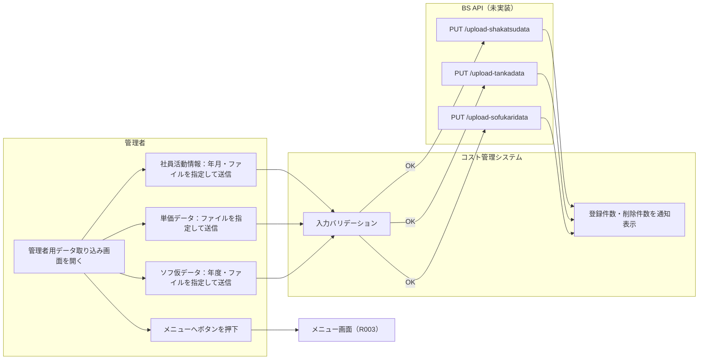

# システム化業務フロー

| 項目 | 内容 |
|---|---|
| プロダクト名 | コスト管理システム |
| 作成日 | 2026/08/20 |
| 作成者 | Claude Code |
| 最終更新日 | 2026/08/20 |
| 最終更新者 | Claude Code |

> 本ファイルは `reacter-react-tsx2doc-試作/_src/routes/AppRoutes.tsx`（画面遷移の定義）および各画面コンポーネントの API 呼び出しを一次情報源として、要件ID（R001〜R007）単位の業務フローを再構成したものである。`docs/requirements/画面遷移図.md` は画面ID単位の遷移条件を機械的に整理したものであり、本ファイルは要件ID単位で「利用者の業務としての一連の流れ」を再構成する点で観点が異なる。

## 業務フロー一覧

| No. | 業務フロー名 | 対応要件ID | 主な担当者 | 概要 |
|---|---|---|---|---|
| 1 | トップページ表示業務 | R001 | 一般ユーザー・管理者（未ログイン含む） | 入口ページの表示とメニューへの導線提供 |
| 2 | ログイン認証業務 | R002 | 一般ユーザー・管理者 | ユーザーID・パスワードによる認証 |
| 3 | メニュー選択業務 | R003 | 一般ユーザー・管理者 | ログイン後の機能選択 |
| 4 | 工番別収支データ参照業務 | R004 | 一般ユーザー・管理者 | 工番別収支データの検索・参照（コスト利用率参照業務と相互遷移） |
| 5 | コスト利用率参照業務 | R005 | 一般ユーザー・管理者 | コスト利用率の検索・参照（工番別収支データ参照業務と相互遷移） |
| 6 | プロ管データ取り込み業務 | R006 | 一般ユーザー・管理者 | プロ管（計画値）データのCSV取り込み |
| 7 | 管理者用データ取り込み業務 | R007 | 管理者 | 社員活動情報・単価・ソフ仮データのCSV取り込み |

---

## 1. トップページ表示業務（R001）

### 業務概要

未ログインの利用者を含め、誰でもアクセスできる入口ページを表示する業務。お知らせ・お問い合わせ先を確認し、メニュー画面（実質的にはログイン画面経由）へ進む起点となる。

### 登場人物（スイムレーン）

| 識別子 | 名称 | 区分 |
|---|---|---|
| User | 一般ユーザー・管理者（未ログイン含む） | 利用者 |
| System | コスト管理システム（フロントエンド） | システム |

### 業務フロー（スイムレーン図）

### 業務フロー説明

| ステップ | 担当 | 処理内容 | 備考 |
|---|---|---|---|
| 1 | 利用者 | トップページを開く | ログイン不要 |
| 2 | システム | お知らせ・お問い合わせ先を表示する | 静的なハードコード情報 |
| 3 | 利用者 | 「メニュー画面へ」ボタンを押下する | — |
| 4 | システム | ログイン状態を判定する | ルーティング保護（`PrivateRoute`）による判定 |
| 5 | システム | ログイン済みならメニュー画面へ、未ログインならログイン画面へ遷移する | — |

### 特記事項・業務上の制約

- トップページ自体はバックエンドAPIを呼び出さない（静的表示のみ）。

---

## 2. ログイン認証業務（R002）

### 業務概要

ユーザーID・パスワードによる認証を行い、ログイン状態をアプリケーションに保持する業務。認証成功後は、遷移元画面（保護画面へのURL直接指定などで `from` が設定されている場合）またはメニュー画面へ進む。

### 登場人物（スイムレーン）

| 識別子 | 名称 | 区分 |
|---|---|---|
| User | 一般ユーザー・管理者 | 利用者 |
| System | コスト管理システム（フロントエンド） | システム |
| BS | BS API（ログインAPI・未実装） | 外部（バックエンド） |

### 業務フロー（スイムレーン図）

### 業務フロー説明

| ステップ | 担当 | 処理内容 | 備考 |
|---|---|---|---|
| 1 | 利用者 | ログイン画面を開く | トップページのボタン、または保護画面へのURL直接指定・セッションタイムアウトから遷移 |
| 2 | 利用者 | ユーザーID・パスワードを入力する | — |
| 3 | システム | 入力バリデーション（必須・桁数）を実行する | クライアント側チェック（Zod） |
| 4 | システム | ログインAPI（`POST /login`）を呼び出す | BS API・本リポジトリでは未実装 |
| 5 | システム | 認証成功時、ユーザー情報（`username`・`authorities`）をアプリケーションに保持する | ローカルストレージにも保持し再読み込み後も維持 |
| 6 | システム | 認証成功時、遷移元画面（`from`）またはメニュー画面へ遷移する | — |
| 7 | システム | 認証失敗時、エラーメッセージ「ユーザーIDまたはパスワードが正しくありません。」を表示する | — |

### 特記事項・業務上の制約

- 「Topページ」ボタンでは認証を行わずトップページへ戻れる。
- 認証は独自ID・パスワード方式であり、外部認証基盤（Azure AD 等）との連携は確認できない（旧設計書に記載なし）。

---

## 3. メニュー選択業務（R003）

### 業務概要

ログイン後、利用者が次に行う機能（工番別収支データ参照・コスト利用率参照・プロ管取込・管理者用データ取り込み）を選択する業務。

### 登場人物（スイムレーン）

| 識別子 | 名称 | 区分 |
|---|---|---|
| User | 一般ユーザー | 利用者 |
| Admin | 管理者 | 利用者 |
| System | コスト管理システム（フロントエンド） | システム |

### 業務フロー（スイムレーン図）

### 業務フロー説明

| ステップ | 担当 | 処理内容 | 備考 |
|---|---|---|---|
| 1 | 利用者 | メニュー画面を開く | ログイン必須（ルーティング保護） |
| 2 | システム | ログインユーザーの権限（`role`）を判定し「管理者用」ボタンの表示を制御する | 管理者（`admin`）の場合のみ表示 |
| 3 | 利用者 | 利用する機能のボタンを押下する | — |
| 4 | システム | 選択された機能の画面へ遷移する | — |

### 特記事項・業務上の制約

- 「プロ管 取込」ボタンは権限に関わらず全ログインユーザーに表示される（R006）。
- 「管理者用」ボタンの非表示はクライアント側の抑止的な制御であり、実際の認可判定はバックエンド側（BS API）で行う想定（`docs/requirements/業務概要.md` 3章 参照）。

---

## 4. 工番別収支データ参照業務（R004）

### 業務概要

工番コード・年度を指定して社員別の計画・実算収支データと合計（計画・実算・利用率）を参照する業務。工番が不明な場合は工番検索ダイアログから検索できる。本業務はコスト利用率参照業務（R005）と相互に遷移する（コスト利用率一覧のダブルクリックから本業務へ遷移できる）。

### 登場人物（スイムレーン）

| 識別子 | 名称 | 区分 |
|---|---|---|
| User | 一般ユーザー・管理者 | 利用者 |
| System | コスト管理システム（フロントエンド） | システム |
| BS | BS API（工番別収支検索API・工番検索API・未実装） | 外部（バックエンド） |

### 業務フロー（スイムレーン図）

### 業務フロー説明

| ステップ | 担当 | 処理内容 | 備考 |
|---|---|---|---|
| 1 | 利用者 | 工番別収支データ参照画面を開く | メニュー画面から、またはコスト利用率参照画面の一覧ダブルクリックから遷移（工番コード・年度が引き渡される） |
| 2 | 利用者 | 工番コード（親番・子番）・年度を入力する | 工番が不明な場合は「工番検索」ボタンからダイアログを開き、工番コード・工番名で検索して選択できる（工番検索API） |
| 3 | システム | 入力バリデーションを実行する | クライアント側チェック（Zod） |
| 4 | システム | 工番別収支検索APIを呼び出し、収支一覧・合計表を表示する | BS API・本リポジトリでは未実装 |
| 5 | 利用者 | 「予実」「列」「順序」を指定し、並び替えボタンを押下する | 通信は発生せず画面内で並び替える |
| 6 | 利用者 | 「メニューへ」ボタンを押下してメニュー画面に戻る | — |

### 特記事項・業務上の制約

- 「プロ管（計画値）」の登録日時が未登録の場合、「プロ管取込」リンクからプロ管データ取り込み業務（R006）へ遷移できる。
- 参照専用の業務であり、登録・更新・削除は行わない。
- 速報値（`(*)` 表示の月）は社員活動情報システムのデータと単価から算出した速報段階の値であり、確定値ではない。

---

## 5. コスト利用率参照業務（R005）

### 業務概要

工番・年度・部署を条件にコスト利用率（対工期・全体・月別）を参照する業務。一覧行のダブルクリックにより、工番別収支データ参照業務（R004）へ工番コード・年度を引き渡して遷移できる（R004との相互遷移）。

### 登場人物（スイムレーン）

| 識別子 | 名称 | 区分 |
|---|---|---|
| User | 一般ユーザー・管理者 | 利用者 |
| System | コスト管理システム（フロントエンド） | システム |
| BS | BS API（コスト利用率検索API・部署コード一覧取得API・未実装） | 外部（バックエンド） |

### 業務フロー（スイムレーン図）

### 業務フロー説明

| ステップ | 担当 | 処理内容 | 備考 |
|---|---|---|---|
| 1 | システム | 画面初期表示時に部署コード選択肢を取得する | 部署コード一覧取得API |
| 2 | 利用者 | 工番コード・工番名・年度・部署を入力する | いずれも任意項目（年度は必須） |
| 3 | システム | 入力バリデーションを実行し、コスト利用率検索APIを呼び出す | BS API・本リポジトリでは未実装 |
| 4 | システム | コスト利用率一覧を表示する | 100%超・100%・100%未満・データなし（`-1`）でセルの表示を変える |
| 5 | 利用者 | 「列」「順序」を指定し並び替えボタンを押下する | 通信は発生せず画面内で並び替える |
| 6 | 利用者 | 一覧行をダブルクリックする | 工番コード（親番・子番）が両方存在する場合のみ、工番別収支データ参照業務（R004）へ工番コード・年度を引き渡して遷移する |
| 7 | 利用者 | 「メニューへ」ボタンを押下してメニュー画面に戻る | — |

### 特記事項・業務上の制約

- 表示金額は確定している金額のみである（速報値の扱いはR004と異なる）。
- 「プロ管（計画値）」の登録日時が未登録の場合、「プロ管取込」リンクからプロ管データ取り込み業務（R006）へ遷移できる。

---

## 6. プロ管データ取り込み業務（R006）

### 業務概要

プロ管（プロジェクト管理）計画値データをCSV形式で取り込む業務。権限による制限はなく、全ログインユーザーが利用できる。取り込み前提として、専用のCSV変換マクロ（Excelマクロファイル）を配布している。

### 登場人物（スイムレーン）

| 識別子 | 名称 | 区分 |
|---|---|---|
| User | 一般ユーザー・管理者 | 利用者 |
| System | コスト管理システム（フロントエンド） | システム |
| BS | BS API（プロ管データアップロードAPI・未実装） | 外部（バックエンド） |

### 業務フロー（スイムレーン図）

### 業務フロー説明

| ステップ | 担当 | 処理内容 | 備考 |
|---|---|---|---|
| 1 | 利用者 | 必要に応じてCSV変換マクロ（`.xlsm`）をダウンロードし、プロ管計画値をCSV化する | 業務システム側（プロ管システム）の操作。本業務フローの範囲外 |
| 2 | 利用者 | データ取り込み画面を開く | メニュー画面・R004・R005から遷移 |
| 3 | 利用者 | フォルダ選択でCSVファイル群を選択する | 複数ファイルを一括選択（`webkitdirectory`） |
| 4 | システム | 入力バリデーション（必須選択・空ファイル禁止・CSV形式）を実行する | — |
| 5 | システム | プロ管データアップロードAPIを呼び出す | BS API・本リポジトリでは未実装 |
| 6 | システム | 登録件数・削除件数を通知（トースト）表示する | 送信後、選択状態をクリアする |

### 特記事項・業務上の制約

- 権限（一般ユーザー／管理者）による利用制限はない。

---

## 7. 管理者用データ取り込み業務（R007）

### 業務概要

管理者権限を持つ利用者が、社員活動情報データ・単価データ・ソフ仮データの3種類のCSVデータをそれぞれ独立したフォームから取り込む業務。

### 登場人物（スイムレーン）

| 識別子 | 名称 | 区分 |
|---|---|---|
| Admin | 管理者 | 利用者 |
| System | コスト管理システム（フロントエンド） | システム |
| BS | BS API（社活・単価・ソフ仮の各アップロードAPI・未実装） | 外部（バックエンド） |

### 業務フロー（スイムレーン図）

### 業務フロー説明

| ステップ | 担当 | 処理内容 | 備考 |
|---|---|---|---|
| 1 | 管理者 | 管理者用データ取り込み画面を開く | メニュー画面の「管理者用」ボタンから遷移（管理者権限が必要） |
| 2 | 管理者 | 社員活動情報データフォームで年月・CSVファイルを指定し送信する | 社活データアップロードAPIを呼び出す |
| 3 | 管理者 | 単価データフォームでCSVファイルを指定し送信する | 単価データアップロードAPIを呼び出す |
| 4 | 管理者 | ソフ仮データフォームで年度・CSVファイルを指定し送信する | ソフ仮データアップロードAPIを呼び出す |
| 5 | システム | 各アップロード成功時、登録件数（・削除件数）を通知（トースト）表示し、当該フォームをクリアする | — |
| 6 | 管理者 | 「メニューへ」ボタンを押下してメニュー画面に戻る | — |

### 特記事項・業務上の制約

- 3つのフォームは独立しており、任意の順序・組み合わせで送信できる。
- 管理者権限（`admin`）以外の利用者は、メニュー画面に「管理者用」ボタンが表示されないため、通常は本画面に到達しない（URL直接指定時はメニュー画面へリダイレクトされる。`docs/requirements/画面遷移図.md` 遷移条件No.16 参照）。

---

## 更新履歴

| Ver | 更新日 | 更新者 | 更新内容 |
|---|---|---|---|
| 1.0 | 2026/08/20 | Claude Code | 初版（`reacter-react-tsx2doc-試作/_src/routes/AppRoutes.tsx` および各画面コンポーネントのAPI呼び出しから要件ID単位の業務フローを再構成） |
