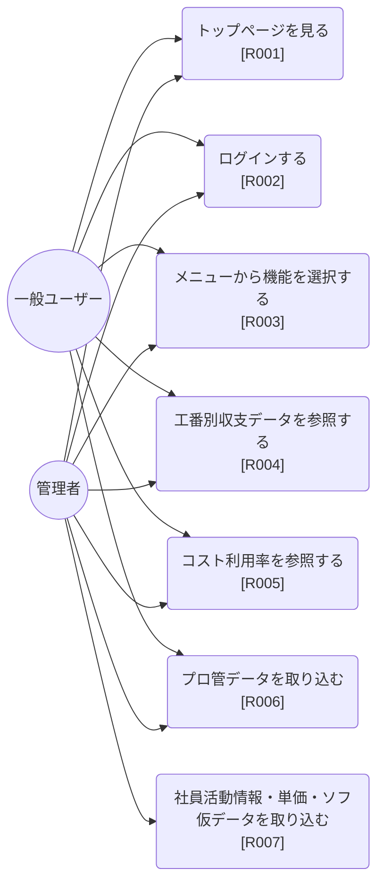

# ユースケース図

| 項目 | 内容 |
|---|---|
| プロダクト名 | コスト管理システム |
| 作成日 | 2026/08/20 |
| 作成者 | Claude Code |
| 最終更新日 | 2026/08/20 |
| 最終更新者 | Claude Code |

> 本ファイルは `docs/requirements/要件一覧.md`（R001〜R007）・`docs/requirements/業務概要.md`（3章 利用者・権限）を一次情報源として作成した。要件ID（R###）とユースケースは1:1で対応する。

## アクター一覧

| 識別子 | 名称 | 概要 |
|---|---|---|
| User | 一般ユーザー（`member`） | 工番別収支データ参照・コスト利用率参照・データ取り込み（プロ管取込）を利用できる利用者 |
| Admin | 管理者（`admin`） | 一般ユーザーの機能に加え、管理者用データ取り込み（社員活動情報・単価・ソフ仮データ）を利用できる利用者 |

## ユースケース図

> 管理者（Admin）は一般ユーザー（User）の全ユースケースを含んだうえで、管理者専用のユースケース（UC7）を追加で持つ（権限の包含関係。`docs/requirements/業務概要.md` 3章参照）。

## ユースケース一覧

| 要件ID | ユースケース名 | 主アクター | 概要 |
|---|---|---|---|
| R001 | トップページを見る | 一般ユーザー・管理者（未ログイン含む） | 未ログインでもアクセスできる入口ページで、お知らせ・お問い合わせ先を確認する |
| R002 | ログインする | 一般ユーザー・管理者 | ユーザーID・パスワードによる認証を行い、ログイン状態を確立する |
| R003 | メニューから機能を選択する | 一般ユーザー・管理者 | ログイン後、利用したい機能（収支データ参照系・データ取り込み系）を選択する |
| R004 | 工番別収支データを参照する | 一般ユーザー・管理者 | 工番・年度を指定して社員別の計画・実算収支データと合計を参照する（工番検索を含む） |
| R005 | コスト利用率を参照する | 一般ユーザー・管理者 | 工番・年度・部署を指定してコスト利用率（対工期・月別）を参照する |
| R006 | プロ管データを取り込む | 一般ユーザー・管理者 | プロ管（計画値）データをCSV形式で取り込む（権限による制限なし） |
| R007 | 社員活動情報・単価・ソフ仮データを取り込む | 管理者 | 社員活動情報・単価・ソフ仮データをそれぞれCSV形式で取り込む（管理者権限が必要） |

## 更新履歴

| Ver | 更新日 | 更新者 | 更新内容 |
|---|---|---|---|
| 1.0 | 2026/08/20 | Claude Code | 初版（`docs/requirements/要件一覧.md`・`業務概要.md` を基に作成） |
