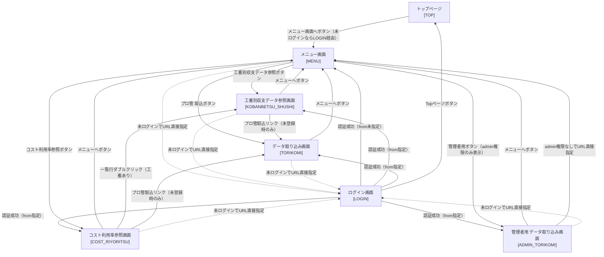

# 画面遷移図

| 項目 | 内容 |
|---|---|
| プロダクト名 | コスト管理システム |
| 作成日 | 2026/08/20 |
| 作成者 | 不明（旧設計書からの移行） |
| 最終更新日 | 2026/08/20 |
| 最終更新者 | 不明（旧設計書からの移行） |

## 画面一覧

| 画面ID | 画面名 | 概要 | 対応要件ID |
|---|---|---|---|
| TOP | トップページ | お知らせ・お問い合わせ先を表示する入口ページ | R001 |
| LOGIN | ログイン画面 | ユーザーID・パスワードによる認証を行う | R002 |
| MENU | メニュー画面 | 各機能への入口ボタンを表示する | R003 |
| KOBANBETSU_SHUSHI | 工番別収支データ参照画面 | 工番別の収支（計画・実算・利用率）を検索・参照する | R004 |
| COST_RIYORITSU | コスト利用率参照画面 | 工番ごとの月別コスト利用率を検索・参照する | R005 |
| TORIKOMI | データ取り込み画面 | プロ管データ（CSV）を取り込む | R006 |
| ADMIN_TORIKOMI | 管理者用 データ取り込み画面 | 社員活動情報・単価・ソフ仮データ（CSV）を取り込む（管理者権限限定） | R007 |

## 画面遷移図

## 遷移条件

| No. | 遷移元 | 遷移先 | 契機 | 条件 |
|---|---|---|---|---|
| 1 | トップページ | メニュー画面 | 「メニュー画面へ」ボタン押下 | 未ログインの場合はルーティング保護によりログイン画面が表示される |
| 2 | ログイン画面 | メニュー画面 | 認証成功 | 遷移元パス（`from`）を受け取っていない場合。履歴は残す |
| 3 | ログイン画面 | 遷移元の画面（`from`） | 認証成功 | 遷移元パスを受け取っている場合。履歴を置き換える |
| 4 | ログイン画面 | トップページ | 「Topページ」ボタン押下 | 認証を行わない |
| 5 | メニュー画面 | 工番別収支データ参照画面 | 「工番別収支データ参照」ボタン押下 | なし |
| 6 | メニュー画面 | コスト利用率参照画面 | 「コスト利用率参照」ボタン押下 | なし |
| 7 | メニュー画面 | データ取り込み画面 | 「プロ管 取込」ボタン押下 | 権限によらず遷移可能 |
| 8 | メニュー画面 | 管理者用データ取り込み画面 | 「管理者用」ボタン押下 | 管理者権限（`admin`）の場合のみボタン表示・遷移可能 |
| 9 | 工番別収支データ参照画面 | メニュー画面 | 「メニューへ」ボタン押下 | なし |
| 10 | 工番別収支データ参照画面 | データ取り込み画面 | 「プロ管取込」リンク押下 | 「プロ管（計画値）」登録日時が未登録の場合のみ表示 |
| 11 | コスト利用率参照画面 | 工番別収支データ参照画面 | 一覧行のダブルクリック | 行に工番コードの親番・子番がともに存在する場合。工番コード・年度を引き渡す |
| 12 | コスト利用率参照画面 | データ取り込み画面 | 「プロ管取込」リンク押下 | 「プロ管（計画値）」登録日時が未登録の場合のみ表示 |
| 13 | コスト利用率参照画面 | メニュー画面 | 「メニューへ」ボタン押下 | なし |
| 14 | データ取り込み画面 | メニュー画面 | 「メニューへ」ボタン押下 | なし |
| 15 | 管理者用データ取り込み画面 | メニュー画面 | 「メニューへ」ボタン押下 | なし |
| 16 | 管理者用データ取り込み画面 | メニュー画面 | 管理者権限なしでURL直接指定 | 履歴を置き換える |
| 17 | 保護対象画面（MENU/KOBANBETSU_SHUSHI/COST_RIYORITSU/TORIKOMI/ADMIN_TORIKOMI） | ログイン画面 | 未ログインでURLに直接アクセス、またはセッションタイムアウト | 遷移元パスを `from` として引き渡す。履歴を置き換える |

## 更新履歴

| Ver | 更新日 | 更新者 | 更新内容 |
|---|---|---|---|
| 1.0 | 2026/08/20 | 不明（旧設計書からの移行） | 初版（`old_docs/` 各画面の「プログラム概要」記載の遷移情報から作成） |
