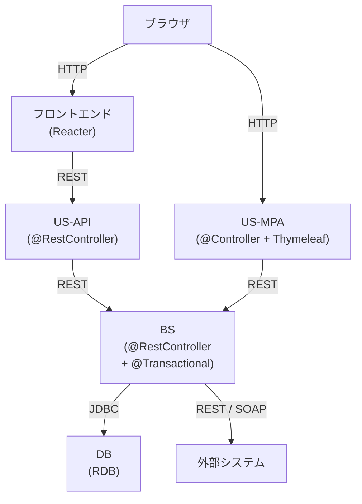

# システム全体図

| 項目 | 内容 |
|---|---|
| プロダクト名 | <!-- プロダクト名 --> |
| 作成日 | <!-- YYYY/MM/DD --> |
| 作成者 | <!-- 氏名 --> |
| 最終更新日 | <!-- YYYY/MM/DD --> |
| 最終更新者 | <!-- 氏名 --> |

## システム全体図

<!-- 利用するスタック（Reacter / US-API / US-MPA / BS）に合わせて図を編集する -->
<!-- 外部システム連携がない場合は該当箇所を削除する -->

## システムコンテキスト

| コンポーネント | 役割 | 主要技術 |
|---|---|---|
| ブラウザ | ユーザーが操作するクライアント | — |
| フロントエンド (Reacter) | SPA フロント | Reacter / TypeScript |
| US-API | SPA 向け JSON API | Springer / Spring Boot |
| US-MPA | Thymeleaf 画面 | Springer / Spring Boot / Thymeleaf |
| BS | ビジネスロジック・DB アクセス | Springer / Spring Boot / MyBatis |
| DB | データストア | RDB（Oracle / PostgreSQL 等） |

<!-- 不要なコンポーネントの行は削除する -->

## 関連システム

| システム名 | 連携種別 | 連携方式 | 概要 |
|---|---|---|---|
| <!-- 外部システム名 --> | <!-- 入力 / 出力 / 双方向 --> | <!-- REST / SFTP / バッチ等 --> | <!-- 連携の概要 --> |

<!-- 関連システムがない場合は「なし」と記載 -->

## 更新履歴

| Ver | 更新日 | 更新者 | 更新内容 |
|---|---|---|---|
| 1.0 | <!-- YYYY/MM/DD --> | <!-- 氏名 --> | 初版 |
