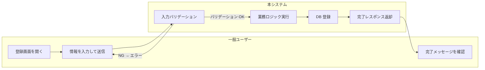

# システム化業務フロー

| 項目 | 内容 |
|---|---|
| プロダクト名 | <!-- プロダクト名 --> |
| 作成日 | <!-- YYYY/MM/DD --> |
| 作成者 | <!-- 氏名 --> |
| 最終更新日 | <!-- YYYY/MM/DD --> |
| 最終更新者 | <!-- 氏名 --> |

## 業務フロー一覧

| No. | 業務フロー名 | 対応要件ID | 主な担当者 | 概要 |
|---|---|---|---|---|
| 1 | <!-- 業務フロー名 --> | <!-- R001 --> | <!-- 担当者区分 --> | <!-- 概要 --> |

---

## 1. <!-- 業務フロー名（例: 商品登録業務） -->

### 業務概要

<!-- この業務の目的・背景を記述する -->

### 登場人物（スイムレーン）

| 識別子 | 名称 | 区分 |
|---|---|---|
| User | <!-- 一般ユーザー --> | 利用者 |
| Admin | <!-- 管理者 --> | 利用者 |
| System | <!-- 本システム --> | システム |
| ExtSys | <!-- 外部システム --> | 外部 |

<!-- 不要な行は削除する -->

### 業務フロー（スイムレーン図）

<!-- 登場人物に合わせてスイムレーンを追加・変更する -->

### 業務フロー説明

| ステップ | 担当 | 処理内容 | 備考 |
|---|---|---|---|
| 1 | 一般ユーザー | 登録画面を開く | — |
| 2 | 一般ユーザー | 情報を入力して送信する | — |
| 3 | 本システム | 入力バリデーションを実行する | エラー時はエラーメッセージを表示 |
| 4 | 本システム | 業務ロジックを実行し DB に登録する | — |
| 5 | 一般ユーザー | 完了メッセージを確認する | — |

### 特記事項・業務上の制約

- <!-- 業務上の制約・例外ケース・代替フローがあれば記述する -->

---

## 更新履歴

| Ver | 更新日 | 更新者 | 更新内容 |
|---|---|---|---|
| 1.0 | <!-- YYYY/MM/DD --> | <!-- 氏名 --> | 初版 |
