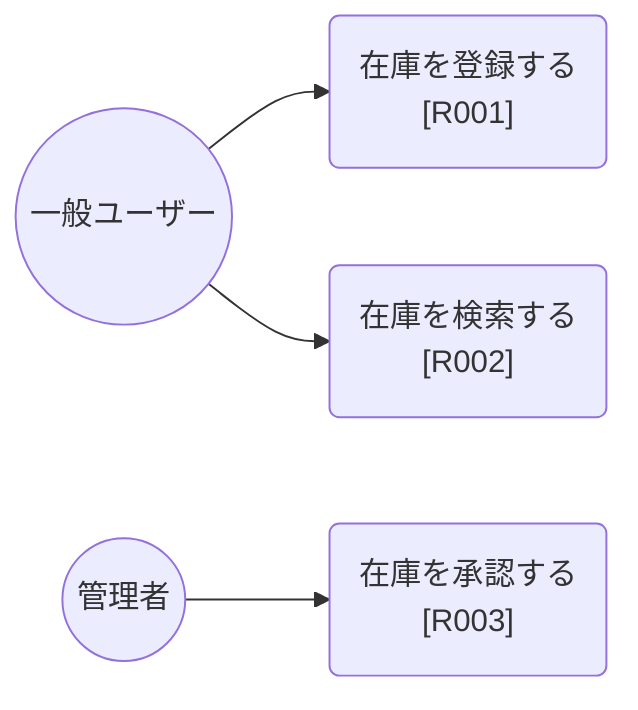

# ユースケース図

> 工程1 SA（要件定義）の正式成果物。`/requirement-doc-gen` が `docs/requirements/ユースケース図.md` に直接生成する（**案件共通1ファイル・累積**）。
> システム化業務フロー.md と相互に観点を補強する（業務フローは時系列の処理の流れ、ユースケース図はアクターと機能の関係を俯瞰する）。**要件ID（R###）とユースケースは1:1で管理する**（1要件ID=1ユースケース。「ユースケース一覧」表の1行が1要件ID=1ユースケースに対応する）。UI工程のロバストネス図（`ロバストネス図_{要件ID}.md`）はこの1:1関係を前提に要件ID単位で生成される。

| 項目 | 内容 |
|---|---|
| プロダクト名 | <!-- プロダクト名 --> |
| 作成日 | <!-- YYYY/MM/DD --> |
| 作成者 | <!-- 氏名 --> |
| 最終更新日 | <!-- YYYY/MM/DD --> |
| 最終更新者 | <!-- 氏名 --> |

## アクター一覧

| 識別子 | 名称 | 概要 |
|---|---|---|
| User | 一般ユーザー | <!-- 概要 --> |
| Admin | 管理者 | <!-- 概要 --> |
| ExtSys | 外部システム | <!-- 概要 --> |

<!-- 不要な行は削除する -->

## ユースケース図

<!-- Mermaid にユースケース図の専用記法はないため、graph LR で アクター(角丸) と ユースケース(円弧=丸括弧ノード) の関連として近似表現する -->

## ユースケース一覧

| 要件ID | ユースケース名 | 主アクター | 概要 |
|---|---|---|---|
| R001 | <!-- 在庫を登録する --> | <!-- 一般ユーザー --> | <!-- 概要 --> |
| R002 | <!-- 在庫を検索する --> | <!-- 一般ユーザー --> | <!-- 概要 --> |

## 更新履歴

| Ver | 更新日 | 更新者 | 更新内容 |
|---|---|---|---|
| 1.0 | <!-- YYYY/MM/DD --> | <!-- 氏名 --> | 初版 |
