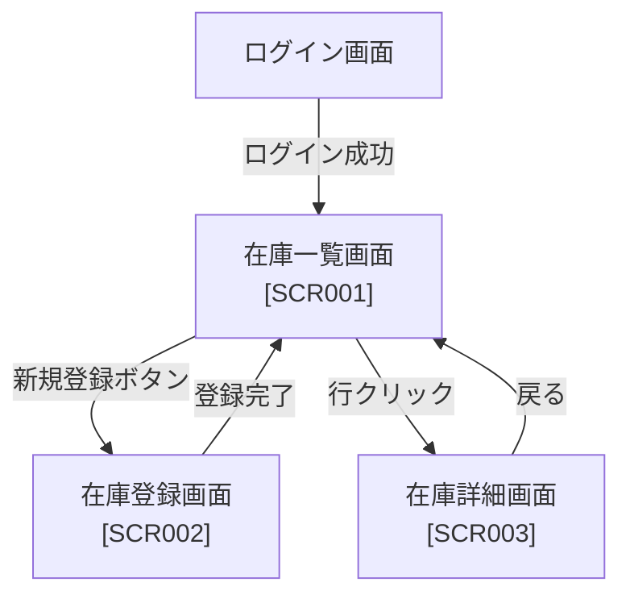

# 画面遷移図

> 工程1 SA（要件定義）の正式成果物。`/requirement-doc-gen` が `docs/requirements/画面遷移図.md` に直接生成する（**案件共通1ファイル・累積**）。
> 画面レイアウト.md と対応する（画面の項目定義ではなく、画面間の遷移関係を俯瞰する）。要件定義段階では業務要求レベルの粗い遷移を示し、詳細な状態遷移（state）は基本設計工程の画面状態遷移図.md で扱う。

| 項目 | 内容 |
|---|---|
| プロダクト名 | <!-- プロダクト名 --> |
| 作成日 | <!-- YYYY/MM/DD --> |
| 作成者 | <!-- 氏名 --> |
| 最終更新日 | <!-- YYYY/MM/DD --> |
| 最終更新者 | <!-- 氏名 --> |

## 画面一覧

| 画面ID | 画面名 | 概要 | 対応要件ID |
|---|---|---|---|
| <!-- SCR001 --> | <!-- 在庫一覧画面 --> | <!-- 概要 --> | <!-- R001 --> |
| <!-- SCR002 --> | <!-- 在庫登録画面 --> | <!-- 概要 --> | <!-- R001 --> |

## 画面遷移図

## 遷移条件

| No. | 遷移元 | 遷移先 | 契機 | 条件 |
|---|---|---|---|---|
| 1 | <!-- 在庫一覧画面 --> | <!-- 在庫登録画面 --> | <!-- 新規登録ボタン押下 --> | <!-- なし --> |
| 2 | <!-- 在庫登録画面 --> | <!-- 在庫一覧画面 --> | <!-- 登録完了 --> | <!-- 登録成功時のみ --> |

## 更新履歴

| Ver | 更新日 | 更新者 | 更新内容 |
|---|---|---|---|
| 1.0 | <!-- YYYY/MM/DD --> | <!-- 氏名 --> | 初版 |
