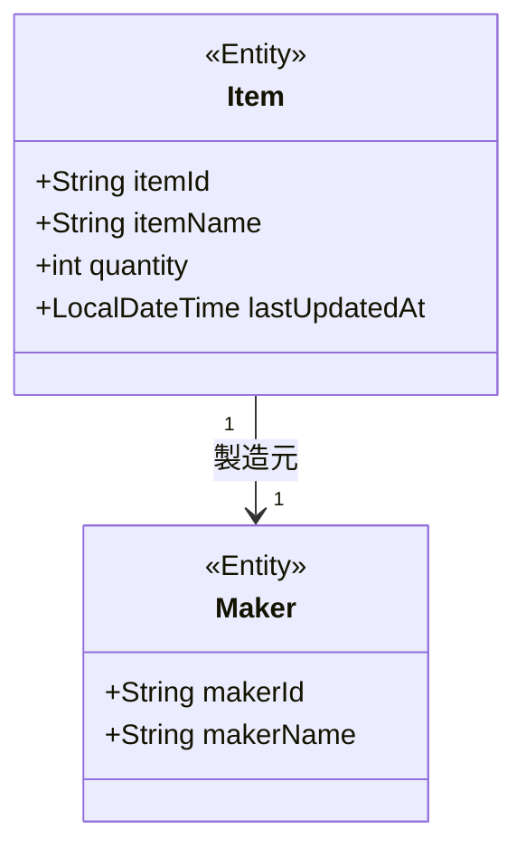

# クラス図

> 工程2 UI（基本設計）の正式成果物。`/basic-design-gen` が `docs/base-design/クラス図.md` に直接生成する（**案件共通1ファイル・累積**）。
> **Entity 中心のドメインモデルに限定する**（Controller/Service 等の実装クラスは `実装対象クラス一覧.md` の管轄。ここで重複させない）。ロバストネス図の Entity オブジェクトを集約して育てる。今回機能分の Entity 差分のみ追記し、既存クラス・関連は変更しない。

| 項目 | 内容 |
|---|---|
| プロダクト名 | <!-- プロダクト名 --> |
| 作成日 | <!-- YYYY/MM/DD --> |
| 作成者 | <!-- 氏名 --> |
| 最終更新日 | <!-- YYYY/MM/DD --> |
| 最終更新者 | <!-- 氏名 --> |

## ドメインモデル クラス図

<!-- 属性は Entity として重要なもののみ記載する（実装クラスのフィールド全量ではない） -->

## Entity 一覧

| Entity名 | 概要 | 対応テーブル（テーブル定義書を参照） | 初出機能ID |
|---|---|---|---|
| <!-- Item --> | <!-- 在庫 --> | <!-- T_ITEM --> | <!-- bs-001 --> |
| <!-- Maker --> | <!-- メーカー --> | <!-- T_MAKER --> | <!-- bs-001 --> |

## 更新履歴

| Ver | 更新日 | 更新者 | 更新内容 |
|---|---|---|---|
| 1.0 | <!-- YYYY/MM/DD --> | <!-- 氏名 --> | 初版 |
