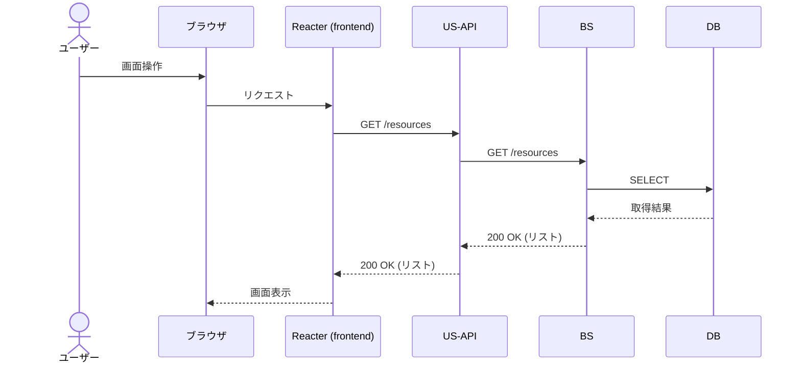

# シーケンス図

| 項目 | 内容 |
|---|---|
| プロダクト名 | <!-- プロダクト名 --> |
| 作成日 | <!-- YYYY/MM/DD --> |
| 作成者 | <!-- 氏名 --> |
| 最終更新日 | <!-- YYYY/MM/DD --> |
| 最終更新者 | <!-- 氏名 --> |

> 本ファイルは `シーケンス図_{機能ID}.md` として **1機能ID = 1シーケンス** で生成する。
> 機能ID・要件ID・スタックの対応は `docs/base-design/機能一覧.md` を正とする。

---

## <!-- シーケンス名（例: リソース一覧取得） -->

| 項目 | 内容 |
|---|---|
| 機能ID | <!-- bs-001 --> |
| 要件ID | <!-- R001 --> |

### 概要

<!-- このシーケンスの目的・処理の流れを説明する -->

### 登場人物

| 識別子 | 名称 | 役割 |
|---|---|---|
| Browser | ブラウザ | クライアント |
| Frontend | Reacter (frontend) | SPA フロント |
| US-API | US-API アプリ | JSON API フロント |
| BS | BS アプリ | バックエンド |
| DB | データベース | データストア |

### シーケンス

### 処理説明

| ステップ | 送信元 | 送信先 | 内容 |
|---|---|---|---|
| 1 | ユーザー | ブラウザ | 画面の操作（ボタン押下など） |
| 2 | Frontend | US-API | `GET /resources` を呼び出す |
| 3 | US-API | BS | `GET /resources` を転送する |
| 4 | BS | DB | リソースを検索する |
| 5 | DB | BS | 検索結果を返す |
| 6 | BS | US-API | `200 OK` + リソースリストを返す |
| 7 | US-API | Frontend | `200 OK` + リソースリストを返す |
| 8 | Frontend | ブラウザ | 一覧を画面に描画する |

---

## 更新履歴

| Ver | 更新日 | 更新者 | 更新内容 |
|---|---|---|---|
| 1.0 | <!-- YYYY/MM/DD --> | <!-- 氏名 --> | 初版 |
