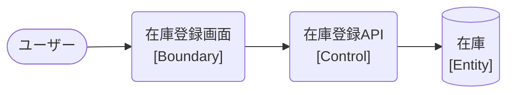

# ロバストネス図

> 工程2 UI（基本設計）の正式成果物。`/basic-design-gen` が `docs/base-design/ロバストネス図_{要件ID}.md` に生成する（**1要件ID = 1ロバストネス図**。要件ID＝ユースケース単位で分析する。1要件IDが複数機能IDに分解されても分割しない）。
> ユースケース（要件ID）の記述を Boundary（境界）・Control（制御）・Entity（実体）オブジェクトに変換し、実装対象クラス一覧・シーケンス図への解像度を上げる（ICONIXプロセスの手法を採用）。
> 機能ID・要件ID・スタックの対応は `docs/base-design/機能一覧.md` を正とする。

| 項目 | 内容 |
|---|---|
| プロダクト名 | <!-- プロダクト名 --> |
| 作成日 | <!-- YYYY/MM/DD --> |
| 作成者 | <!-- 氏名 --> |
| 最終更新日 | <!-- YYYY/MM/DD --> |
| 最終更新者 | <!-- 氏名 --> |

---

## <!-- ロバストネス名（例: 在庫登録） -->

| 項目 | 内容 |
|---|---|
| 要件ID | <!-- R001 --> |
| 関連機能ID | <!-- bs-001, front-inter-001 等（本要件ID が分解された全機能ID。機能一覧.md を参照） --> |

### 概要

<!-- このロバストネス図が対象とするユースケースの目的を記述する -->

### ロバストネス図

<!-- Mermaid にロバストネス図の専用記法はないため、flowchart でノード形状により Boundary(角丸) / Control(円) / Entity(下線=矩形) を区別して近似表現する -->

<!-- Boundary=画面のみ（APIはControlに分類する）。矢印は Actor→Boundary→Control→Entity の単方向のみとし、戻り矢印は書かない。
     縦軸（列）は種別で揃え、ノード・エッジは Boundary→Control→Entity の種別ごとにまとめて記述する。1行に複数の Control・複数の Entity を並べない。 -->

### オブジェクト一覧

| 種別 | 名称 | 概要 | 対応実装クラス（実装対象クラス一覧を参照） |
|---|---|---|---|
| Boundary | <!-- 在庫登録画面 --> | <!-- ユーザーとの接点 --> | <!-- ItemRegisterPage --> |
| Control | <!-- 在庫登録API --> | <!-- API受付・業務ロジック --> | <!-- ItemController / ItemService --> |
| Entity | <!-- 在庫 --> | <!-- 永続化される実体 --> | <!-- Item / T_ITEM --> |

---

## 更新履歴

| Ver | 更新日 | 更新者 | 更新内容 |
|---|---|---|---|
| 1.0 | <!-- YYYY/MM/DD --> | <!-- 氏名 --> | 初版 |
