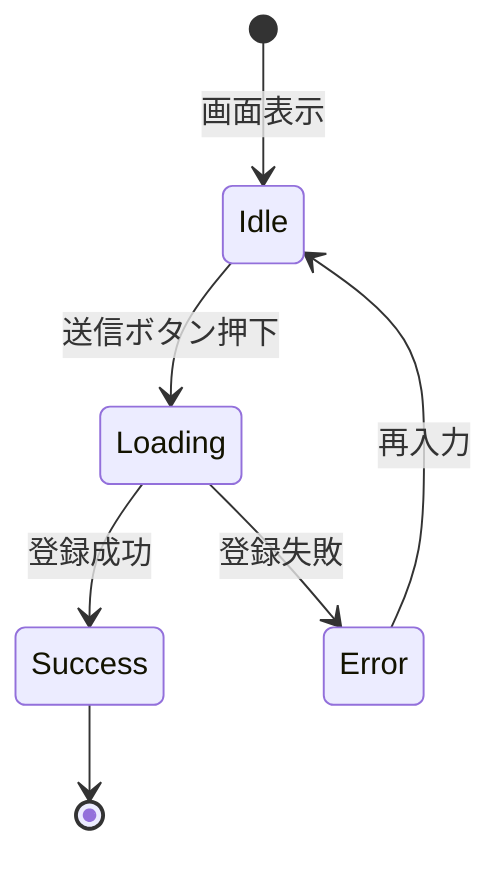

# 画面状態遷移図

> 工程2 UI（基本設計）の正式成果物。`/basic-design-gen` が `docs/base-design/画面状態遷移図_{機能ID}.md` に生成する（**1機能ID = 1画面**・frontend のみ）。
> 画面（コンポーネント）内部の state 設計の軸になる。`コンポーネント仕様書_{機能ID}.md` の State 定義と対応させる。

| 項目 | 内容 |
|---|---|
| プロダクト名 | <!-- プロダクト名 --> |
| 作成日 | <!-- YYYY/MM/DD --> |
| 作成者 | <!-- 氏名 --> |
| 最終更新日 | <!-- YYYY/MM/DD --> |
| 最終更新者 | <!-- 氏名 --> |

## 基本情報

| 項目 | 内容 |
|---|---|
| 機能ID | <!-- front-inter-001 --> |
| 画面名 | <!-- 在庫登録画面 --> |
| コンポーネント名 | <!-- ItemRegisterPage --> |

## 状態遷移図

## 状態一覧

| 状態 | 概要 | 画面表示 |
|---|---|---|
| Idle | <!-- 初期表示・入力待ち --> | <!-- フォーム表示 --> |
| Loading | <!-- 送信処理中 --> | <!-- ローディングスピナー --> |
| Success | <!-- 登録完了 --> | <!-- 完了メッセージ --> |
| Error | <!-- 登録失敗 --> | <!-- エラーメッセージ --> |

## 更新履歴

| Ver | 更新日 | 更新者 | 更新内容 |
|---|---|---|---|
| 1.0 | <!-- YYYY/MM/DD --> | <!-- 氏名 --> | 初版 |
