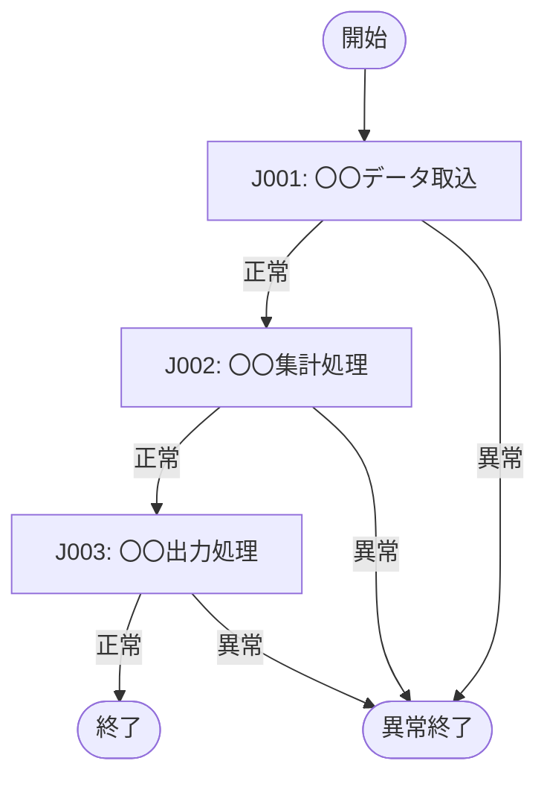

# ジョブネット一覧

| 項目 | 内容 |
|---|---|
| プロダクト名 | <!-- プロダクト名 --> |
| 作成日 | <!-- YYYY/MM/DD --> |
| 作成者 | <!-- 氏名 --> |
| 最終更新日 | <!-- YYYY/MM/DD --> |
| 最終更新者 | <!-- 氏名 --> |

## ジョブネット一覧

| No. | ジョブネットID | ジョブネット名 | 実行スケジュール | 起動種別 | 概要 |
|---|---|---|---|---|---|
| 1 | <!-- JN001 --> | <!-- 〇〇日次処理 --> | <!-- 毎日 02:00 --> | <!-- 自動（cron） --> | <!-- 概要 --> |
| 2 | <!-- JN002 --> | <!-- 〇〇月次集計 --> | <!-- 毎月 1 日 03:00 --> | <!-- 自動（cron） --> | <!-- 概要 --> |
| 3 | <!-- JN003 --> | <!-- 〇〇手動処理 --> | <!-- 随時 --> | <!-- 手動 --> | <!-- 概要 --> |

### 起動種別定義

| 起動種別 | 説明 |
|---|---|
| 自動（cron） | cron・ジョブスケジューラーによる定期自動実行 |
| イベント駆動 | 外部システム連携・ファイル着信等のイベントをトリガーに起動 |
| 手動 | 運用者が手動で起動する |

---

## <!-- JN001: ジョブネット名（例: 〇〇日次処理） -->

### 概要

<!-- このジョブネットの目的・処理の流れを記述する -->

### ジョブネット構成図

### ジョブ構成

| No. | ジョブID | ジョブ名 | クラス名 | 実行順序 | 先行ジョブ | 備考 |
|---|---|---|---|---|---|---|
| 1 | <!-- J001 --> | <!-- 〇〇データ取込 --> | <!-- XxxImportRunner --> | 1 | — | — |
| 2 | <!-- J002 --> | <!-- 〇〇集計処理 --> | <!-- XxxAggregateRunner --> | 2 | J001 | — |
| 3 | <!-- J003 --> | <!-- 〇〇出力処理 --> | <!-- XxxExportRunner --> | 3 | J002 | — |

### スケジュール

| 項目 | 内容 |
|---|---|
| 実行環境 | <!-- PRD / STG --> |
| スケジュール（cron 式） | <!-- 0 2 * * * --> |
| タイムゾーン | <!-- Asia/Tokyo --> |
| タイムアウト | <!-- 60 分 --> |
| 再実行ポリシー | <!-- 自動リトライ N 回 / 手動再実行 --> |

### 前提条件・依存関係

- <!-- 外部ファイルの着信 / 前回バッチ完了 / DB 状態 等 -->

---

## 更新履歴

| Ver | 更新日 | 更新者 | 更新内容 |
|---|---|---|---|
| 1.0 | <!-- YYYY/MM/DD --> | <!-- 氏名 --> | 初版 |
