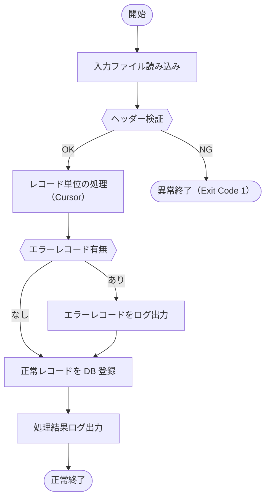

# ジョブフロー一覧

| 項目 | 内容 |
|---|---|
| プロダクト名 | <!-- プロダクト名 --> |
| 作成日 | <!-- YYYY/MM/DD --> |
| 作成者 | <!-- 氏名 --> |
| 最終更新日 | <!-- YYYY/MM/DD --> |
| 最終更新者 | <!-- 氏名 --> |

## ジョブフロー一覧

> **機能ID**（`batch-###`・カテゴリ`batch`ごとの3桁ゼロ埋め連番・`docs/base-design/機能一覧.md` で採番）と **ジョブID**（本表で維持する既存識別子）は 1:1 対応。
> 本ファイルは `ジョブフロー一覧_{機能ID}.md` として **1機能ID = 1ジョブ** で生成する。

| No. | 機能ID | ジョブID | ジョブ名 | 所属ジョブネット | クラス名 | 概要 |
|---|---|---|---|---|---|---|
| 1 | <!-- batch-001 --> | <!-- J001 --> | <!-- 〇〇データ取込 --> | <!-- JN001 --> | <!-- XxxImportRunner --> | <!-- 概要 --> |

---

## <!-- ジョブID: J001（機能ID: batch-001） --> <!-- ジョブ名: 〇〇データ取込 -->

### 概要

<!-- このジョブの目的・処理の流れを記述する -->

### ジョブフロー図



### 処理ステップ

| ステップ | 処理内容 | 使用クラス / メソッド | 備考 |
|---|---|---|---|
| 1 | 入力ファイルを読み込む | `XxxImportRunner.run()` | ファイル未存在時は異常終了 |
| 2 | ヘッダー行を検証する | `XxxImportService.validateHeader()` | 列数・列名チェック |
| 3 | レコード単位の業務処理を実行する | `XxxImportService.processRecord()` | Cursor 利用 |
| 4 | エラーレコードをログに出力する | `LoggerFactory.APP.warn()` | エラーレコードはスキップして継続 |
| 5 | 正常レコードを DB に登録する | `XxxRepository.createOne()` | トランザクション：レコード単位 |
| 6 | 処理結果（件数・エラー数）をログ出力する | `LoggerFactory.APP.info()` | — |

### 入出力

| 区分 | 種別 | 名称 | 概要 |
|---|---|---|---|
| 入力 | ファイル | <!-- F-IN-001 〇〇入力ファイル --> | <!-- ファイル定義書 F-IN-001 参照 --> |
| 出力 | テーブル | <!-- T_XXX --> | <!-- 登録・更新 --> |
| 出力 | ログ | アプリケーションログ | 開始・終了・件数サマリー・エラー明細 |

### 大量データ処理（Cursor 利用）

<!-- 全件読み込み禁止。Cursor を使ってレコード単位に処理すること -->

```java
try (Cursor<XxxRecord> cursor = this.xxxMapper.selectCursor(condition)) {
    for (XxxRecord record : cursor) {
        this.processRecord(record);
    }
} catch (IOException e) {
    throw new SystemException("{メッセージキー}", e);
}
```

### エラーハンドリング

| エラー種別 | 対応 | Exit Code |
|---|---|---|
| ファイル未存在 | 異常終了 | 1 |
| ヘッダー不正 | 異常終了 | 1 |
| レコード処理エラー | スキップして継続（ログ出力） | 0（全件スキップ時は 2） |
| DB エラー | 異常終了 | 1 |

<!-- Exit Code は運用設計に合わせて変更する -->

---

## 更新履歴

| Ver | 更新日 | 更新者 | 更新内容 |
|---|---|---|---|
| 1.0 | <!-- YYYY/MM/DD --> | <!-- 氏名 --> | 初版 |
