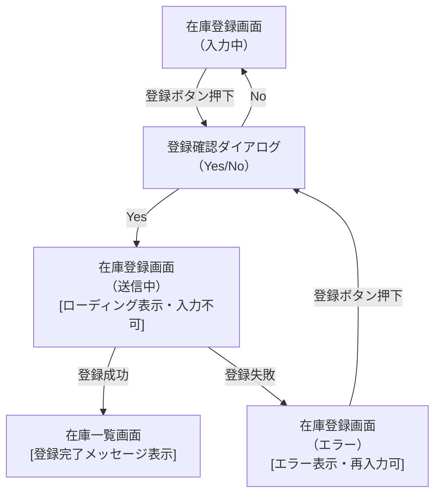

# 画面アクション遷移図

> 工程4 SS 詳細設計の形式設計書（frontend）。`/detailed-design-gen` が `frontend/docs/detail-design/画面アクション遷移図_{機能ID}.md` に生成する（**1機能ID = 1画面**・PSK 標準外・プロジェクト独自）。
> `コンポーネント仕様書_{機能ID}.md` の「画面遷移」表（操作→遷移先）と「アクション定義」表（操作→処理シーケンス）を、**同じ WB（`frontend.md`）から**1つの Mermaid 図に可視化したもの。両表を置き換えるものではなく、実装時に画面のアクション・表示制御・遷移先を俯瞰できるようにする補完資料。
> `docs/base-design/画面状態遷移図_{機能ID}.md`（UI・画面内部の state のみ）とは異なり、他画面への遷移・確認ダイアログ等も含めて描く。

| 項目 | 内容 |
|---|---|
| プロダクト名 | <!-- プロダクト名 --> |
| 作成日 | <!-- YYYY/MM/DD --> |
| 作成者 | <!-- 氏名 --> |
| 最終更新日 | <!-- YYYY/MM/DD --> |
| 最終更新者 | <!-- 氏名 --> |

## 基本情報

| 項目 | 内容 |
|---|---|
| 機能ID | <!-- front-inter-001 --> |
| 画面名 | <!-- 在庫登録画面 --> |
| コンポーネント名 | <!-- ItemRegisterPage --> |

## 遷移図

<!-- ノードは「画面名（状態）」で表記し、[ ] 内に画面表示の変化（ローディング表示・入力不可化等）を注記する。
     矢印のラベルにはアクション（トリガー）を記載する。他画面への遷移も同じ図の中に含める。 -->

## アクション×状態 対応表

<!-- 図だけでは表現しづらい詳細（条件等）を補う表。「コンポーネント仕様書」の画面遷移表・アクション定義表と記載を一致させること。 -->

| No. | アクション（トリガー） | 起点状態 | 画面表示の変化 | 遷移先 | 条件 |
|---|---|---|---|---|---|
| 1 | <!-- 登録ボタン押下 --> | <!-- 入力中 --> | <!-- 確認ダイアログ表示 --> | <!-- 登録確認ダイアログ --> | <!-- なし --> |
| 2 | <!-- Yes --> | <!-- 登録確認ダイアログ --> | <!-- ローディング表示・入力不可化 --> | <!-- 在庫登録画面（送信中） --> | <!-- なし --> |
| 3 | <!-- No --> | <!-- 登録確認ダイアログ --> | <!-- ダイアログを閉じる --> | <!-- 在庫登録画面（入力中） --> | <!-- なし --> |
| 4 | <!-- API応答（成功） --> | <!-- 送信中 --> | <!-- 完了メッセージ表示 --> | <!-- 在庫一覧画面 --> | <!-- 登録成功時のみ --> |
| 5 | <!-- API応答（失敗） --> | <!-- 送信中 --> | <!-- エラー表示・再入力可能化 --> | <!-- 在庫登録画面（エラー） --> | <!-- なし --> |

## 更新履歴

| Ver | 更新日 | 更新者 | 更新内容 |
|---|---|---|---|
| 1.0 | <!-- YYYY/MM/DD --> | <!-- 氏名 --> | 初版 |
