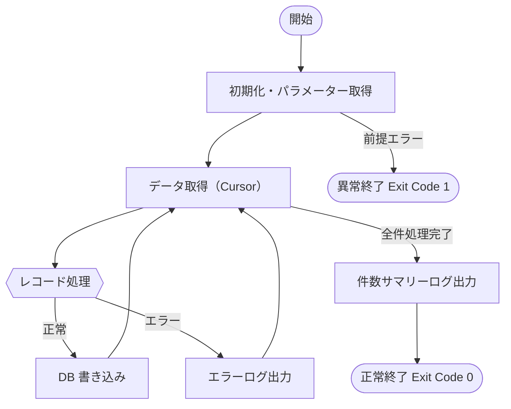

# {機能名} バッチ詳細設計

> 工程4 SS 詳細設計WB — {スタック}/specs/{案件キー}/detail-design/{issue_id}_{機能ID}/batch.md に配置（specs・push・PR対象）
> **1 機能ID = 1 ジョブ**（`docs/base-design/機能一覧.md` の分解単位に合わせる）。

## 基本情報

| 項目 | 値 |
|-----|---|
| 機能ID | {機能一覧.md の機能ID 例: batch-001} |
| 要件ID | {要件一覧.md の要件ID 例: R001} |
| ジョブ ID | `{ジョブID 例: J001}`（既存識別子・機能IDと1:1対応） |
| ジョブ名 | `{ジョブ名}` |
| クラス名（Runner） | `{機能名}BatchRunner` |
| FQCN | `{ベースパッケージ}.runner.{機能名}BatchRunner` |
| 所属ジョブネット | `{ジョブネットID}` |
| 起動種別 | 自動（cron） / 手動 / イベント駆動 |

## 処理概要

<!-- このバッチの目的・概要を記述する -->

## 入出力

| 区分 | 種別 | 名称 | 概要 |
|---|---|---|---|
| 入力 | テーブル / ファイル | `{名称}` | `{概要}` |
| 出力 | テーブル / ファイル / ログ | `{名称}` | `{概要}` |

## ジョブフロー（Runner 処理フロー）



## クラス設計

### Runner

| 項目 | 値 |
|-----|---|
| クラス名 | `{機能名}BatchRunner` |
| 実装インターフェース | `CommandLineRunner` |
| アノテーション | `@Component` |

```java
@Override
public void run(String... args) {
    // 1. 開始ログ出力（LoggerFactory.APP.info）
    // 2. サービス呼び出し → 処理件数・エラー件数を受け取る
    // 3. 件数サマリーログ出力
    // ※ ApplicationException 発生時: エラーログ + System.exit(1)
}
```

### Service

| 項目 | 値 |
|-----|---|
| インターフェース | `{機能名}BatchService` |
| 実装クラス | `{機能名}BatchServiceImpl` |
| アノテーション | `@Service` + `@Transactional`（DB 直アクセス時のみ） |

#### メソッド一覧

| メソッド名 | 概要 | トランザクション |
|---|---|---|
| `execute` | バッチ処理全体を実行する | required（1 件ずつ commit する場合は REQUIRES_NEW） |

#### execute メソッド処理フロー

1. {ステップ 1 の説明}
2. {ステップ 2 の説明}
3. Cursor でレコードを 1 件ずつ処理する（全件読み込み禁止）
4. エラーレコードはスキップしてログ出力（継続 or 中断はポリシーに応じて選択）
5. 処理件数・エラー件数を返却する

### Repository（DB アクセス型）

| メソッド名 | 概要 | SQL 種別 |
|---|---|---|
| `selectCursor` | 処理対象データを Cursor で取得する | SELECT |
| `updateProcessed` | 処理済みフラグを更新する | UPDATE |

#### Cursor 利用パターン

```java
try (Cursor<{型}> cursor = this.{xxx}Mapper.selectCursor({条件})) {
    for ({型} record : cursor) {
        this.processRecord(record);
    }
} catch (IOException e) {
    throw new SystemException("{メッセージキー}", e);
}
```

## エラーハンドリング

| エラー種別 | 対応方針 | Exit Code |
|---|---|---|
| 前提条件エラー（入力ファイル不正等） | 処理中断 | 1 |
| レコード処理エラー（業務エラー） | スキップして継続 | 0（全件スキップ時は 2） |
| DB エラー | 処理中断 | 1 |

## トランザクション設計

| 選択肢 | 説明 | 採用 |
|---|---|---|
| 全体 1 トランザクション | 全件をまとめてコミット | ○ / × |
| レコード単位トランザクション | 1 件ずつコミット（`REQUIRES_NEW`） | ○ / × |
| チャンク単位トランザクション | N 件ごとにコミット | ○ / × |

採用: <!-- 上記から選択 -->
理由: <!-- 採用理由 -->

## 性能要件

| 項目 | 要件値 |
|---|---|
| 最大処理件数 | <!-- N 万件 --> |
| タイムアウト時間 | <!-- N 分 --> |
| メモリ使用量（目標上限） | <!-- N MB --> |

## 再実行設計（冪等性）

- 再実行時の処理済みレコードの判定方法: <!-- 例: `processed_flg = '1'` のレコードをスキップ -->
- 重複データ防止: <!-- 例: UPSERT / 処理前に DELETE してから INSERT -->

